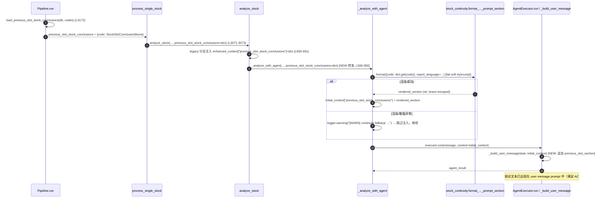

# 系统架构设计 + 任务分解：P0 第一批 T01/U1 + T04/U4

> **文档类型**：架构设计 + 任务分解（增量）
> **架构师**：高见远（Bob，software-architect）
> **日期**：2026-07-27
> **仓库边界**：`Elevensails/daily_stock_analysis_test`（dsa-test），本地副本 `projects/dsa-test`
> **上游**：`.workbuddy/prd/p0_t01_t04_prd.md` + 代码核查（行号基于 2026-07-27 工作副本）
> **溯源键**：T01 ↔ U1 ↔ TECH-T02；T04 ↔ U4 ↔ TECH-T01
> **状态**：设计冻结待实现（本文档不写实现代码，仅给方案、签名、调用流、任务）

---

## 0. 主理人拍板落实确认（PRD §6 四点）

| # | 拍板意见 | 本设计落实方式 |
|---|----------|----------------|
| 1 | **T01 范围**：仅修复 agent 路径连续性 fail-open + fail-soft 降级，不含 deploy workflow 跨运行状态持久化 | 仅改 `pipeline.py` + `executor.py`（agent 路径内闭环），不触碰任何 workflow 状态/重试逻辑。✓ |
| 2 | **T04 范围**：仅 `scripts/deploy_pages.py`（GH Pages）；`report_renderer.py` Jinja2 autoescape 单列 follow-up | 不修改 `report_renderer.py` / `templates/report_*.j2`。✓ |
| 3 | **XSS 静态门禁**：本期不加 CI lint 强约束；靠 `html.escape` + 单测；工程师提供 grep/人工 review 证据 | 不在 `ci_gate.sh` 加 lint 规则；在 PR 提供"无裸注入 f-string"的 grep 证据（见 §7）。✓ |
| 4 | **CSP 头**：本期不追加，留后续安全专项 | 不追加 `Content-Security-Policy`。✓ |

> ⚠️ 第 1 点拍板覆盖"agent 路径 fail-open"，但 PRD §5 文件清单只列了 `pipeline.py`。经代码核查（见 §5.1 时序与 §8），要让结论真正进入模型 prompt，必须同步改 `src/agent/executor.py::_build_user_message`。这属于"修复 agent 路径 fail-open"的必要消费侧，已纳入本设计，并对 PRD §5 文件清单做必要修正（见 §3）。

---

## 1. 实现方案概述

### T01 / U1 — 工作流连续性对齐与错误降级
**核心缺口**：`run`(L3172) 加载的连续性字典 `previous_slot_stock_conclusions` 经 `process_single_stock`(L3210)→`analyze_stock`(L3071) 已透传到 `analyze_stock`，legacy 分支在 L690-691 把它挂入 `enhanced_context["previous_slot_stock_conclusions"]`；但 **agent 分支 `analyze_stock→_analyze_with_agent` 调用处(L566-580)未转发该字典，且 `_analyze_with_agent`(L1294) 签名无此参数**，导致 agent 路径完全断链（fail-open）。

**方案**：
1. **对齐注入**：`analyze_stock` 的 agent 分支把 `previous_slot_stock_conclusions` 转发给 `_analyze_with_agent`；`_analyze_with_agent` 新增该 keyword-only 参数，按 `code` 取出对应 `StockSlotConclusion`，经既有 `format_previous_slot_stock_conclusions_prompt_section(...)` 渲染为**已渲染的 prompt 段落字符串**，挂入 `initial_context["previous_slot_stock_conclusions"]`（键名与 legacy 对齐）。
2. **错误降级（fail-soft）**：连续性渲染整体 `try/except` 包裹，失败时 `logger.warning("[WARN] continuity fallback: ...")` 并继续以空结论段分析，绝不静默丢空、不中断单股分析（与 L460 实时行情降级、L531 快照写失败、L114 风格一致）。模型调用级异常维持既有 L1433 `raise`。
3. **消费侧闭环（关键修正）**：`_analyze_with_agent` 把渲染段写入 `initial_context` 后，必须由 `src/agent/executor.py::_build_user_message` 将其并入最终 prompt（当前该方法只显式渲染 `market_phase/daily_market/market_structure/analysis_context_pack` 等已知键，`previous_slot_stock_conclusions` 不在其中，若不补则注入是"死键"，fail-open 实质未修）。
4. **docstring 补全**：`_analyze_with_agent` 及其连续性封装 100% 补全 docstring，说明与 legacy 在连续性注入上的对齐点（fail-soft 语义、注入键名、空值处理）。
5. **复用**：只读复用 `src/services/stock_continuity.py`，不改动其契约。

### T04 / U4 — HTML 报告 XSS 安全渲染
**核心缺口**：`scripts/deploy_pages.py` 的 `md2html`(L120-149) 与 `make_report_page`(L241-250) 将模型/外部文本以 f-string 裸注入 HTML，未 `html.escape`；而同文件 `extract_preview`(L337) 已做 escape，证明该 sink 被遗漏。

**方案**：
1. **转义所有模型注入文本**：`md2html` 内表格 `{c}`(L127/L130)、`{stock_title}`(L137)、`<h1>/<h3>/<blockquote>/<li>` 行文本(L139-142)、`<p>` 文本(L145-146) 全部用 `html.escape(...)` 包裹；`make_report_page` 的 `title`(L243/L245) 包裹 `html.escape`。`html.escape` 仅转义 `< > & " '`，`*` 不被转义，故合法 markdown 强调 `**bold**` 不受影响——但 `<p>` 行需要先 escape 原始模型文本、再对转义后文本做 `**→<strong>` 替换（顺序不可反，否则我方生成的 `<strong>` 会被转义破坏）。
2. **可测性重构**：从 `make_report_page` 抽出**纯拼装函数** `build_report_html(md, title, now_ts) -> str`（无 I/O），使 XSS 测试可离线运行、无需 `GITHUB_TOKEN`/网络。
3. **import 守卫（配套）**：`deploy_pages.py` 模块级 `if not TOKEN: raise SystemExit(1)`(L7-11) 改为 `__name__ == "__main__"` 守卫（或在 `main()` 内校验），否则离线 `import deploy_pages` 会因缺 token 直接 `SystemExit`，XSS 单测无法 import。
4. **CI 门禁**：两个 deploy workflow 在 `Deploy to GH Pages` 步骤**之前**新增 XSS step（`python3 -m pytest tests/test_xss_escape.py -q`），失败即阻断 deploy；`ci.yml` 的 `offline-tests`（`pytest -m "not network"`）自动覆盖该测试（测试须保持 offline、不标 `network`）。
5. **范围控制**：仅 `scripts/deploy_pages.py`；`report_renderer.py` / 模板不改动。

---

## 2. 框架 / 依赖选型

- **无新增第三方依赖**。
- **T01**：仅用仓库既有模块 `src/services/stock_continuity.py`（已落地，只读复用）；标准库 `logging`。
- **T04**：仅用 Python 标准库 `html`（脚本 L3 已 `import html`）。
- **测试**：沿用既有 `pytest` + `unittest.mock`（`tests/test_agent_pipeline.py`、`tests/test_continuity.py` 风格）；T01 测试用 `tests.litellm_stub.ensure_litellm_stub()` 与 mock executor 避免真实 LLM/DB。
- **CI**：沿用既有 `.github/workflows/ci.yml`（`scripts/ci_gate.sh offline-tests` → `pytest -m "not network"`）与两个 deploy workflow，不引入新 action。

---

## 3. 文件清单及相对路径（与 PRD 一致，细化到函数/行号）

### T01 / U1（连续性对齐 + fail-soft）
| 文件 | 变更 | 涉及函数 / 行号 |
|------|------|------------------|
| `src/core/pipeline.py` | **MODIFY** | `analyze_stock`(L383)：agent 分支调用 `_analyze_with_agent`(L566-580) 新增转发 `previous_slot_stock_conclusions=previous_slot_stock_conclusions`；`_analyze_with_agent`(L1294) 新增 keyword-only 参数 `previous_slot_stock_conclusions`，在构建 `initial_context` 后(L1383 附近，social/persisted 注入之后)做 fail-soft 渲染注入；补全 `_analyze_with_agent` 与连续性封装 docstring。 |
| `src/agent/executor.py` | **MODIFY**（PRD §5 未列，本设计**必要修正**） | `_build_user_message`(L856)：在 `market_structure_section` 处理之后(L890-891)、`analysis_context_pack_summary` 之前，新增把 `context.get("previous_slot_stock_conclusions")` 并入 `parts` 的逻辑（mirror `market_phase_section` 写法）。 |
| `src/services/stock_continuity.py` | **不改（只读复用）** | `StockSlotConclusion` / `load_previous_slot_stock_conclusions` / `format_previous_slot_stock_conclusions_prompt_section` 已具备，仅消费。 |
| `tests/test_agent_continuity.py` | **NEW** | agent 路径注入断言 + `[WARN] continuity fallback` 降级告警断言（mock executor，离线）。 |

### T04 / U4（XSS 安全渲染）
| 文件 | 变更 | 涉及函数 / 行号 |
|------|------|------------------|
| `scripts/deploy_pages.py` | **MODIFY** | `md2html`(L120-149)：所有模型文本节点 `html.escape`；`make_report_page`(L241-250)：`title` `html.escape`，并委托给新纯函数 `build_report_html`；**新增** `build_report_html(md, title, now_ts)`（纯拼装，无 I/O）；模块级 TOKEN 守卫(L7-11)改为 `__name__=="__main__"` 或移入 `main()`。 |
| `tests/test_xss_escape.py` | **NEW** | XSS payload 转义断言（离线，覆盖 `md2html` 与 `build_report_html`，并验证合法 `**bold**` 不被破坏）。 |
| `.github/workflows/daily-analysis-v2.yml` | **MODIFY** | 在 `Deploy to GH Pages`(L42) 之前新增 `XSS render gate` step。 |
| `.github/workflows/vibe-quant.yml` | **MODIFY** | 在 `Deploy to GH Pages`(L35) 之前新增 `XSS render gate` step。 |

### 关联但本期不改动（透明披露）
- `src/services/report_renderer.py`（Jinja2 `autoescape=False`，L256）+ `templates/report_*.j2`：独立 webapp/API 渲染路径 → **follow-up，不纳入本期**（对应拍板 #2）。
- `src/utils/sanitize.py`：密钥脱敏，与 XSS 无关，不改动。

---

## 4. 数据结构与接口变更（before / after）

> 仅列出有签名/契约变化的接口。所有变更向后兼容（新增可选参数，默认值 `None`）。

### 4.1 `_analyze_with_agent`（pipeline.py，L1294）
签名**新增** 1 个 keyword-only 参数（置于 `market_structure_context` 之后、`->` 之前）：

```python
# BEFORE
def _analyze_with_agent(
    self, code, report_type, query_id, stock_name, realtime_quote, chip_data,
    fundamental_context=None, trend_result=None, *,
    market_phase_context=None, market_phase_summary=None,
    daily_market_context=None, portfolio_context=None, market_structure_context=None,
) -> Optional[AnalysisResult]: ...

# AFTER
def _analyze_with_agent(
    self, code, report_type, query_id, stock_name, realtime_quote, chip_data,
    fundamental_context=None, trend_result=None, *,
    market_phase_context=None, market_phase_summary=None,
    daily_market_context=None, portfolio_context=None, market_structure_context=None,
    previous_slot_stock_conclusions: Optional[Dict[str, Any]] = None,   # NEW
) -> Optional[AnalysisResult]: ...
```
**注入契约**：成功渲染时 `initial_context["previous_slot_stock_conclusions"] = <已渲染的 prompt 段落字符串>`；无历史/渲染失败时该键缺省（fail-soft，不注入）。

### 4.2 `analyze_stock` 的 agent 分支调用（pipeline.py，L566-580）
调用点**新增**转发（其余参数不变）：

```python
# BEFORE
return self._analyze_with_agent(
    code, report_type, query_id, stock_name, realtime_quote, chip_data,
    fundamental_context, trend_result,
    market_phase_context=market_phase_context_dict,
    market_phase_summary=market_phase_summary,
    daily_market_context=daily_market_context,
    portfolio_context=portfolio_context,
    market_structure_context=market_structure_context,
)

# AFTER
return self._analyze_with_agent(
    code, report_type, query_id, stock_name, realtime_quote, chip_data,
    fundamental_context, trend_result,
    market_phase_context=market_phase_context_dict,
    market_phase_summary=market_phase_summary,
    daily_market_context=daily_market_context,
    portfolio_context=portfolio_context,
    market_structure_context=market_structure_context,
    previous_slot_stock_conclusions=previous_slot_stock_conclusions,   # NEW 转发
)
```
`（analyze_stock` 签名 L383 已含 `previous_slot_stock_conclusions` 参数，无需改签名。）

### 4.3 `executor._build_user_message`（src/agent/executor.py，L856）
签名不变；**新增** 在 `market_structure_section` 之后追加段落（mirror L876-891 写法）：

```python
# 连续性（T01）：把上一时段个股结论段并入 prompt，键名与 legacy 对齐
previous_slot_section = context.get("previous_slot_stock_conclusions")
if isinstance(previous_slot_section, str) and previous_slot_section:
    parts.append(previous_slot_section)
```

### 4.4 `deploy_pages.md2html` / `make_report_page` / 新增 `build_report_html`
- `md2html(md)`、`make_report_page(md_file, html_name, now_ts)`：签名不变，内部改为 escape（见 §5.2）。
- **新增** `build_report_html(md: str, title: str, now_ts: str) -> str`：纯函数，`make_report_page` 与测试共用；不调用 `gh_get_sha`/`gh_put`。
- 模块级：`TOKEN = os.environ.get('GITHUB_TOKEN','')` 保留；`if not TOKEN: raise SystemExit(1)` 改为 `if __name__ == "__main__" and not TOKEN: raise SystemExit(1)`（或移入 `main()` 首行），使离线 import 可行。

---

## 5. 程序调用流程 / 时序

### 5.1 T01：continuity 字典如何从 `run` 流向 `_analyze_with_agent`（并进入 prompt）



> 要点：legacy 路径把**原始 dict** 塞进 `enhanced_context`，由 `src/analyzer.py:3762` 在拼 prompt 时渲染；agent 路径改为在 `pipeline` 内**预渲染为字符串**塞进 `initial_context`，再由 `executor._build_user_message` 直接并入——两条路径键名 `previous_slot_stock_conclusions` 对齐，但值形态不同（dict vs 已渲染字符串）。这是 per-stock vs per-run 渲染的自然差异（见 §8 澄清项）。

### 5.2 T04：报告生成 → 转义 → 部署 调用链（含离线测试）

```mermaid
sequenceDiagram
    autonumber
    participant MD as report_*.md (模型输出)
    participant MRP as make_report_page
    participant M2H as md2html
    participant BRH as build_report_html (新增, 纯函数)
    participant GH as gh_put (网络)
    participant Test as test_xss_escape.py

    Note over MD,GH: 生产路径
    MRP->>MRP: title = html.escape(first_line.replace('# ','').strip())
    MRP->>M2H: md2html(md)
    M2H->>M2H: 每个文本节点 html.escape；<p> 行先 escape 再 **→<strong>
    M2H-->>MRP: body_html (已转义)
    MRP->>BRH: build_report_html(md, title, now_ts)
    BRH-->>MRP: full_page_html (title/body 均转义)
    MRP->>GH: gh_put(html_name, full_page_html)

    Note over Test: 离线测试路径 (无 GITHUB_TOKEN / 无网络)
    Test->>M2H: payload = "<script>alert(1)</script>" / ""
    M2H-->>Test: "&lt;script&gt;..." / "&lt;img ...&gt;"
    Test->>BRH: 同上 payload 经 build_report_html
    BRH-->>Test: 转义后 HTML
    Test->>Test: assert 含 &lt;script&gt; / &lt;img，不含裸 <script>/onerror=；合法 **bold**→<strong> 不被破坏
```

---

## 6. 任务列表（有序、含依赖、按实现顺序；标注归属 T01/T04）

> T01 与 T04 相互独立，可**并行**开发。每个簇内按 A→B→C 顺序；带依赖的任务须在其依赖完成后实现。

| Task ID | 归属 | 任务名 | 源文件 | 依赖 | 优先级 |
|---------|------|--------|--------|------|--------|
| **T-01-A** | T01 | continuity 注入层（pipeline 侧） | `src/core/pipeline.py` | 无（基础） | P0 |
| **T-01-B** | T01 | prompt 消费侧（executor 侧） | `src/agent/executor.py` | T-01-A | P0 |
| **T-01-C** | T01 | agent 连续性单测 | `tests/test_agent_continuity.py` | T-01-A, T-01-B | P0 |
| **T-04-A** | T04 | deploy_pages 转义 + 纯函数拆分 + import 守卫 | `scripts/deploy_pages.py` | 无（基础） | P0 |
| **T-04-B** | T04 | XSS 单测 + 双 workflow CI 门禁 | `tests/test_xss_escape.py`, `.github/workflows/daily-analysis-v2.yml`, `.github/workflows/vibe-quant.yml` | T-04-A | P0 |

### 各任务交付要点
- **T-01-A**：`analyze_stock` agent 分支转发(L566-580)；`_analyze_with_agent` 新增参数 + fail-soft 渲染注入(L1383 附近) + 补全 docstring。改动仅 pipeline.py。
- **T-01-B**：`executor._build_user_message` 并入 `previous_slot_stock_conclusions` 段落(L890-891 后)。(PRD §5 未列，本设计必要修正。)
- **T-01-C**：mock `build_agent_executor` 捕获 `context`，断言 `context["previous_slot_stock_conclusions"]` 含该标的结论文本（如"上一时段个股结论/持有/观望"）；构造渲染异常分支，断言日志含 `[WARN] continuity fallback` 且流程不中断。离线、`not network`。
- **T-04-A**：`md2html` 全量 escape；`<p>` 行先 escape 再 `**→<strong>`；`make_report_page` 抽 `build_report_html` + `title` escape；模块级 TOKEN 守卫改为 `__name__=="__main__"`。
- **T-04-B**：`tests/test_xss_escape.py` 离线断言转义与不破坏合法 markdown；两 workflow 在 `Deploy to GH Pages` 前加 `python3 -m pytest tests/test_xss_escape.py -q`。

### 实现顺序建议
1. T-01-A 与 T-04-A 可同时开工（互不依赖）。
2. T-01-B 紧跟 T-01-A；T-01-C 在 A/B 完成后执行。
3. T-04-B 紧跟 T-04-A。
4. 全部完成后跑 `./scripts/ci_gate.sh offline-tests` 与两个 deploy workflow 的 XSS step 验证。

---

## 7. 共享知识 / 跨文件约定

- **连续性注入键名**：agent 与 legacy 两条路径统一使用键 `previous_slot_stock_conclusions`。
  - legacy：`enhanced_context["previous_slot_stock_conclusions"]` = **原始 dict**（由 `analyzer.py:3762` 渲染）。
  - agent：`initial_context["previous_slot_stock_conclusions"]` = **已渲染的 prompt 段落字符串**（由 `pipeline._analyze_with_agent` 渲染）。
  - 两者值形态不同是 per-stock vs per-run 渲染差异，刻意但需代码评审时留意（见 §8）。
- **fail-soft 日志约定**：连续性注入/渲染异常统一 `logger.warning("[WARN] continuity fallback: <原因>")`，继续以空结论段分析；**不得静默丢空、不得中断单股分析**。模型调用级异常仍 `raise`（L1433）。
- **渲染复用**：agent 路径渲染调用 `format_previous_slot_stock_conclusions_prompt_section({code: conclusion}, report_language=...)`，该函数已做 brace 转义（`_escape_braces`），无需再处理 f-string 注入。
- **XSS escape 边界**：仅对**模型/外部文本**做 `html.escape`；我方代码生成的标签（`<strong>/<td>/<th>/<table>` 等）与常量（CSS、文件名、导航文案）不 escape。`<p>` 行必须先 escape 原始文本、再做 `**→<strong>` 替换（顺序不可反）。
- **离线测试约定**：`ci_gate.sh offline-tests` = `pytest -m "not network"`。T-01-C / T-04-B **不得**标 `network`，且不得触发真实 LLM/DB/网络（`deploy_pages` import 因 §4.4 守卫已可离线 import）。
- **XSS 静态证据（拍板 #3）**：实现者在 PR 提供 grep 证据，证明 `deploy_pages.py` 中除可信常量/文件名外，无 `{模型文本}` 形式的裸 HTML 注入 f-string。示例核查：
  - `grep -nE "f'(<[^>]*>)\{[^}]+\}" scripts/deploy_pages.py`（应仅命中我方常量模板，无模型文本裸注入）
  - 人工 review `md2html` / `build_report_html` 每个 f-string 插值点均已 escape。
- **不改动清单**：`src/services/stock_continuity.py`、`src/services/report_renderer.py`、`templates/report_*.j2`、`src/utils/sanitize.py`、两个 deploy workflow 的跨运行状态/重试逻辑（拍板 #1/#2）。

---

## 8. 待明确事项（Open / 需主理人确认）

1. **【已识别·建议确认】T01 文件清单须扩至 `executor.py`**：PRD §5 仅列 `pipeline.py`，但代码核查证明仅改 `pipeline.py` 会让 `initial_context["previous_slot_stock_conclusions"]` 成为"死键"——`executor._build_user_message` 不渲染该键，结论进不了 prompt，AC#1（断言 prompt 含结论）无法满足。本设计已将 `src/agent/executor.py` 纳入 T-01-B，落在主理人拍板"仅修复 agent 路径 fail-open"范围内。
   - **建议**：主理人确认将 `executor.py` 加入 T01 文件清单（否则 T01 实际无效）。

2. **agent 路径值形态与 legacy 不一致**：agent 存"已渲染字符串"，legacy 存"原始 dict"。键名对齐、语义一致，但下游若将来有工具/技能读取 `initial_context["previous_slot_stock_conclusions"]` 会拿到字符串而非 dict。当前无消费者读取该键（仅 prompt 使用），风险可控。
   - **建议**：保持现状（pipeline 预渲染），在 docstring 与 §7 已注明；如未来需要 dict 形态，再统一。

3. **T04 纯函数拆分粒度**：本设计抽 `build_report_html(md, title, now_ts)`，未动 `main()`（仍调 `make_report_page`）。若主理人倾向更彻底拆分（如同时抽 `build_slot_html`/`build_index_html`），可后续 follow-up；本期保持最小改动。

4. **`report_renderer.py` Jinja2 autoescape** 按拍板 #2 单列 follow-up，不在本期；建议在路线图登记独立安全项。

5. **CSP 头** 按拍板 #4 留后续安全专项；本期不追加。

---

## 9. 验收对照（速查）

| 验收项（PRD） | 对应任务 | 满足方式 |
|--------------|----------|----------|
| T01 AC#1 注入对齐（prompt 含结论） | T-01-A + T-01-B + T-01-C | pipeline 渲染注入 + executor 并入 prompt + 单测断言 |
| T01 AC#2 降级可观测（`[WARN] continuity fallback`） | T-01-A + T-01-C | fail-soft try/except + 单测断言日志 |
| T01 AC#3 docstring 补全 | T-01-A | 补全 `_analyze_with_agent` 及封装 |
| T01 AC#4 无回归（offline-tests） | T-01-C | 既有 `test_continuity.py` 通过 + 新测试 offline |
| T01 AC#5 范围控制（仅 pipeline 单文件 + 测试） | T-01-A/B/C | ⚠️ 实际需 +`executor.py`（见 §8-1） |
| T04 AC#1 零未转义注入 | T-04-A + T-04-B | `html.escape` 全量 + grep 证据 |
| T04 AC#2 XSS 单测 | T-04-B | `test_xss_escape.py` 离线 |
| T04 AC#3 CI 阻断 | T-04-B | 双 workflow 加 XSS step |
| T04 AC#4 回归不破坏合法 markdown | T-04-A + T-04-B | `<p>` 先 escape 后 `**→<strong>` + 测试断言 |
