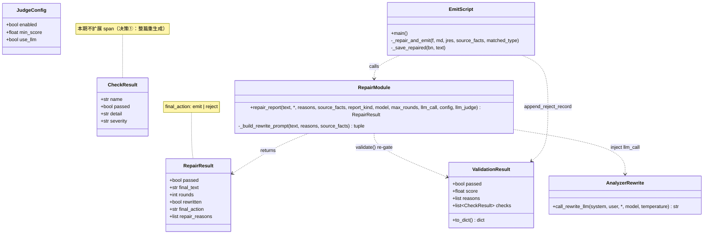
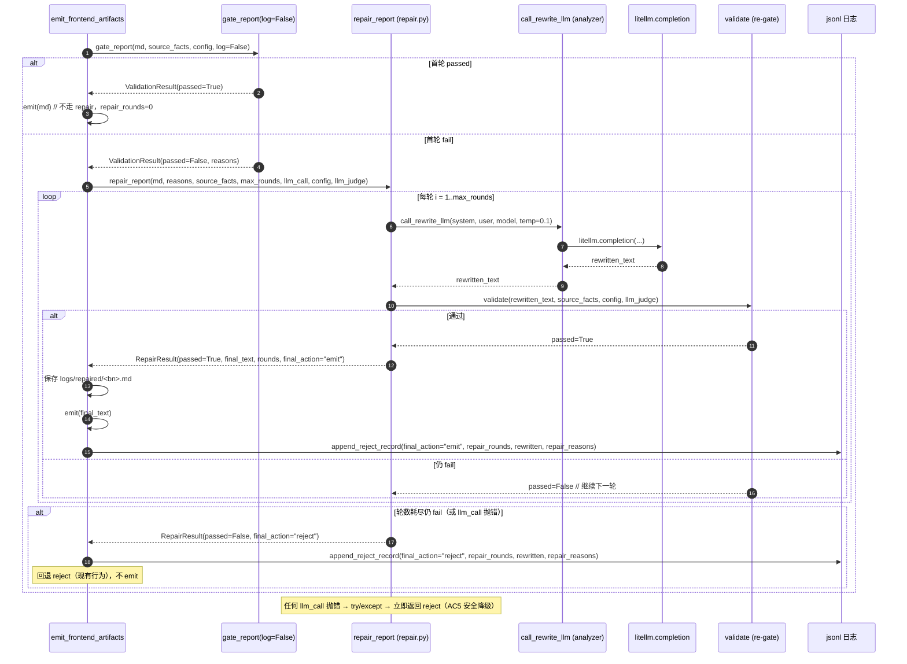
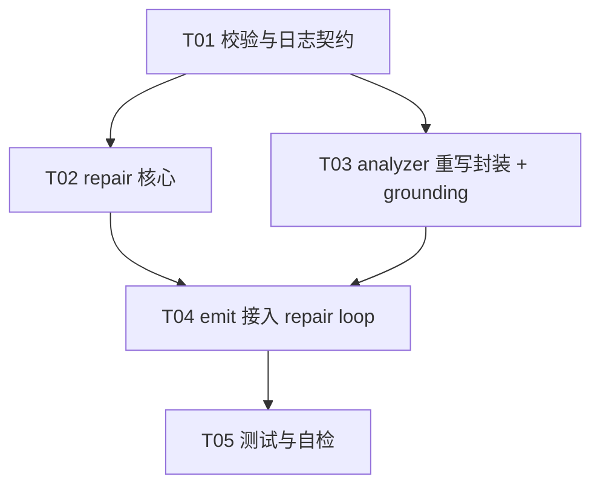

# 架构设计（增量）— U3 升级：防幻觉闭环（repair loop）

> 范围：仅描述 U3 从 **reject-only → repair+grounding** 的**变更部分**。设计遵循**最小变更原则**：不破坏现有 `tests/test_judge_gate.py` 的 10/10，repair 作为新增分支，超限时回退到现有 reject 行为。
> 主线仓：`dsa-test/`；设计产出：`docs/arch_u3_antihalluc.md`（本文）。
> 关联 PRD：`docs/prd_u3_antihalluc.md`。

---

## 1. 实现方案 + 框架选型

### 1.1 技术难点与选型

| 难点 | 决策 |
|---|---|
| repair 需要模型调用，但 emit 脚本当前**无任何 LLM 客户端** | 新增 `src/core/repair.py` 作为**纯逻辑 + 可注入 `llm_call`** 的封装；真实调用通过注入 `analyzer.call_rewrite_llm` 复用 `analyzer.py` 已 import 的 `litellm` 依赖（**不新增重依赖**）。 |
| repair.py 被破坏测试 / 引入 analyzer 巨型模块 | `repair.py` **不 import analyzer**，仅依赖标准库 + `src/core/validator.validate`（纯标准库）。`llm_call` 由 emit 注入，单测用 mock，零网络、零重型 import。 |
| 不得绕过现有 gate 主逻辑 | `validator.py` 主逻辑**完全不动**；仅做**增量**扩展（见 §3）。repair 每次重写后走与首轮**完全相同**的 `validate()` 入口（含红线/一致性/不可能数值/未举证 + 可选数字核对/LLM judge）。 |
| 安全降级（模型故障不崩流水线） | rewrite 调用全程 `try/except`；异常即退出循环、回退 reject，绝不抛到 emit 主循环。 |

**框架/库**：纯 Python + 标准库（与 `validator.py` 一致）。模型调用复用项目已有依赖 `litellm`（已在 `requirements.txt` / pipeline 使用，analyzer 已 import）。**不新增任何第三方依赖**。

**架构模式**：脚本式 pipeline（emit 为部署前唯一全量读报告关卡）+ 纯函数式 repair 模块 + 依赖注入（llm_call / validate_fn 可替换）。无 OOP 框架开销。

### 1.2 四大待确认问题 —— 明确决策

> 下列 4 点直接回应 PRD §6 待确认项，为硬性结论。

**① 重写粒度：整篇重生成（推荐）**

- **决策**：采用**整篇重生成**，不实现段落 patch。
- **理由**：
  1. 当前 `CheckResult` 仅存人类可读 `detail`，**无违规 span/行号**；段落 patch 需扩展 `CheckResult` 增加 `span`/`matched_text`，工作量大且会触及 `test_judge_gate.py` 的 10/10 断言，风险高。
  2. PRD P0-1 明确允许「原报告全文 + 违规反馈 + source_facts → 调用模型重写违规部分；写入后重新跑完整 gate」。整篇重生成天然复用 analyzer 的 rewrite 能力。
  3. **最小风险路径**：整篇重写后**强制完整 re-gate**（AC6）——即便模型改坏了正常段落或只修好部分，未通过仍进下一轮 / 超限 reject，**绝不会 emit 不合格报告**。因此「改动正常段落」的风险被 re-gate 兜底，不会外泄到 GitHub Pages。
- **结论**：`validator.py` 的 `CheckResult` **本期不扩展 span**（保留 10/10）。段落 patch 列为后续可选优化，不在 U3 范围。
- 复用入口：`analyzer.py` 新增模块级 `call_rewrite_llm(system, user, *, model, temperature)` 封装 `litellm.completion`。

**② `REPAIR_MAX_ROUNDS` 默认 `2`（上限 3）**

- **决策**：默认 `2`，环境变量可覆盖，**硬上限 3**。
- **理由**：默认 2 = 最多 1 次 rewrite 后 re-gate + 第 2 次兜底（共 2 次模型调用 + 2 次完整 gate），在成本/延迟与修复成功率间平衡。PRD P0-2 亦建议默认 2。设为 3 仅作异常兜底，不建议日常使用（每轮一次模型调用 + 一次完整 gate）。
- 含义：`repair_rounds` = 实际发生的 rewrite 模型调用次数（首轮即通过为 `0`）。

**③ rewrite 模型：复用主模型 `deepseek/deepseek-v4-flash`，低温度**

- **决策**：
  - 模型：复用 `LITELLM_MODEL`（即 `deepseek/deepseek-v4-flash`），通过新环境变量 `REPAIR_MODEL` 覆盖（默认 = `LITELLM_MODEL`）。**不引入独立轻量模型**（避免额外配置与密钥管理）。
  - 温度：**低温度 `0.1`**（环境变量 `REPAIR_TEMPERATURE` 可覆盖），「照反馈改、不自由发挥」，降低引入新幻觉的概率。
  - 封装落点：**新建 `src/core/repair.py`**（逻辑 + 可注入 llm_call，便于单测）；analyzer 仅新增一个**模块级** `call_rewrite_llm` 薄包装供注入。repair.py 因此不依赖 analyzer 巨型模块。

**④ `source_facts` 是否必填：本期不强制，缺失即退化**

- **决策**：
  - **不强制** `.facts.json` 侧车必填（与 P1-1 grounding 解耦，避免本轮改 pipeline 注入链）。
  - **退化策略**：侧车缺失（`source_facts=None`）时，repair 仍运行，仅依靠 `reasons`（校验反馈的人读违规原因）作为改写信号让模型自纠；准确率下降但 re-gate 仍兜底。
  - 侧车存在时，作为 grounding 上下文注入 rewrite prompt（「结论须与行情源一致」），提升修复精度。
  - **不**在本轮强制 pipeline 产出侧车；建议 P1 阶段再推动 grounding 联动强制侧车（见 §6 待明确）。

---

## 2. 文件列表（相对仓库根 `dsa-test/`，新增 / 修改）

| 文件 | 动作 | 说明 |
|---|---|---|
| `src/core/repair.py` | **新增** | repair 核心：`RepairResult` + `repair_report()`；构造 rewrite prompt、循环、安全降级、调用 `validate` 再校验。仅依赖标准库 + `validator.validate`。 |
| `src/core/prompts_repair.py` | **新增** | repair 的 system / user prompt 模板常量（含 grounding 约束文案），与 analyzer 报告生成 prompt 的 grounding 段共享措辞。 |
| `src/core/validator.py` | **修改（增量）** | ① `gate_report(..., log: bool = True)` 增加 `log` 开关；② 新增公共 `append_reject_record(log_path, report_kind, result, context=None, **extra)` 供 emit 写带 repair 字段的终态记录。**主校验逻辑不变**。 |
| `src/analyzer.py` | **修改（增量）** | 新增模块级 `call_rewrite_llm(system, user, *, model=None, temperature=0.1) -> str`，薄封装 `litellm.completion`（复用已 import 的 `litellm` 与 env 配置）。P1-1：在报告生成 prompt 追加 grounding 约束。 |
| `scripts/emit_frontend_artifacts.py` | **修改** | 将 line 125–138 的 `not passed → continue` 改为：首轮 `gate_report(log=False)` → 失败进 `repair_report` loop → 通过则 emit + 落盘 `logs/repaired/`；超限/降级则 `append_reject_record(final_action="reject")`。并预留 LLM judge 注入（P1-2）。 |
| `tests/test_repair_loop.py` | **新增** | 覆盖 AC1/AC3/AC4/AC5/AC6 的 repair 回归用例（mock `llm_call`）。 |
| `docs/arch_u3_antihalluc.md` | **新增（本文）** | 架构设计文档（架构师产出）。 |
| `docs/sequence-diagram.mermaid` | **新增** | §4 时序图独立文件。 |
| `docs/class-diagram.mermaid` | **新增** | §3 类图独立文件。 |

> 现有 `tests/test_judge_gate.py`（10/10）**只读、不改**；其断言依赖的 `CheckResult`/`ValidationResult`/`gate_report` 行为保持不变（仅 `gate_report` 新增默认 `True` 的 `log` 形参，向后兼容）。

---

## 3. 数据结构与接口（Mermaid 类图 + 签名）



### 3.1 `src/core/repair.py` 核心签名

```python
@dataclass
class RepairResult:
    passed: bool            # 最终是否通过完整 gate
    final_text: str         # 通过=修正后文本；失败=原始文本（永不 emit 不合格版）
    rounds: int             # 实际 rewrite 次数（首轮即通过=0）
    rewritten: bool         # 是否真正发起过模型重写（rounds>0）
    final_action: str       # "emit" | "reject"
    repair_reasons: list[str]  # 喂给模型的首轮违规原因（便于回查）

def repair_report(
    text: str,
    *,
    reasons: list[str],                 # 来自首轮 ValidationResult.reasons
    source_facts: "dict | None" = None, # <stem>.facts.json 侧车；可空（决策④）
    report_kind: str = "stock",         # stock | market | vibe
    model: "str | None" = None,         # 默认 REPAIR_MODEL / LITELLM_MODEL
    max_rounds: int = 2,                # REPAIR_MAX_ROUNDS，硬上限 3
    llm_call: "Callable[[str, str], str]",  # (system, user) -> text；注入 analyzer.call_rewrite_llm
    config: "JudgeConfig | None" = None,# 与首轮相同，保证完整 gate 不绕过
    llm_judge: "Callable | None" = None,# 可选 LLM judge（P1-2 预留）
    temperature: float = 0.1,           # REPAIR_TEMPERATURE
) -> RepairResult:
    """fail→重写→再校验循环。任意 llm_call 抛错即安全降级返回 reject。"""
```

### 3.2 `src/analyzer.py` 新增模块级函数（复用现有 `litellm`）

```python
def call_rewrite_llm(
    system_prompt: str,
    user_prompt: str,
    *,
    model: "str | None" = None,   # 默认 LITELLM_MODEL
    temperature: float = 0.1,
) -> str:
    """薄封装 litellm.completion（复用 analyzer 已配置的 litellm + env 密钥）。"""
    # 等价于现有 _dispatch_litellm_completion 末尾的 litellm.completion(**kwargs)
    # 不依赖 analyzer 实例 / Router，避免 pull 整个运行时
```

### 3.3 `src/core/validator.py` 增量扩展（向后兼容）

```python
def gate_report(text, *, source_facts=None, report_kind="stock",
                config=None, log_path="logs/judge_rejects.jsonl",
                context=None, llm_judge=None,
                log: bool = True) -> ValidationResult:
    # log=False 时仅校验、不写 jsonl（emit 自行控制终态日志）

def append_reject_record(log_path, report_kind, result: ValidationResult,
                         context=None, **extra) -> None:
    # 公共函数：写入一条 jsonl，合并 extra（repair_rounds/rewritten/final_action/repair_reasons）
    # 失败静默，不阻断主流程
```

---

## 4. 程序调用流程（Mermaid 时序图）



> 时序图独立文件：`docs/sequence-diagram.mermaid`；类图独立文件：`docs/class-diagram.mermaid`。

---

## 5. 任务列表（有序 + 依赖，按实现顺序排列）

> 共 5 个任务，满足「≤5 任务、按模块分组、T01 为基础设施契约、不拆单文件」约束。每个任务 ≥3 个相关文件。

### T01 — 校验与日志契约扩展（基础，P0）
- **Source Files**：`src/core/validator.py`、`tests/test_judge_gate.py`（回归验证 10/10 不破）、`docs/arch_u3_antihalluc.md`（本文基线）
- **Dependencies**：无
- **Priority**：P0
- **内容**：`gate_report` 增加 `log: bool = True` 形参；新增公共 `append_reject_record(...)`（支持 `**extra` 合并 repair 字段）。校验主逻辑、CheckResult/ValidationResult 不变 → 10/10 保持。

### T02 — repair 核心模块（P0）
- **Source Files**：`src/core/repair.py`（新增）、`src/core/prompts_repair.py`（新增）、`src/core/validator.py`（被 `repair_report` import `validate`，依赖 T01 契约）
- **Dependencies**：T01
- **Priority**：P0
- **内容**：实现 `RepairResult` + `repair_report`：构造 rewrite prompt（整篇重生成）、`for i in range(max_rounds)` 循环调用注入的 `llm_call` → `validate` 再校验 → 通过返回 emit / 失败继续 / 超限或抛错返回 reject；全程 `try/except` 安全降级；`final_text` 失败时回退原始文本。

### T03 — analyzer 重写调用封装 + grounding（P0/P1）
- **Source Files**：`src/analyzer.py`（新增模块级 `call_rewrite_llm`；P1-1 报告生成 prompt 追加 grounding 约束）、`src/core/repair.py`（llm_call 注入契约对接，依赖 T02）、`src/core/prompts_repair.py`（grounding 措辞共享）
- **Dependencies**：T01（litellm 已 import，无需 validator）；逻辑上独立，可与 T02 并行
- **Priority**：P0（`call_rewrite_llm` 为 emit 所需）/ P1（grounding prompt 段）
- **内容**：`call_rewrite_llm` 薄封装 `litellm.completion`（复用 env 配置、默认 `deepseek/deepseek-v4-flash`、temp 0.1）；P1-1 在 analyzer 报告生成 prompt 强制「数字须来自行情 context、禁编造、涨跌停/价位结论须与 source_facts 一致」。

### T04 — emit 接入 repair loop + LLM judge 预留 + 落盘（P0/P1）
- **Source Files**：`scripts/emit_frontend_artifacts.py`（改 gate 分支）、`src/analyzer.py`（emit 内 lazy import `call_rewrite_llm`，依赖 T03）、`src/core/repair.py`（emit import `repair_report`，依赖 T02）
- **Dependencies**：T02、T03
- **Priority**：P0（loop 接入）/ P1（judge 预留）
- **内容**：首轮 `gate_report(log=False)`；fail → `repair_report(..., llm_call=call_rewrite_llm, config=_JUDGE_CONFIG, llm_judge=注入当 JUDGE_USE_LLM)`；通过则 `emit(final_text)` 并 `append_reject_record(final_action="emit", ...)` + 落盘 `logs/repaired/<bn>.md`；超限/降级则 `append_reject_record(final_action="reject", ...)`。P1-2：确认 `JUDGE_USE_LLM` + `llm_judge` 注入通道可接真实 DeepSeek judge（本轮不强制激活）。

### T05 — 测试与自检（P1 + 收尾）
- **Source Files**：`tests/test_repair_loop.py`（新增，AC1/AC3/AC4/AC5/AC6）、`src/core/repair.py`（`python -m py_compile` 自检）、`docs/arch_u3_antihalluc.md`（终稿）
- **Dependencies**：T04
- **Priority**：P1
- **内容**：用 mock `llm_call` 覆盖 AC1（真实样本修好 emit）、AC3（正常样本不进 loop）、AC4（超轮 reject）、AC5（llm_call 抛错安全降级）、AC6（部分修复仍 fail）。运行 `python -m py_compile src/core/repair.py src/core/validator.py scripts/emit_frontend_artifacts.py` 与 `pytest tests/test_judge_gate.py tests/test_repair_loop.py` 确保 10/10 + 新增全绿。

### 任务依赖图（Mermaid）



---

## 6. 依赖包

```
- 标准库（json / re / dataclasses / pathlib / datetime）：validator/repair 已使用，无新增
- litellm（已在 requirements.txt / analyzer 依赖）：仅复用，repair 不直连，经 analyzer.call_rewrite_llm 注入
# 不新增任何第三方依赖；repair 单测用 unittest.mock 注入 llm_call，零网络
```

---

## 7. 共享知识（跨文件约定）

- **jsonl 新增字段**（写入 `logs/judge_rejects.jsonl`，由 `append_reject_record` 合并，旧字段 `ts/kind/passed/score/reasons/checks/context` 保持兼容）：
  - `repair_rounds: int` — 实际 rewrite 次数（首轮通过 = `0`）。
  - `rewritten: bool` — 是否真正发起过模型重写。
  - `final_action: str` — `"emit"`（修好发布）/ `"reject"`（超限或降级丢弃）。
  - `repair_reasons: list[str]` — 喂给模型重写的首轮违规原因。
  - **写入时机**：① 修好并 emit → 写一条 `final_action="emit"`；② 超轮/降级 reject → 写 `final_action="reject"`；③ 首轮即通过**仍不写**（维持现状，零噪音）。
- **环境变量**（emit 读取，均有默认值，不写死）：
  - `REPAIR_MAX_ROUNDS`（默认 `2`，硬上限 `3`）
  - `REPAIR_MODEL`（默认 = `LITELLM_MODEL` = `deepseek/deepseek-v4-flash`）
  - `REPAIR_TEMPERATURE`（默认 `0.1`）
- **rewrite 模型策略**：复用主模型；低温度 0.1「照反馈改、不自由发挥」；封装落 `src/core/repair.py`（逻辑），真实调用经 `analyzer.call_rewrite_llm` 注入。
- **source_facts 非必填**：缺失（`None`）时 repair 仅靠 `reasons` 自纠；存在时作为 grounding 注入 rewrite prompt。本期不强制 pipeline 产出侧车。
- **repaired md 落盘**：修复成功发布的报告另存 `logs/repaired/<bn>.md`（**不放 `reports/`**，避免下一轮 emit 把它当成新报告重新处理）。
- **完整 gate 不可绕过**：repair 每次 re-gate 均走 `validate()`（与首轮同 `config`/`llm_judge`），禁止对任何 check 豁免。
- **安全降级契约**：`llm_call` 抛错 → `repair_report` 立即返回 `RepairResult(passed=False, final_action="reject")`，emit 据此 reject 且不阻断其余报告。

---

## 8. 待明确事项

1. **`.facts.json` 强制化**：P1-1 grounding 若要真正压住幻觉，建议后续强制 pipeline 在生成阶段产出侧车（analyzer 写入 `<stem>.facts.json`）。本期不强制，仅「有则用」。
2. **LLM judge 真值来源**：P1-2 接口已预留（`JUDGE_USE_LLM` + `llm_judge`），但本轮不激活真实 DeepSeek judge；若后续启用，需确认 judge 返回的修正建议如何并入 rewrite prompt（当前仅用启发式 `reasons`）。
3. **repair 触发成本**：默认 2 轮在「大量报告同时 fail」时会增加 emit 阶段 API 调用与延迟（GitHub Actions 超时风险）。若生产出现，可考虑 `REPAIR_MAX_ROUNDS=1` 或只对 `severity=critical` 的报告 repair。
4. **repaired md 存放位置**：当前定 `logs/repaired/`，若团队偏好 `reports/` 同级需再议（需注意勿被 emit 重新 glob）。
5. **`gate_report(log=False)` 的其它调用方**：确认除 emit 外无其他脚本依赖「fail 即自动写 jsonl」的副作用（默认 `log=True` 已保持，理论上无影响）。
