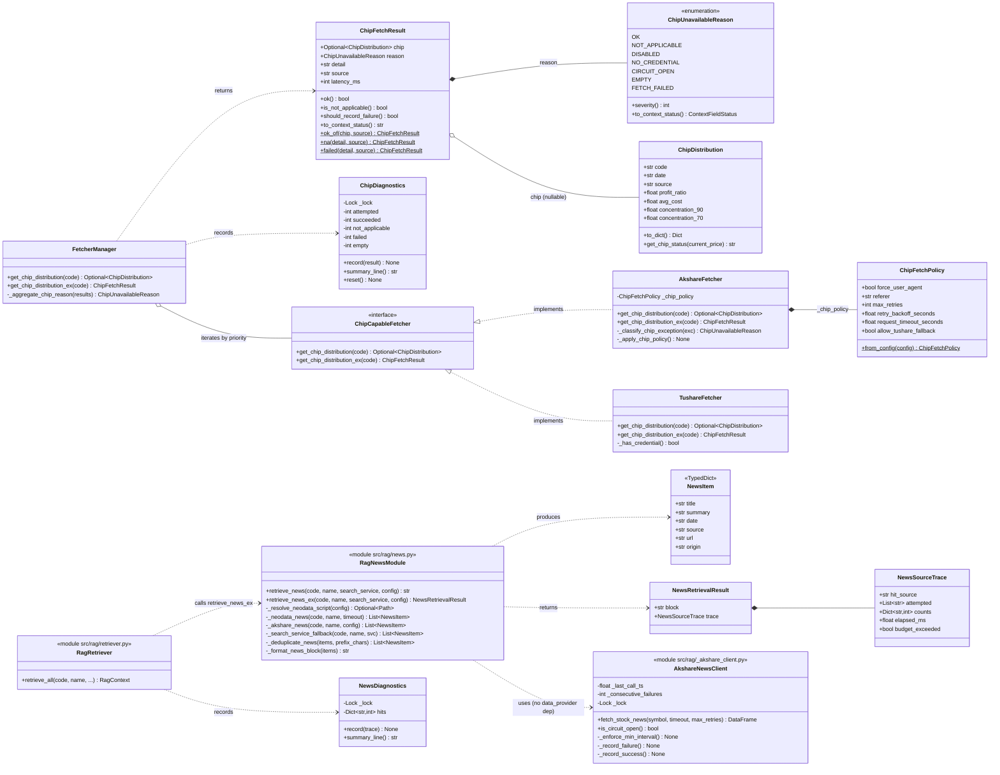
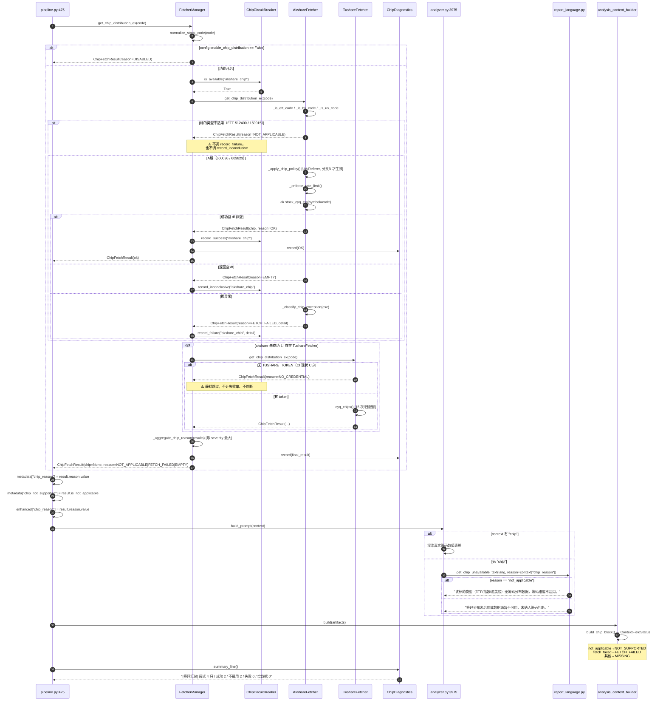
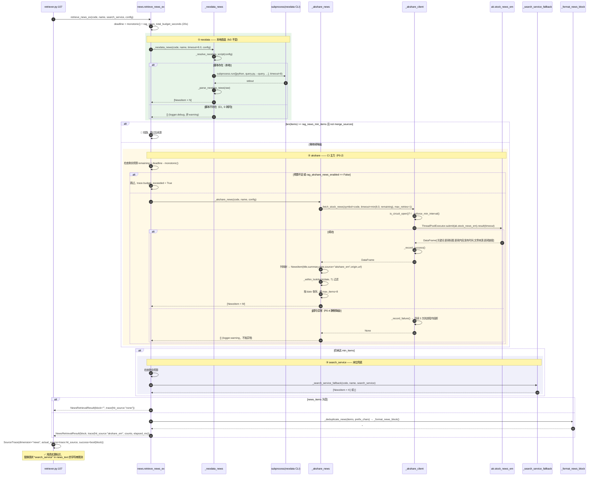
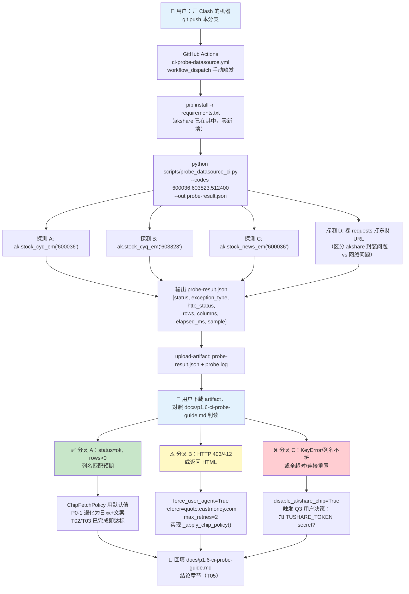
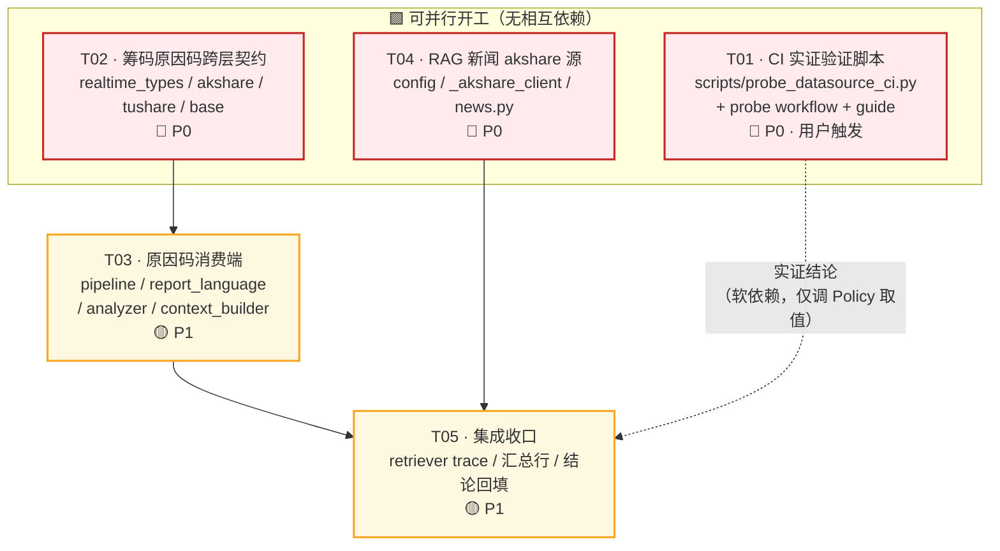

# P1.6 增量架构设计 — 筹码分布修复 & RAG 新闻 CI 化

| 项 | 内容 |
|---|---|
| 文档类型 | 增量架构设计 + 任务分解（仅描述变更部分） |
| 版本 | v1.0 |
| 编写人 | 高见远（架构师） |
| 上游输入 | `docs/p1.6-incremental-prd.md`（许清楚 / 产品经理） |
| 项目 | dsa-test — A股每日分析系统 |
| 语言 | 中文 |
| 落盘路径 | `docs/p1.6-arch-design.md` |
| 附属产物 | `docs/p1.6-class-diagram.mermaid`、`docs/p1.6-sequence-diagram.mermaid` |

---

## 0. 设计前提与环境硬约束（决定性）

> 本节是全部设计决策的地基，工程师实施前必须先读。

| # | 约束 | 对设计的强制影响 |
|---|---|---|
| **C1** | 当前执行沙箱**无 Clash 代理、Python 出网被阻断、无法 push GitHub** | 所有"接口是否可用"的结论**在本地不可证伪**（PRD F1 已证：`curl` 200 而 Python `RemoteDisconnected`）。**禁止**据本地失败现象修改任何接口调用逻辑 |
| **C2** | CI 实证只能由用户在开 Clash 的机器 push 后手动触发 | P0-1 的第一个交付物必须是**可独立运行的验证脚本 + 手动触发 workflow**，而非代码修复 |
| **C3** | 代码改造必须**同时兼容三种实证结果** | 筹码链路的"修复"不能写死某一种假设，必须做成**策略参数化**（见 §3.4 `ChipFetchPolicy`），三分叉落地时只调开关/参数，不改架构 |
| **C4** | 本地只能做 **mock 测试** | 所有新增单测一律 monkeypatch/mock 掉 `akshare` 与 `subprocess`，**禁止**任何实调网络的单测（网络实调归 `pytest -m network`，由 `network-smoke.yml` 在 CI 跑） |
| **C5** | CI 只有 `DEEPSEEK_API_KEY` 一个 secret（PRD F2） | tushare 筹码兜底按"**有 token 才启用**"设计，无 token 时**静默跳过且不计入失败率、不触发熔断** |
| **C6** | CI 零新增依赖 | `akshare>=1.12.0` 已在 `requirements.txt:14`，本期**不新增任何三方包** |

### 核心设计信条

> **把"不确定的外部事实"隔离在策略参数里，把"确定的内部契约"固化在类型里。**

- 不确定的（需 CI 实证）：`stock_cyq_em` 在 ubuntu-latest 能否跑通 → 收敛到 `ChipFetchPolicy` 一个数据类
- 确定的（可立即施工）：原因码跨层契约、新闻多源降级拓扑、配置项、路径解析 → 可与 T01 并行开工

---

## 1. 实现方案 / Implementation Approach

### 1.1 技术难点分析

| # | 难点 | 本质 | 解法 |
|---|---|---|---|
| D1 | 根因不可本地证伪 | 环境隔离，非代码缺陷 | 把"验证"从"修复"里剥离成独立可交付物（T01），验证脚本零业务依赖、单文件可跑 |
| D2 | 三分叉方案不能并存三套代码 | 方案分叉会导致代码分叉 | **策略对象参数化**：三种结果映射到同一个 `ChipFetchPolicy` 的不同取值，代码路径唯一 |
| D3 | "ETF 无筹码" 与 "接口挂了" 在 `None` 处无法区分 | **信息在数据层被丢弃**，渲染层无从恢复 | 引入 `ChipFetchResult(chip, reason)` 原因码回传，且**并列新增而非破坏式变更**返回类型（§3.2） |
| D4 | ETF 的正常空值会污染熔断器与失败率 | 语义错误地复用了"失败"通道 | 熔断器分流：只有 `FETCH_FAILED` 才 `record_failure`；`NOT_APPLICABLE` / `NO_CREDENTIAL` **完全不触碰熔断器** |
| D5 | rag 层要调 akshare，是否复用 data_provider 设施 | 分层依赖方向问题 | **不跨层**。rag 层自建 80 行极简客户端（§3.5、Q7 结论） |
| D6 | CI 时间预算紧（analyze-emit 25min） | 多源串行叠加超时 | **串行短路 + 单标的总预算 deadline**（§3.6、Q8 结论） |
| D7 | 硬编码 Windows 路径 | 配置未外化 | `config → env → 候选路径`三级解析，未命中走 debug 级降级（§3.7） |

### 1.2 框架选型

**本期无新框架、无新依赖。** 全部沿用现有栈：

| 层 | 沿用组件 | 本期用法 |
|---|---|---|
| 数据源 | `akshare>=1.12.0`（已在 requirements） | 筹码 `stock_cyq_em`（现有）+ 新闻 `stock_news_em`（新增用法，非新依赖） |
| 数据源兜底 | `tushare>=1.4.0`（已在 requirements） | 保留但降级为"有 token 才启用"的可选路径 |
| 外部检索 | neodata CLI（`subprocess`，本地优先） | 路径解析改为 config 驱动，行为不变 |
| 配置 | `src/config.py` dataclass + `parse_env_*` | 新增 8 个 `rag_*` 字段，风格对齐 `src/config.py:1248-1253` |
| 契约 | `dataclass` + `str, Enum` | 新增 `ChipUnavailableReason` / `ChipFetchResult` |
| 状态语义 | `src/schemas/analysis_context_pack.py:38 ContextFieldStatus` | **复用**已有枚举（`NOT_SUPPORTED` / `FETCH_FAILED` / `MISSING`），不造新枚举 |
| 测试 | `pytest` + `unittest.mock` | 全 mock，零网络 |
| CI | GitHub Actions，`workflow_dispatch` | 新增 probe workflow，模式对齐现有 `network-smoke.yml` |

### 1.3 架构模式

- **策略参数化（Strategy-as-Data）**：`ChipFetchPolicy` 是纯数据类而非多态类层次，避免为三种实证结果造三个子类
- **原因码回传（Result Object）**：以 `ChipFetchResult` 取代裸 `Optional`，但**保留旧签名做 shim**，实现零破坏迁移
- **责任链短路（Chain of Responsibility + Deadline）**：新闻多源串行降级，带全局 deadline
- **分层依赖单向**：`src/rag/*` ⇸ `data_provider/*` 双向禁止（§7 共享知识）

---

## 2. 文件列表 / File List

### 2.1 新增文件

| 相对路径 | 类型 | 职责 | 所属任务 |
|---|---|---|---|
| `scripts/probe_datasource_ci.py` | 脚本 | **CI 实证验证脚本**。零业务依赖，探测 `stock_cyq_em` / `stock_news_em` 可用性，输出结构化 JSON + 人类可读日志 | T01 |
| `.github/workflows/ci-probe-datasource.yml` | CI | `workflow_dispatch` 手动触发 job，跑 probe 脚本并上传 artifact | T01 |
| `docs/p1.6-ci-probe-guide.md` | 文档 | 用户触发步骤 + **三分叉判读表**（结果 → 应落地的 policy 取值） | T01 |
| `tests/test_probe_datasource_ci.py` | 测试 | mock akshare，验证 probe 脚本的三种分类逻辑与 JSON schema | T01 |
| `tests/test_chip_reason_contract.py` | 测试 | 原因码枚举、严重度聚合、熔断分流的 mock 单测 | T02 |
| `tests/test_chip_reason_rendering.py` | 测试 | 原因码 → 文案 / ContextFieldStatus 的分流断言 | T03 |
| `src/rag/_akshare_client.py` | 模块 | **rag 层私有** akshare 极简客户端：模块级限频 + 超时 + 单次重试 + 进程内熔断。**零跨层依赖** | T04 |
| `tests/test_rag_news_akshare.py` | 测试 | `_akshare_news()` 字段映射 / 时间窗 / 异常降级，全 mock | T04 |
| `tests/test_rag_news_integration.py` | 测试 | 多源降级拓扑、短路、deadline、trace 回传的集成级 mock 测试 | T05 |

### 2.2 修改文件

| 相对路径 | 关键改动点 | 所属任务 |
|---|---|---|
| `data_provider/realtime_types.py` | 新增 `ChipUnavailableReason` / `ChipFetchResult` / `ChipFetchPolicy` / `ChipDiagnostics`；`ChipDistribution` 不动 | T02 |
| `data_provider/akshare_fetcher.py:1575` | 抽出 `get_chip_distribution_ex()`；原 `get_chip_distribution()` 降为 shim；接入 `ChipFetchPolicy`（UA/Referer/重试退避钩子） | T02 |
| `data_provider/tushare_fetcher.py:1151` | 抽出 `get_chip_distribution_ex()`；无 token → `NO_CREDENTIAL`；原方法降为 shim | T02 |
| `data_provider/base.py:2117` | 新增 `FetcherManager.get_chip_distribution_ex()`；原因码严重度聚合；熔断器分流；诊断计数 | T02 |
| `src/core/pipeline.py:475` | 改调 `_ex`，落 `metadata["chip_reason"]` / `enhanced["chip_reason"]`；批次末尾输出 `[筹码汇总]` 行 | T03 |
| `src/report_language.py:319` | 文案拆两条；`get_chip_unavailable_text(language, reason=None)` 向后兼容签名 | T03 |
| `src/analyzer.py:3960` / `:904` | else 分支按 `chip_reason` 取文案 | T03 |
| `src/services/analysis_context_builder.py:317` | `chip_reason` → `ContextFieldStatus` 映射（兼容既有 `chip_not_supported`） | T03 |
| `src/config.py:1250` / `:2218` | 新增 8 个 `rag_*` 字段 + `from_env` 解析 | T04 |
| `config.yaml:78` | `rag:` 节点扩展 8 项，带中文注释 | T04 |
| `src/rag/news.py:26` | **删除硬编码路径**；`_resolve_neodata_script(config)` 三级解析；新增 `_akshare_news()`；`retrieve_news` 改串行短路 + deadline；新增 `retrieve_news_ex()` 回传 trace | T04 / T05 |
| `src/rag/retriever.py:107` | 改调 `retrieve_news_ex()`，`SourceTrace.actual_source` 用真实源标识（去掉字符串猜测） | T05 |
| `docs/p1.6-ci-probe-guide.md` | 回填 CI 实证结论 | T05 |

### 2.3 明确不改动（对齐 PRD N1-N7）

- `.github/workflows/daily-analysis-v2.yml`（双 job / 15+25min / max_workers=5 保持不变，N7）
- `web/`、`templates/`、报告 UI（N2）
- `src/rag/retriever.py` 的编排契约（仅改 trace 字段来源，不改函数签名，N4）
- `data_provider/base.py` 中除筹码外的任何链路

---

## 3. 数据结构与接口 / Data Structures and Interfaces

### 3.1 类图



### 3.2 ⭐ 跨层契约核心：筹码"原因码"（PRD Q8 / 第三优先级第 8 条）

#### 3.2.1 为什么不能直接改 `get_chip_distribution` 的返回类型

现存调用点共 **6 处生产代码 + ≥8 处测试引用**（`grep -rn "get_chip_distribution"` 实测）：

```
src/core/pipeline.py:475               ← 主链路
src/agent/tools/data_tools.py:402      ← Agent 工具（LLM function calling schema）
data_provider/akshare_fetcher.py:1682  ← get_enhanced_data 内部
data_provider/base.py:2179             ← manager 内部转发
data_provider/akshare_fetcher.py:2309  ← __main__ 自测
data_provider/tushare_fetcher.py:1336  ← __main__ 自测

tests/test_chip_distribution_manager.py（×3）
tests/test_agent_pipeline.py:1635
tests/test_pipeline_daily_market_context.py:281
tests/test_pipeline_market_phase_context.py:79
tests/test_realtime_quote_fallback_logging.py:72
tests/test_tushare_fetcher_followups.py:145
tests/test_tushare_fetcher_get_stock_list.py（×2）
```

**结论：破坏式变更成本过高且违反"增量设计"约束（PRD N4 精神）。**

#### 3.2.2 采用方案：并列新增 `_ex` 入口 + 旧签名降为 shim

```python
# ── data_provider/realtime_types.py（新增）────────────────────────────

class ChipUnavailableReason(str, Enum):
    """筹码不可用原因码。str 混入使其可直接 JSON 序列化 / 写入 metadata。"""
    OK             = "ok"              # 成功
    NOT_APPLICABLE = "not_applicable"  # 标的类型本就无筹码（ETF/指数/港股/美股）
    DISABLED       = "disabled"        # config.enable_chip_distribution=False
    NO_CREDENTIAL  = "no_credential"   # tushare 无 TUSHARE_TOKEN（CI 现状，C5）
    CIRCUIT_OPEN   = "circuit_open"    # 熔断中
    EMPTY          = "empty"           # 接口通但返回空 / 字段不完整
    FETCH_FAILED   = "fetch_failed"    # 网络异常 / HTTP 错误 / 解析异常

    @property
    def severity(self) -> int:
        """聚合排序用严重度。数值越大越"像故障"。"""
        return {
            "ok": -1, "disabled": -1,
            "not_applicable": 0,
            "circuit_open": 1,
            "no_credential": 2,
            "empty": 3,
            "fetch_failed": 4,
        }[self.value]

    def to_context_status(self) -> str:
        """映射到既有 ContextFieldStatus（不造新枚举）。"""
        return {
            "ok":             "available",
            "not_applicable": "not_supported",
            "fetch_failed":   "fetch_failed",
        }.get(self.value, "missing")   # disabled/empty/no_credential/circuit_open → missing


@dataclass
class ChipFetchResult:
    chip: Optional[ChipDistribution] = None
    reason: ChipUnavailableReason = ChipUnavailableReason.FETCH_FAILED
    detail: str = ""          # 简短诊断串，如 "ConnectionError: RemoteDisconnected"
    source: str = ""          # 命中或最后尝试的 fetcher 名
    latency_ms: int = 0

    @property
    def ok(self) -> bool:
        return self.chip is not None and self.reason is ChipUnavailableReason.OK

    @property
    def is_not_applicable(self) -> bool:
        return self.reason is ChipUnavailableReason.NOT_APPLICABLE

    @property
    def should_record_failure(self) -> bool:
        """⚠️ 熔断分流关键：仅真故障计入熔断，避免 ETF 把 akshare 筹码熔掉。"""
        return self.reason is ChipUnavailableReason.FETCH_FAILED

    @property
    def should_record_provider_run(self) -> bool:
        """NOT_APPLICABLE / NO_CREDENTIAL 不计入失败率（PRD US-3）。"""
        return self.reason not in (
            ChipUnavailableReason.NOT_APPLICABLE,
            ChipUnavailableReason.NO_CREDENTIAL,
        )

    def to_context_status(self) -> str:
        return self.reason.to_context_status()

    # 工厂方法（工程师优先用这些，避免手搓 reason）
    @classmethod
    def ok_of(cls, chip, source: str, latency_ms: int = 0): ...
    @classmethod
    def na(cls, detail: str, source: str): ...      # NOT_APPLICABLE
    @classmethod
    def empty(cls, detail: str, source: str): ...
    @classmethod
    def failed(cls, detail: str, source: str): ...
    @classmethod
    def no_credential(cls, source: str): ...
```

#### 3.2.3 Fetcher 层签名（向后兼容 shim）

```python
# ── data_provider/akshare_fetcher.py ────────────────────────────────
class AkshareFetcher:
    def get_chip_distribution_ex(self, stock_code: str) -> ChipFetchResult:
        """真正的实现。前置类型跳过 → NOT_APPLICABLE；异常 → 分类到 EMPTY/FETCH_FAILED。"""

    def get_chip_distribution(self, stock_code: str) -> Optional[ChipDistribution]:
        """向后兼容 shim —— 一行转发，签名与行为对既有调用者完全不变。"""
        return self.get_chip_distribution_ex(stock_code).chip
```

`TushareFetcher` 同构，额外增加：

```python
    def _has_credential(self) -> bool:
        """无 TUSHARE_TOKEN 时返回 False（C5：CI 现状）。"""

    def get_chip_distribution_ex(self, code) -> ChipFetchResult:
        if not self._has_credential():
            logger.debug("[筹码] TushareFetcher 无 token，跳过（不计失败、不熔断）")
            return ChipFetchResult.no_credential("TushareFetcher")
        ...
```

#### 3.2.4 Manager 层聚合规则（严重度取最大）

```python
# ── data_provider/base.py ───────────────────────────────────────────
class FetcherManager:
    def get_chip_distribution_ex(self, stock_code: str) -> ChipFetchResult:
        """
        聚合规则：
          1. 配置关闭            → DISABLED（短路，不遍历）
          2. 任一源 ok           → 立即返回该 OK 结果（短路）
          3. 全部失败 → 取 severity 最大的 reason 作为最终原因码
        """
```

| 场景 | akshare 结果 | tushare 结果 | 聚合原因码 | 报告文案 | 计入失败率 | 触发熔断 |
|---|---|---|---|---|---|---|
| 600036 成功 | OK | （短路不调） | `OK` | 真实数值 | ✅ 成功 | 否 |
| **512400 ETF** | NOT_APPLICABLE(0) | NOT_APPLICABLE(0) | **`NOT_APPLICABLE`** | 「该标的类型无筹码分布数据」 | ❌ 不计 | **否** |
| 600036 CI 网络失败 | FETCH_FAILED(4) | NO_CREDENTIAL(2) | **`FETCH_FAILED`** | 「数据源暂不可用」 | ✅ 计失败 | 是（仅 akshare） |
| 600036 接口返回空 | EMPTY(3) | NO_CREDENTIAL(2) | **`EMPTY`** | 「数据源暂不可用」 | ✅ 计失败 | inconclusive |
| 全局开关关闭 | — | — | `DISABLED` | 「筹码分布未启用」 | ❌ 不计 | 否 |

> ⚠️ **这修正了现状的一个隐患**：现在 ETF 走 `record_inconclusive()`（`base.py:2210`），虽未直接熔断但仍占用 HALF_OPEN 探测名额。新设计下 ETF 完全不进入熔断器逻辑。

#### 3.2.5 消费端分流（渲染层）

```python
# ── src/report_language.py（拆分文案）───────────────────────────────
_CHIP_UNAVAILABLE_BY_LANGUAGE = {   # 保留原文案，用于 fetch_failed / empty / disabled
    "zh": "筹码分布未启用或数据源暂不可用，未纳入筹码判断。", ...
}
_CHIP_NOT_APPLICABLE_BY_LANGUAGE = {  # 🆕 用于 not_applicable
    "zh": "该标的类型（ETF/指数/港美股）无筹码分布数据，筹码维度不适用。",
    "en": "This instrument type (ETF/index/HK/US) has no chip distribution data; chip analysis is not applicable.",
    "ko": "해당 종목 유형(ETF/지수/홍콩·미국주)은 매물대 데이터가 없어 매물대 분석이 적용되지 않습니다.",
}

def get_chip_unavailable_text(language, reason: Optional[str] = None) -> str:
    """⚠️ reason 为可选参数 → 既有 2 处调用（analyzer.py:904 / :3975）零改动即可编译通过。"""
    lang = normalize_report_language(language)
    if reason == "not_applicable":
        return _CHIP_NOT_APPLICABLE_BY_LANGUAGE[lang]
    return _CHIP_UNAVAILABLE_BY_LANGUAGE[lang]
```

```python
# ── src/analyzer.py:3975 ────────────────────────────────────────────
chip_unavailable_text = get_chip_unavailable_text(
    report_language, reason=context.get('chip_reason')
)
# 且当 reason == "not_applicable" 时，chip_instruction 换成
# 「该标的无筹码数据属正常现象，请勿将其表述为数据故障或数据缺失。」
```

```python
# ── src/services/analysis_context_builder.py:317 ────────────────────
def _build_chip_block(artifacts):
    chip = _to_dict(artifacts.chip_data)
    if not chip:
        md = artifacts.metadata or {}
        reason = md.get("chip_reason")
        # 兼容既有布尔 key（tests/test_analysis_context_builder.py:344 已依赖）
        if md.get("chip_not_supported"):
            reason = reason or "not_applicable"
        status = ContextFieldStatus(_CHIP_REASON_TO_STATUS.get(reason, "missing"))
        ...
```

---

### 3.3 数据流：`chip_reason` 从数据层到报告的完整传递路径

```
AkshareFetcher.get_chip_distribution_ex()
        │ ChipFetchResult(chip=None, reason=NOT_APPLICABLE)
        ▼
FetcherManager.get_chip_distribution_ex()      [聚合 + 熔断分流 + ChipDiagnostics 计数]
        │ ChipFetchResult
        ▼
pipeline.py:475   chip_result = manager.get_chip_distribution_ex(code)
        │         chip_data = chip_result.chip
        │         metadata["chip_reason"]        = chip_result.reason.value
        │         metadata["chip_not_supported"] = chip_result.is_not_applicable   # 兼容旧 key
        ▼
pipeline.py:982   enhanced["chip_reason"] = chip_result.reason.value   # 无 chip 时也写
        │
        ├──► analyzer.py:3975  get_chip_unavailable_text(lang, reason=context["chip_reason"])
        │                       └─► 报告 prompt 文案分流 ✅ US-3 / P1-3
        │
        └──► analysis_context_builder._build_chip_block()
                                └─► ContextFieldStatus.NOT_SUPPORTED vs FETCH_FAILED ✅
```

---

### 3.4 ⭐ `ChipFetchPolicy` —— 兼容三种 CI 实证结果的唯一变更面（C3）

```python
@dataclass(frozen=True)
class ChipFetchPolicy:
    """CI 实证结论的落地载体。三种分叉 = 三组取值，代码路径唯一。"""
    force_user_agent: bool          = False   # 分叉B：真正注入 UA 到 requests session
    referer: str                    = ""      # 分叉B：注入 Referer
    max_retries: int                = 0       # 分叉B：失败重试次数
    retry_backoff_seconds: float    = 1.5     # 分叉B：指数退避基数
    request_timeout_seconds: float  = 10.0
    allow_tushare_fallback: bool    = True    # 分叉C + Q3：有 token 才真正生效
    disable_akshare_chip: bool      = False   # 分叉C 兜底：确认接口已死时整源关闭

    @classmethod
    def from_config(cls, config) -> "ChipFetchPolicy": ...
```

#### 三分叉落地映射表（T01 结论回来后按此改，**不改代码结构**）

| CI 实证结果 | 判定证据 | Policy 取值 | 附加动作 |
|---|---|---|---|
| **A. CI 可用** ✅ | probe 返回 `status=ok`，rows>0，列名匹配 | 全部默认值（零改动） | P0-1 退化为纯日志/文案工作，T02+T03 即已完成交付 |
| **B. 反爬 / 请求头** ⚠️ | probe 返回 HTTP 403/412，或返回 HTML 而非 JSON | `force_user_agent=True`<br>`referer="https://quote.eastmoney.com/"`<br>`max_retries=2` | 在 `_apply_chip_policy()` 中真正设置 `requests.Session.headers`（现有 `_set_random_user_agent()` 实为空操作，见 akshare_fetcher.py:406-420） |
| **C. 接口变更 / 封禁** ❌ | probe 返回 `KeyError`/列名不符，或全部超时/连接重置 | `disable_akshare_chip=True`<br>`allow_tushare_fallback=True` | 触发 Q3 用户决策：加 `TUSHARE_TOKEN` secret 则启用兜底；不加则 A 股稳定落到 `FETCH_FAILED` 文案，**至少不再与 ETF 混淆**（US-3 达成） |

> **关键**：无论 A/B/C，T02+T03（原因码契约 + 文案分流）与 T04（新闻）**都不需要重写**。分叉只影响 `ChipFetchPolicy` 的默认值与 `_apply_chip_policy()` 内 30 行实现。

---

### 3.5 ⭐ Q7 结论：rag 层**不复用** `akshare_fetcher` 设施

#### 现状澄清（先纠正一个容易想当然的前提）

`src/rag/` **并非**对 `data_provider/` 零依赖。已存在一条边：

```python
# src/rag/financial.py:194-238  _efinance_fallback()
def _efinance_fallback(code: str) -> str:
    try:
        from data_provider.base import DataFetcherManager   # ← 函数内惰性 import
        manager = DataFetcherManager()
        info = manager.get_stock_info(code)
        ...
    except ImportError:
        logger.debug("[RAG.financial] data_provider 不可用，跳过 efinance 回退")
        return ""
```

因此本项目的既有约定是：**rag→data_provider 允许，但必须是「函数内惰性 import + `except ImportError` 保护」，且复用的必须是"完整业务数据能力"。**

#### 决策：新闻场景**不**跨层复用；rag 层自建极简客户端

**论据（三条，均已核对源码）：**

| # | 论据 | 证据 |
|---|---|---|
| 1 | **复用性质不同**：`financial.py` 复用的是 `DataFetcherManager.get_stock_info()` —— 一个**完整的业务数据能力**，跨层是正当的。而新闻场景想复用的是「限频 / UA / 熔断」这类**基础设施细节**，为拿基础设施而依赖整个数据源层，是典型的依赖倒置错误 | `src/rag/financial.py:201` |
| 2 | **复用成本远高于收益**：`AkshareFetcher._enforce_rate_limit()` 依赖**实例状态** `self._last_request_time`（`akshare_fetcher.py:399`）。rag 要复用必须持有 fetcher 实例 → 拖入 `FetcherManager` 初始化 → 拖入 config / 熔断器 / `eastmoney_patch`，仅为发一次新闻请求 | `akshare_fetcher.py:388-440` |
| 3 | **被复用的能力本身是空的**：`_set_random_user_agent()`（`akshare_fetcher.py:406-420`）实测**只 `random.choice(USER_AGENTS)` 后打了一行 debug log，从未真正设置任何 session header**。所谓"复用防封禁能力"在当前实现下收益 ≈ 0 | `akshare_fetcher.py:406-420` 源码 |

> **一句话结论**：跨层复用"业务能力"可以（已有先例），跨层复用"基础设施"不行 —— 尤其当那个基础设施是实例状态 + 空实现时。

**替代方案**：`src/rag/_akshare_client.py`（约 80 行，模块级单例）

```python
"""rag 层私有 akshare 客户端。零跨层依赖（仅依赖 akshare 与标准库）。"""
_MIN_INTERVAL_SECONDS = 0.8        # 模块级限频
_CIRCUIT_FAILURE_THRESHOLD = 3     # 进程内连续失败 N 次后禁用本源
_lock = threading.Lock()
_last_call_ts: float = 0.0
_consecutive_failures: int = 0

def is_circuit_open() -> bool: ...

def fetch_stock_news(symbol: str, *, timeout: float, max_retries: int = 1):
    """调用 ak.stock_news_em(symbol)。
    - 模块级最小间隔限频（线程安全，兼容 max_workers=5）
    - 超时通过 concurrent.futures 包裹（akshare 无 timeout 参数）
    - 失败重试 max_retries 次，指数退避
    - 连续失败达阈值 → 进程内熔断，后续直接返回 None（CI 单次 run 内不再浪费时间）
    返回 DataFrame 或 None（**绝不抛异常**）
    """
```

> ⚠️ 工程师注意：`ak.stock_news_em()` **没有 timeout 参数**。超时必须用 `concurrent.futures.ThreadPoolExecutor(max_workers=1).submit(...).result(timeout=T)` 包裹。超时后底层线程仍在跑（daemon），需确保不阻塞主流程退出 —— 用模块级共享 executor 且 `shutdown(wait=False)`。这是 P0-4「不阻断主流程」的实现要点。

---

### 3.6 ⭐ 新闻多源降级拓扑（Q4 / Q5 / Q6 / Q8 结论）

#### Q6 结论：**串行短路降级**（默认），可配置为合并

```
neodata (本地首选, N3)  ──命中≥min_items──► 短路，直接格式化
        │ 未命中
        ▼
akshare stock_news_em (CI 主力)  ──命中≥min_items──► 短路
        │ 未命中
        ▼
search_service (末位兜底)  ──命中──► 格式化
        │ 未命中
        ▼
      空 block（return ""）
```

- 默认 `rag_news_merge_sources=False`（短路）→ CI 省时，本地 neodata 命中即返回（比现状还快，**不劣化** P0-3）
- 置 `True` 时恢复"全源合并 + 去重"的现状行为（保留退路）
- **任一源异常一律吞掉并降级**（P0-4）：每个 `_xxx_news()` 内部 `try/except Exception` 包全，只 warn 不抛

> ⚠️ **行为变更提醒**：现状 `retrieve_news()` 是 neodata + search_service **合并**（news.py:67-74，`extend` 两次），并非短路。改为短路是**有意的行为变更**，理由是 CI 时间预算（Q8）与 P0-3 只要求"neodata 仍为首选"。此变更需在 PR 描述中显式标注。

#### Q4 结论：只用 `stock_news_em`，**不纳入** `stock_notice_report`

| 接口 | 签名（akshare 1.18.72 实测） | 是否采用 | 理由 |
|---|---|---|---|
| `stock_news_em` | `(symbol: str = '603777') -> DataFrame` | ✅ **主力** | 按个股代码直查，与标的强相关，一次调用返回最近 100 条 |
| `stock_notice_report` | `(symbol='全部', date='20220511') -> DataFrame` | ❌ 本期不用 | **按日期查全市场**公告。取近 7 日需 7 次调用 × 全市场大 DataFrame，再本地按代码过滤 —— CI 时间/流量开销不可接受，与 Q8 预算冲突 |
| `stock_info_global_em` / `stock_info_cjzc_em` | `() -> DataFrame` | ❌ 不用 | 全球快讯/财经早餐，与个股无关联，会引入噪声污染 600 字符预算 |

> `stock_notice_report` 列为 **P2 可选增强**：若后续要做，应改为"每日一次全市场公告拉取 + 进程内缓存 + 按代码索引"，而非按标的调用。

#### Q5 结论：字段映射表（列名已由 `inspect.getsource(ak.stock_news_em)` 实测确认）

`ak.stock_news_em()` 返回列：`关键词, 新闻标题, 新闻内容, 发布时间, 文章来源, 新闻链接`

| akshare 列名 | 内部字段 | 转换规则 |
|---|---|---|
| `新闻标题` | `title` | `str().strip()`，截断 80 字符；空标题条目**丢弃** |
| `新闻内容` | `summary` | `str().strip()`，截断 200 字符；为空则回落用 `title` 前 100 字符 |
| `发布时间` | `date` | 取前 10 字符（`"2026-02-13 09:30:00"` → `"2026-02-13"`）；解析失败置 `""` |
| `文章来源` | `origin` | 原始来源（如"证券时报"），保留但当前 `_format_news_block` 不渲染 |
| — | `source` | **固定写 `"akshare_em"`**（内部源标识，供 trace 与去重用），不使用 `文章来源` |
| `新闻链接` | `url` | 原样保留，本期不渲染（N2 不改 UI） |
| `关键词` | — | 丢弃（等于入参 symbol） |

**近 7 日时间窗过滤实现：**

```python
def _within_lookback(date_str: str, lookback_days: int) -> bool:
    """空日期 → 保留（宁可多不可少，但排序靠后）。"""
    if not date_str:
        return True
    try:
        d = datetime.strptime(date_str[:10], "%Y-%m-%d").date()
    except ValueError:
        return True
    return (date.today() - d).days <= lookback_days
```

处理顺序：**取回 → 过滤时间窗 → 按 `date` 倒序 → 截 `rag_akshare_news_max_items`（默认 8）**。
取 8 条而非 5 条，是为跨源去重后仍能凑满 `_format_news_block` 的 5 条上限留余量。

#### Q8 结论：超时预算

| 阶段 | 超时 | 配置项 | 最坏耗时 |
|---|---|---|---|
| neodata subprocess | 8.0s | `rag_neodata_timeout_seconds`（现有） | 8s（CI 下脚本不存在 → **0s 立即返回**） |
| akshare 新闻（含 1 次重试 + 退避） | 6.0s × 2 + 1.5s | `rag_akshare_news_timeout_seconds` | 13.5s |
| search_service | 受其自身控制 | — | ~10s |
| **单标的硬上限** | **20.0s** | `rag_news_total_budget_seconds` 🆕 | **20s（deadline 强制截断）** |

`retrieve_news_ex()` 内部用 `deadline = time.monotonic() + budget`，**每调下一个源前检查剩余预算**，不足则跳过并置 `trace.budget_exceeded=True`。

**总预算核算：**

| 场景 | 计算 | 结果 | 占 analyze-emit 25min |
|---|---|---|---|
| CI 最坏（无 neodata，akshare 全失败，4 标的串行） | 4 × 20s | 80s | **5.3%** ✅ |
| CI 实际（`max_workers=5`，4 标的并行） | ≈ 20s | 20s | **1.3%** ✅ |
| CI 正常（akshare 首次命中） | 4 标的并行 × ~2s | ≈ 2s | **0.1%** ✅ |
| 本地（neodata 命中即短路） | 4 × ~3s 并行 | ≈ 3s | — |

**结论：不会突破 25min 上限，余量充足，无需改动 workflow（符合 N7）。**

---

### 3.7 P1-1：neodata 路径解析（Q9 结论）

```python
# ── src/rag/news.py（删除 line 26 硬编码常量）────────────────────────
_NEODATA_RELATIVE = "skills/neodata-financial-search/scripts/query.py"

def _resolve_neodata_script(config: Any = None) -> Optional[Path]:
    """解析顺序：显式配置 → 常见候选路径 → None（debug 级降级，不报错）。

    ⚠️ 源码中不得出现任何 'C:/Users/29096' 字面量（DoD 硬性验收项）。
    """
    # 1. 显式配置（env RAG_NEODATA_SCRIPT_PATH > config.yaml rag.neodata_script_path）
    explicit = (getattr(config, "rag_neodata_script_path", "") or "").strip()
    if explicit:
        p = Path(explicit).expanduser()
        if p.exists():
            return p
        logger.debug("[RAG.news] 配置的 neodata 路径不存在: %s", p)

    # 2. 常见候选（跨平台，全部基于 Path.home()）
    for base in (".workbuddy", ".claude", ".codebuddy"):
        cand = Path.home() / base / _NEODATA_RELATIVE
        if cand.exists():
            return cand

    # 3. 仓库同级（开发者本地 checkout 场景）
    repo_cand = Path(__file__).resolve().parents[2] / _NEODATA_RELATIVE
    if repo_cand.exists():
        return repo_cand

    logger.debug("[RAG.news] 未找到 neodata query.py，跳过该源（CI 环境属预期）")
    return None
```

> CI 环境下三级全部未命中 → 返回 `None` → `_neodata_news()` 立即返回 `[]`（**0 耗时**）→ 直接进入 akshare。日志为 `debug` 级，不污染 CI 输出（P1-1 验收项）。

---

### 3.8 配置项设计（Q9 完整清单，对齐 `src/config.py:1248-1253` 的 `rag_*` 风格）

| # | config 字段 | 环境变量 | config.yaml | 类型 | 默认 | 解析函数 | 说明 |
|---|---|---|---|---|---|---|---|
| 1 | `rag_neodata_script_path` | `RAG_NEODATA_SCRIPT_PATH` | `rag.neodata_script_path` | str | `""` | 直接 `os.getenv` | neodata query.py 显式路径（P1-1） |
| 2 | `rag_akshare_news_enabled` | `RAG_AKSHARE_NEWS_ENABLED` | `rag.akshare_news_enabled` | bool | `True` | `parse_env_bool` | akshare 新闻源总开关（P1-4） |
| 3 | `rag_akshare_news_timeout_seconds` | `RAG_AKSHARE_NEWS_TIMEOUT_SECONDS` | `rag.akshare_news_timeout_seconds` | float | `6.0` | `parse_env_float(minimum=0.0)` | 单次调用超时 |
| 4 | `rag_akshare_news_max_items` | `RAG_AKSHARE_NEWS_MAX_ITEMS` | `rag.akshare_news_max_items` | int | `8` | `parse_env_int(minimum=1)` | 单源取回上限（去重留余量） |
| 5 | `rag_akshare_news_lookback_days` | `RAG_AKSHARE_NEWS_LOOKBACK_DAYS` | `rag.akshare_news_lookback_days` | int | `7` | `parse_env_int(minimum=1)` | 时间窗（近 N 日） |
| 6 | `rag_akshare_news_max_retries` | `RAG_AKSHARE_NEWS_MAX_RETRIES` | `rag.akshare_news_max_retries` | int | `1` | `parse_env_int(minimum=0)` | 失败重试次数 |
| 7 | `rag_news_total_budget_seconds` | `RAG_NEWS_TOTAL_BUDGET_SECONDS` | `rag.news_total_budget_seconds` | float | `20.0` | `parse_env_float(minimum=1.0)` | **单标的新闻总预算**（Q8） |
| 8 | `rag_news_merge_sources` | `RAG_NEWS_MERGE_SOURCES` | `rag.news_merge_sources` | bool | `False` | `parse_env_bool` | `False`=串行短路，`True`=全源合并（Q6） |
| 9 | `rag_news_min_items` | `RAG_NEWS_MIN_ITEMS` | `rag.news_min_items` | int | `1` | `parse_env_int(minimum=1)` | 短路阈值：命中≥N 条即不再调下一源 |

> 共 9 项。全部严格照抄 `src/config.py:2218-2233` 的写法：`os.getenv('XXX', _yaml_get(yaml_cfg, ['rag', 'xxx'], default))`。
> **筹码侧本期不新增 config 项** —— `ChipFetchPolicy` 先用类默认值内联，避免过早引入 7 个用不上的开关；待 CI 实证落分叉 B/C 时再按需外化（YAGNI）。

---

### 3.9 诊断可观测性（P1-2）

```python
# 筹码汇总行（pipeline 批次末尾输出，线程安全计数器）
[筹码汇总] 尝试 4 只 / 成功 2 / 不适用 2 / 失败 0 / 空数据 0
# 新闻汇总行
[新闻汇总] 尝试 4 只 / neodata 0 / akshare 4 / search_service 0 / 空 0 / 超预算 0
```

**逐标的诊断行**（`INFO` 级，可 grep）：

```
[筹码] 600036 OK       source=AkshareFetcher latency=820ms
[筹码] 512400 不适用    reason=not_applicable detail=ETF/指数无筹码数据
[筹码] 603823 失败      reason=fetch_failed detail=ConnectionError: RemoteDisconnected source=AkshareFetcher
[RAG.news] 600036 命中  source=akshare_em items=6 elapsed=1840ms attempted=neodata,akshare_em
```

> 实现要点：`max_workers=5` 并行 → `ChipDiagnostics` / `NewsDiagnostics` 必须用 `threading.Lock` 保护计数；且需在每次 run 开始时 `reset()`（避免 WebUI 长驻进程累加）。

---

## 4. 程序调用流程 / Program Call Flow

### 4.1 筹码分布原因码全链路时序图



### 4.2 RAG 新闻多源串行降级时序图



### 4.3 T01 CI 实证验证流程（用户触发）



---

## 5. 任务列表 / Task List（按实现顺序）

### 5.1 依赖包列表

**本期零新增依赖。** 全部已在 `requirements.txt`：

```
akshare>=1.12.0    # requirements.txt:14 —— 筹码 stock_cyq_em（现有）+ 新闻 stock_news_em（新增用法）
                   #   实测环境 1.18.72，四个新闻接口均存在（PRD F3 已验证）
tushare>=1.4.0     # requirements.txt:15 —— 筹码可选兜底，"有 token 才启用"（C5）
pandas>=2.0.0      # requirements.txt:33 —— akshare 返回 DataFrame 处理
```

> 标准库使用：`concurrent.futures`（akshare 超时包裹）、`threading`（诊断计数器锁）、`datetime`（时间窗）、`pathlib`（路径解析）、`json`（probe 输出）。

### 5.2 任务清单

---

#### **T01 — CI 实证验证脚本 + 手动触发 workflow** 🔴 P0

| 项 | 内容 |
|---|---|
| **依赖** | 无（可立即开工） |
| **优先级** | **P0（第一个交付物，阻塞 P0-1 的方案定型）** |
| **执行方** | 工程师写脚本 → **用户在开 Clash 的机器 push 后手动触发** |

**源文件：**
- `scripts/probe_datasource_ci.py`（新增）
- `.github/workflows/ci-probe-datasource.yml`（新增）
- `docs/p1.6-ci-probe-guide.md`（新增）
- `tests/test_probe_datasource_ci.py`（新增）

**要点：**
1. `probe_datasource_ci.py` **零业务依赖**（不 import `src.*` / `data_provider.*`），只依赖 `akshare` + `requests` + 标准库 —— 保证任何环境下可独立运行
2. 探测 4 项：`stock_cyq_em('600036')`、`stock_cyq_em('603823')`、`stock_news_em('600036')`、裸 `requests` 打东财 URL（用于区分"akshare 封装问题"与"网络问题"）
3. 输出 `probe-result.json`：每项含 `{name, status, exception_type, exception_msg, http_status, rows, columns, elapsed_ms, sample_row}`
4. **脚本本身永不非零退出**（`exit 0`），避免 CI 红叉遮蔽 artifact 上传；判读交给人
5. workflow 用 `workflow_dispatch`（对齐 `network-smoke.yml` 模式），`continue-on-error: true`，`upload-artifact` 上传 json + log
6. `p1.6-ci-probe-guide.md` 必须含**三分叉判读表**（§3.4 表格）+ 用户操作 5 步
7. 单测全 mock `akshare`，断言三种异常形态被正确分类

**验收：** 用户触发一次 workflow，能下载到含明确 `status` 的 `probe-result.json`，并据 guide 唯一确定分叉 A/B/C。

---

#### **T02 — 筹码原因码跨层契约（数据层）** 🔴 P0

| 项 | 内容 |
|---|---|
| **依赖** | 无（**刻意不依赖 T01**，契约与实证结论正交，可并行） |
| **优先级** | P0 |

**源文件：**
- `data_provider/realtime_types.py`（新增 `ChipUnavailableReason` / `ChipFetchResult` / `ChipFetchPolicy` / `ChipDiagnostics`）
- `data_provider/akshare_fetcher.py`（`get_chip_distribution_ex` + shim + policy 钩子）
- `data_provider/tushare_fetcher.py`（`get_chip_distribution_ex` + `_has_credential` + shim）
- `data_provider/base.py`（`FetcherManager.get_chip_distribution_ex` + 严重度聚合 + 熔断分流）
- `tests/test_chip_reason_contract.py`（新增）

**要点：**
1. 严格按 §3.2 实现；`ChipDistribution` **一个字段都不改**
2. 旧 `get_chip_distribution()` 一律降为 `return self.get_chip_distribution_ex(code).chip` 单行 shim —— **既有 6 处调用点与 8 处测试必须零改动通过**
3. 熔断分流（§3.2.4 表）：`NOT_APPLICABLE` / `NO_CREDENTIAL` **完全不触碰** `circuit_breaker` 与 `record_provider_run`
4. `_classify_chip_exception()`：`requests.HTTPError`(403/412) → `FETCH_FAILED`+detail 带状态码；`KeyError`/`IndexError` → `FETCH_FAILED`+detail 标注"字段变更嫌疑"；空 df → `EMPTY`
5. `ChipFetchPolicy` 本期只落**默认值（分叉 A）**，`_apply_chip_policy()` 先留空实现 + `# TODO(T01结论)` 注释
6. `ChipDiagnostics` 用 `threading.Lock`，提供 `reset()`
7. 测试：mock fetcher 覆盖 §3.2.4 全部 5 个场景 + 严重度聚合矩阵 + "ETF 不熔断"断言

**验收：** `pytest tests/test_chip*.py tests/test_agent_pipeline.py tests/test_run_flow.py` 全绿；ETF 连跑 10 次不触发熔断。

---

#### **T03 — 原因码消费端：文案分流 + 上下文状态 + 汇总诊断** 🟡 P1

| 项 | 内容 |
|---|---|
| **依赖** | **T02** |
| **优先级** | P1（对应 PRD P1-2 / P1-3） |

**源文件：**
- `src/core/pipeline.py`（`:475` 改调 `_ex`；`:982` 写 `chip_reason`；批次末尾汇总行）
- `src/report_language.py`（`:319` 文案拆分 + `get_chip_unavailable_text(reason=)`）
- `src/analyzer.py`（`:3975` 传 reason + `chip_instruction` 分流；`:904` 同步）
- `src/services/analysis_context_builder.py`（`:317` reason → `ContextFieldStatus`）
- `tests/test_chip_reason_rendering.py`（新增）

**要点：**
1. `get_chip_unavailable_text(language, reason=None)` —— **reason 必须是可选参数**，保证既有 2 处调用零改动
2. `_build_chip_block` 必须**兼容既有 `chip_not_supported` 布尔 key**（`tests/test_analysis_context_builder.py:344` 已依赖）
3. `chip_reason` 即使 `chip_data` 为 `None` 也要写入 `metadata` 与 `enhanced`
4. 汇总行格式严格照 §3.9（PRD P1-2 验收要 grep）
5. 测试：ETF → 「不适用」文案 + `NOT_SUPPORTED`；A 股失败 → 「暂不可用」文案 + `FETCH_FAILED`；三语言各断言

**验收：** DoD 第 5 项「ETF 报告使用不适用文案」；DoD 第 6 项「CI 日志含筹码汇总诊断行」。

---

#### **T04 — RAG 新闻 akshare 源 + 路径去硬编码 + 配置项** 🔴 P0

| 项 | 内容 |
|---|---|
| **依赖** | 无（与 T01/T02/T03 完全并行） |
| **优先级** | P0（对应 PRD P0-2 / P0-3 / P0-4 / P1-1 / P1-4） |

**源文件：**
- `src/config.py`（`:1253` 后新增 9 字段；`:2233` 后新增 `from_env` 解析）
- `config.yaml`（`:88` 后 `rag:` 节点扩展 9 项，带中文注释）
- `src/rag/_akshare_client.py`（新增）
- `src/rag/news.py`（删硬编码 + `_resolve_neodata_script(config)` + `_akshare_news()` + 串行短路 + deadline）
- `tests/test_rag_news_akshare.py`（新增）

**要点：**
1. **配置项严格照 §3.8 表格**，逐项对齐 `src/config.py:2218-2233` 写法
2. `_akshare_client.py`：⚠️ `ak.stock_news_em()` **无 timeout 参数**，必须用模块级 `ThreadPoolExecutor` + `.result(timeout=)` 包裹；共享 executor，`shutdown(wait=False)`（§3.5 警示）
3. 字段映射严格照 §3.6 Q5 表；`source` 固定 `"akshare_em"`，原始来源存 `origin`
4. `_resolve_neodata_script` 照 §3.7；**源码禁止出现 `C:/Users/29096` 字面量**（DoD 硬性项，建议加一条 grep 断言测试）
5. `retrieve_news()` 保留原签名与返回 `str`（`retriever.py` 兼容），内部改调 `retrieve_news_ex().block`
6. 短路逻辑：`rag_news_merge_sources=False` 时命中 ≥ `rag_news_min_items` 即返回
7. 每个源函数 `try/except Exception` 包全，**绝不向上抛**（P0-4）
8. 测试：全 mock `akshare` 与 `subprocess`。覆盖①列映射正确性 ②时间窗过滤（含空日期保留）③超时降级返回 `[]` ④连续失败进程内熔断 ⑤`merge_sources` 双模式 ⑥无配置无候选路径时 neodata 静默返回 `[]` ⑦源码无硬编码字面量

**验收：** DoD 第 4 项「源码无 `C:/Users/29096`」；P0-4 断网模拟不抛异常。

---

#### **T05 — 链路集成收口：trace 精确化 + 新闻汇总 + CI 结论回填** 🟡 P1

| 项 | 内容 |
|---|---|
| **依赖** | **T03、T04**（软依赖 T01 的 CI 实证结论） |
| **优先级** | P1 |

**源文件：**
- `src/rag/retriever.py`（`:107` 改调 `retrieve_news_ex`，`SourceTrace.actual_source` 用真实源标识）
- `src/rag/news.py`（`retrieve_news_ex` 的 `NewsSourceTrace` 回传定稿）
- `src/core/pipeline.py`（`[新闻汇总]` 行 + `NewsDiagnostics` reset 时机）
- `docs/p1.6-ci-probe-guide.md`（回填 T01 实证结论 + 落地的 `ChipFetchPolicy` 取值）
- `tests/test_rag_news_integration.py`（新增）

**要点：**
1. 删除 `retriever.py:113` 的字符串猜测 `"search_service" not in news_text` —— 这是个 bug 温床（新闻正文含该串会误判），改用 `trace.hit_source`
2. `NewsDiagnostics` 与 `ChipDiagnostics` 同构，同一处 reset
3. **T01 结论落地**：若分叉 B → 在 `akshare_fetcher._apply_chip_policy()` 补 UA/Referer 实现（~30 行）；若分叉 C → 置 `disable_akshare_chip=True` 并向主理人上报触发 Q3 用户决策
4. 回归：`pytest tests/ -q`（排除 `-m network`）全绿
5. 集成测试：mock 三源，断言短路顺序、deadline 截断、trace 字段、汇总行格式

**验收：** DoD 全 8 项逐条勾选。

---

### 5.3 任务依赖图



**关键路径**：`T02 → T03 → T05`（3 跳）。T01 与 T04 可并行，不进关键路径。
**并行度**：首轮可同时开 T01 / T02 / T04 三条线。

---

## 6. PRD 待确认问题 — 决策结论汇总

| # | 问题 | **结论** | 依据 / 落点 |
|---|---|---|---|
| **Q1** | `ak.stock_cyq_em` 在 CI 是否跑通 | **不预设结论**。交付 T01 验证脚本 + `workflow_dispatch`，由用户触发实证 | C1/C2；§4.3 |
| **Q2** | 若 CI 失败，失败形态 | 用 probe 的 4 项探测区分：HTTP 403/412=反爬；`KeyError`/列名不符=接口变更；全超时/重置=网络封禁。**代码通过 `ChipFetchPolicy` 兼容三种结果** | §3.4 三分叉映射表 |
| **Q3** | 是否新增 `TUSHARE_TOKEN` secret | **默认不加**。tushare 路径保留，无 token → `NO_CREDENTIAL`，**静默跳过、不计失败率、不熔断**。仅当 T01 落分叉 C 时再上报用户决策 | C5；§3.2.3 |
| **Q4** | akshare 新闻接口选型 | **只用 `stock_news_em`**。`stock_notice_report` 不纳入（按日期查全市场，7 次调用×大 DataFrame，与 Q8 预算冲突）；`stock_info_global_em`/`cjzc_em` 与个股无关，会污染 600 字符预算 | §3.6 Q4 表 |
| **Q5** | 字段映射 + 时间窗 | 列名已实测确认：`关键词/新闻标题/新闻内容/发布时间/文章来源/新闻链接`。映射见 §3.6 Q5 表；`source` 固定 `"akshare_em"`，原始来源存 `origin`。时间窗取 `发布时间[:10]` 解析，**空日期保留**，倒序后截 8 条 | §3.6 |
| **Q6** | 串行降级 vs 并行合并 | **串行短路降级**（默认 `rag_news_merge_sources=False`）。拓扑：`neodata → akshare_em → search_service → 空`。⚠️ 这是相对现状（neodata+ss 合并）的**有意行为变更**，需在 PR 显式标注 | §3.6；Q8 预算 |
| **Q7** | 是否复用 `akshare_fetcher` 设施 | **❌ 不复用。** rag 层自建 `src/rag/_akshare_client.py`（~80 行）。<br>**依赖方向结论**：`data_provider → src/rag` 禁止；`src/rag → data_provider` **受限允许**（仅复用完整业务能力 + 函数内惰性 import + ImportError 保护，先例 `financial.py:201`），但**禁止为复用基础设施而跨层**。<br>三条论据：①复用性质不同（业务能力 vs 基础设施）②限频是实例状态，复用要拖整条初始化链 ③`_set_random_user_agent()` 实为空操作，收益≈0 | §3.5 / §7.1 |
| **Q8** | 超时预算 | 单标的硬上限 **20s**（`rag_news_total_budget_seconds`，deadline 强制截断）。4 标的并行（max_workers=5）≈20s 最坏，占 25min 的 **1.3%**；串行最坏 80s 占 5.3%。**不突破，无需改 workflow（符合 N7）** | §3.6 Q8 表 |
| **Q9** | 配置项命名 | 共 **9 项** `rag_*` 字段，严格对齐 `src/config.py:1248-1253` 风格与 `parse_env_*` 解析。neodata 路径解析顺序：`config/env → ~/.workbuddy|.claude|.codebuddy → 仓库同级 → None(debug)` | §3.7 / §3.8 |

---

## 7. 共享知识 / Shared Knowledge（跨文件约定，工程师必读）

### 7.1 分层依赖方向（硬约束）

```
src/rag/*        ──► akshare(三方) / src.config / 标准库        ✅ 允许
src/rag/*        ──► data_provider/*                            ⚠️ 受限允许（见下）
data_provider/*  ──► src/rag/*                                  ❌ 禁止
data_provider/*  ──► src.config                                 ✅ 已存在，保持
```

**⚠️ 受限允许的三条件（缺一不可，先例见 `src/rag/financial.py:201`）：**

1. 复用对象必须是**完整业务数据能力**（如 `DataFetcherManager.get_stock_info()`），**不得**为拿"限频/UA/熔断"等基础设施而跨层
2. 必须**函数内惰性 import**，不得写在模块顶部（避免循环导入 —— `data_provider/base.py` 已反向 `from src.config import get_config`）
3. 必须 `except ImportError` 保护并静默降级

**本期新增代码的具体约束：**

| 文件 | 允许 import `data_provider` | 说明 |
|---|---|---|
| `src/rag/news.py` | ❌ **禁止** | Q7 结论：新闻源自建客户端 |
| `src/rag/_akshare_client.py` | ❌ **禁止** | 只依赖 `akshare` + 标准库 |
| `src/rag/financial.py` | ✅ 保持现状 | 既有正当复用，本期不动 |

> 建议在 `tests/test_rag_news_integration.py` 加一条架构守卫断言：
> `assert "data_provider" not in Path("src/rag/news.py").read_text(encoding="utf-8")`
> 同理断言 `src/rag/_akshare_client.py`。
> ⚠️ **不要**把守卫范围写成整个 `src/rag/` —— `financial.py` 会命中，测试必红。

### 7.2 命名与风格约定

| 约定 | 规则 |
|---|---|
| 新增 config 字段 | 一律 `rag_*` 前缀；env 为字段名大写；yaml 在 `rag:` 节点下去掉 `rag_` 前缀 |
| env 解析 | 必须走 `parse_env_bool` / `parse_env_int` / `parse_env_float` 并带 `field_name=` 与 `minimum=` |
| 原因码 | 一律用 `ChipUnavailableReason` 枚举成员，**禁止裸字符串**；跨层传递时用 `.value`（`str, Enum` 可直接 JSON 化） |
| 内部源标识 | `"neodata"` / `"akshare_em"` / `"search_service"` / `"none"` —— 全链路统一，禁止在 trace 里放展示名 |
| 日志前缀 | 筹码 `[筹码]` / `[筹码汇总]`；新闻 `[RAG.news]` / `[新闻汇总]`。汇总行必须可 grep |
| 日志级别 | 「标的不适用」「CI 无 neodata」→ `debug`；「接口异常」→ `warning`；「成功/汇总」→ `info`。**禁止**把预期空值打成 `error` |

### 7.3 统一状态语义映射（唯一真源）

| `ChipUnavailableReason` | severity | `ContextFieldStatus` | 报告文案 | 计入失败率 | 触碰熔断器 |
|---|---|---|---|---|---|
| `OK` | -1 | `AVAILABLE` | 真实数值 | ✅ 成功 | `record_success` |
| `DISABLED` | -1 | `MISSING` | 「未启用或暂不可用」 | ❌ | 否 |
| `NOT_APPLICABLE` | 0 | `NOT_SUPPORTED` | **「该标的类型无筹码分布数据」** | ❌ | **否** |
| `CIRCUIT_OPEN` | 1 | `MISSING` | 「未启用或暂不可用」 | ❌ | 否（本就熔断中） |
| `NO_CREDENTIAL` | 2 | `MISSING` | 「未启用或暂不可用」 | ❌ | **否** |
| `EMPTY` | 3 | `MISSING` | 「未启用或暂不可用」 | ✅ 失败 | `record_inconclusive` |
| `FETCH_FAILED` | 4 | `FETCH_FAILED` | 「未启用或暂不可用」 | ✅ 失败 | `record_failure` |

> 聚合规则：任一源 `OK` → 短路返回 OK；否则取 **severity 最大**者。

### 7.4 新闻条目内部结构（`NewsItem`）

```python
{
  "title":   str,   # 必填，≤80 字符，空则丢弃该条
  "summary": str,   # ≤200 字符，空则回落 title[:100]
  "date":    str,   # "YYYY-MM-DD" 或 ""（空表示未知，仍保留）
  "source":  str,   # 内部源标识："neodata" | "akshare_em" | "search_service"
  "origin":  str,   # 🆕 原始来源名（如"证券时报"），可选
  "url":     str,   # 🆕 原文链接，可选，本期不渲染（N2）
}
```

> `origin` / `url` 为新增可选字段，既有 `_deduplicate_news` / `_format_news_block` **无需改动**即可兼容（它们只读 `title` / `date`）。

### 7.5 测试约定（C4 硬约束）

- **禁止**任何实调网络的单测。`akshare` 一律 `unittest.mock.patch`，`subprocess.run` 一律 mock
- 网络实调测试统一挂 `@pytest.mark.network`，由 `network-smoke.yml` 在 CI 跑
- 新增测试文件命名：`tests/test_<模块>_<主题>.py`
- 每个新增源函数至少覆盖：成功 / 空返回 / 超时 / 异常 四态

### 7.6 向后兼容红线

| 不得破坏 | 原因 |
|---|---|
| `get_chip_distribution(code) -> Optional[ChipDistribution]` 签名 | 6 处生产调用 + 8 处测试；Agent function calling schema |
| `get_chip_unavailable_text(language)` 单参调用 | `analyzer.py:904` / `:3975` |
| `retrieve_news(...) -> str` 签名 | `retriever.py:107` |
| `metadata["chip_not_supported"]` 布尔 key | `tests/test_analysis_context_builder.py:344` |
| `ChipDistribution` 字段集合 | `to_dict()` 进 LLM prompt，改字段会影响报告 |

---

## 8. 待明确事项 / Anything UNCLEAR

### 8.1 待用户/主理人确认

| # | 事项 | 影响 | 建议 |
|---|---|---|---|
| **U1** | **T01 何时由用户触发**，以及 probe 分支是否单独开 PR | 决定 T05 的收口时点 | 建议 T01 单独小 PR 先合，尽早拿实证结论；T02/T04 并行开发 |
| **U2** | 若 T01 落**分叉 C**（接口已死），是否同意加 `TUSHARE_TOKEN` secret（Q3 重启决策） | 决定 A 股筹码是否还有救 | 免费额度 15 次/日对 2 只 A 股够用；若不加，G1 目标本期不可达，需产品经理调整验收口径 |
| **U3** | Q6 的**行为变更**（新闻由"合并"改"短路"）是否可接受 | 本地新闻条数可能从"neodata+ss 合并"降为"仅 neodata" | 已提供 `rag_news_merge_sources=True` 退路。建议默认短路，本地用户可自行开合并 |

### 8.2 待工程师确认的边界点

| # | 边界点 | 我的倾向 | 需实测确认 |
|---|---|---|---|
| **E1** | `ak.stock_news_em()` 无 timeout 参数，`ThreadPoolExecutor` 超时后底层线程仍在跑 | 用模块级共享 executor + `shutdown(wait=False)`；超时线程标记 daemon | 确认 CI 进程能正常退出、不 hang 住 job |
| **E2** | `stock_news_em` 的 `发布时间` 实际格式 | 预期 `"YYYY-MM-DD HH:MM:SS"`，取前 10 位 | **需 T01 probe 的 `sample_row` 确认**；若格式不同，只改 `_parse_news_date()` 一个函数 |
| **E3** | `TushareFetcher` 在无 token 时**是否会被注册进 FetcherManager** | 若根本不注册，`NO_CREDENTIAL` 分支永不触发（无害，但要在注释说明） | 工程师查 `FetcherManager` 初始化逻辑确认 |
| **E4** | `ChipDiagnostics` / `NewsDiagnostics` 的 **reset 时点** | 每次 `run()` 开始时 reset | WebUI 长驻进程下需确认不会跨 run 累加 |
| **E5** | `max_workers=5` 并行下 `_akshare_client` 的**模块级限频**是否过严 | `_MIN_INTERVAL_SECONDS=0.8` 是全局锁，5 并发会串行化到 4s | 若 T01 显示东财对 CI IP 宽松，可降到 0.3s；先保守 |
| **E6** | `retriever.py` 的 `SourceTrace` 是否有下游消费者依赖 `actual_source` 的旧取值 | grep 确认后再改 | 若有 UI/存储消费，需保持取值集合兼容 |
| **E7** | probe 脚本探测 ETF（512400）时，`stock_cyq_em` 的**实际行为** | 预期报错或空 —— 这恰好可验证"ETF 不适用"的前置跳过是否必要 | T01 顺带确认，成本为零 |

### 8.3 明确的设计假设（若被推翻需回头改设计）

1. **假设 A**：CI ubuntu-latest 的出网是通的（`network-smoke.yml` 现有 job 能跑 → 大概率成立）。若 CI 整体出网也不通，则 P0-1 与 P0-2 同时不可达，需重新评估整个 P1.6。
2. **假设 B**：`stock_news_em` 与 `stock_cyq_em` 的可用性**独立**。若两者同源同封禁策略（都是东财），可能同生共死 —— T01 同时探测两者正是为验证此假设。
3. **假设 C**：现有 `_deduplicate_news`（标题前 20 字符）在跨源场景下够用。PRD F5 指出 neodata 解析粗糙可能降低命中率 —— 本期**不做** P2-1 归一化，若 T05 集成测试发现重复条目明显，再单独提 P2 任务。

---

## 附：交付验收清单映射（DoD → 任务）

| DoD 项 | 负责任务 | 备注 |
|---|---|---|
| CI 实测报告：`stock_cyq_em` 可用性结论 | **T01** | 用户触发，artifact 为证据 |
| 600036/603823 筹码段含真实数值 | **T01 结论 → T02/T05** | 若落分叉 C 且不加 tushare token，此项本期不可达（见 U2） |
| CI 下 ≥3/4 标的新闻 block 非空 | **T04** | akshare_em 为 CI 主力 |
| 源码无 `C:/Users/29096` | **T04** | 建议加 grep 断言测试 |
| ETF 用「不适用」文案 | **T02 + T03** | 与 CI 实证无关，必达 ✅ |
| CI 日志含两条汇总诊断行 | **T03 + T05** | 必达 ✅ |
| 本地 neodata 仍为新闻首选 | **T04** | 短路顺序保证，必达 ✅ |
| 新增源异常不中断主流程 | **T04** | 全 try/except + deadline，必达 ✅ |

> **风险提示**：8 项 DoD 中，**6 项与 CI 实证结论无关，可稳定交付**；仅"筹码真实数值"1 项完全取决于 T01 结论（若落分叉 C 且不加 tushare token 则不可达），"CI 实测报告"1 项取决于用户触发时机。

---

*文档结束 — 高见远（架构师）· P1.6 增量架构设计 v1.0*
