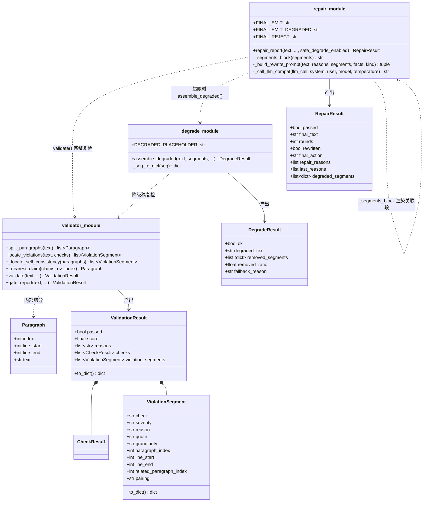
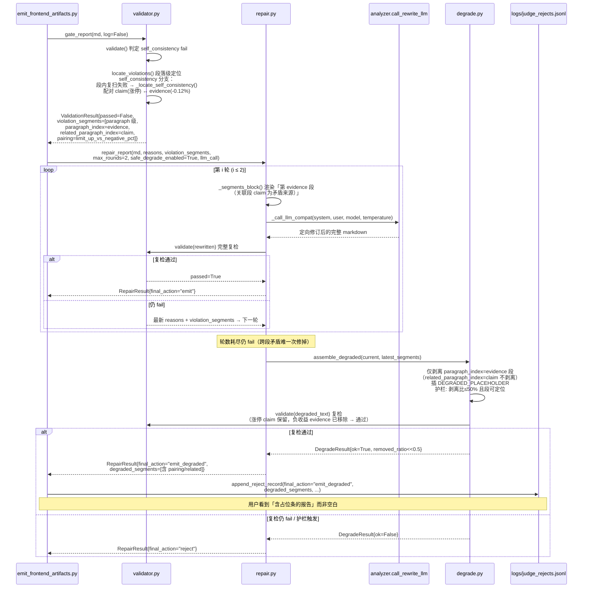
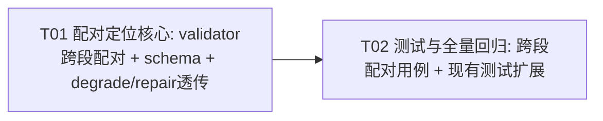

# 系统设计 — P1.5 self_consistency 跨段配对定位（增量）

> - 项目：`u3_guided_repair_safe_degrade` 的增量补丁（P1.5）
> - 上游输入：P1.5 self_consistency 配对定位 增量 PRD（product-manager 产出，已回传 team-lead）
> - 架构师：Bob（software-architect）
> - 语言/栈：Python 3（标准库为主，零新增依赖）；延续 U3 修改策略管道
> - 关联基线文档：`docs/system_design_u3_modification.md`

---

## Part A: 系统设计

### 1. 实现方案（Implementation Approach）

#### 1.1 核心技术难点与对策

| 难点 | 对策 |
|---|---|
| **① 跨段矛盾定位失败（根因）**：`locate_violations` 的 `self_consistency` 分支调用 `_locate_by_recheck(para, _check_internal_consistency)`，而 `_check_internal_consistency` 仅在「同段内同时含 涨停 标记与反向涨跌幅」时才判 fail。当「涨停」在段落 A、「-0.12%」在段落 B 时，逐段复扫均无法复现 → `located` 为空 → **回退 document 级 segment** → `degrade.assemble_degraded` 命中护栏 2 `document_level_violation_not_removable` → `ok=False` → `repair_report` 返回 `final_action="reject"` → **用户看到空白报告** | 新增**跨段配对定位器** `_locate_self_consistency(paragraphs)`：独立扫描「claim 段」（含 涨停/跌停 标记）与「evidence 段」（含反向涨跌幅），把每条 evidence 段与**最近的 claim 段**配对，产出 **paragraph 级** `ViolationSegment`（`paragraph_index`=evidence 段，待剥离；`related_paragraph_index`=claim 段，仅上下文）。彻底消除 self_consistency 的 document 级回退 |
| **② schema 需承载「配对」语义**：现有 `ViolationSegment` 仅单一 `paragraph_index`，无法表达「矛盾来自另一段」 | **加法式**扩展两个字段：`related_paragraph_index: int | None`、`pairing: str | None`；`to_dict()` 在 `location` 内追加，向后兼容（新增字段只加不减，见 U3 §3.1 契约原则） |
| **③ degrade / repair / jsonl 需透传新字段**：剥离逻辑仍按 `paragraph_index`（evidence 段），但 `related_paragraph_index`/`pairing` 必须在 degrade 归一化、jsonl `degraded_segments`、repair prompt 中保留 | `degrade._seg_to_dict` 透传；`repair._segments_block` 渲染「关联段」提示模型一并核对；jsonl 经既有 `append_reject_record(**extra)` 自动携带（dict 形态不变） |
| **④ 不破坏既有回归**：U3 既有 19/19 用例 + `test_safe_degrade.py` 中 `test_document_level_violation_falls_back`（使用 `llm_judge` document 级段，与 self_consistency 无关） | self_consistency 分支仅在「段内复扫失败」时走新配对路径；其他 check（red_line / llm_judge 等）的 document 级回退逻辑**原样保留**；现有判定阈值与 score 计算**零改动** |

#### 1.2 框架选型

- **零新增 pip 包 / npm 包**：全部改动在 `src/core/validator.py` / `degrade.py` / `repair.py` 三个标准库模块内，沿用 U3 既有的「仅标准库 + 互相引用」隔离原则，可被 tests 零网络导入。
- 架构模式：延续 U3 既有的「管道 + 状态机」——`gate → repair loop → safe_degrade → emit`。本期**只改 validator 的违规段定位层与 degrade/repair 的透传**，不动状态机终态枚举与降级护栏阈值。

#### 1.3 架构师裁决落地（PRD §裁决，本期全部采纳）

| # | 裁决 | 本期落地 |
|---|---|---|
| 1 | `max_rounds = 2` | 不改；`repair_report` 默认 `max_rounds=2` 已是现状，保持 |
| 2 | 剥离比例 ratio 保持 50% | 不改；`assemble_degraded(max_removed_ratio=0.5)` 默认值保持，护栏不变 |
| 3 | 告警暂不定 | 不新增告警通道；降级终态仍仅 `logs/judge_rejects.jsonl` 留痕（`final_action=emit_degraded` + `degraded_segments` 已含配对信息） |
| 4 | document 级不做 | self_consistency **不再产出 document 级 segment**：跨段配对定位器必能产出 paragraph 级段（check 已 fail 即说明全文同时含标记与反向涨跌幅，二者必落在某段落），document 级回退仅作为「理论上不可达」的防御兜底 |

---

### 2. 文件列表（File List）

| 文件（相对 dsa-test/） | 改/新增 | 说明 |
|---|---|---|
| `src/core/validator.py` | 改 | `ViolationSegment` 加法字段 `related_paragraph_index` / `pairing` + `to_dict()` 同步；新增 `_nearest_claim()` / `_locate_self_consistency()`；`locate_violations` 的 `self_consistency` 分支改为「先段内复扫，失败则跨段配对」 |
| `src/core/degrade.py` | 改（叠加式） | `_seg_to_dict` 透传 `related_paragraph_index` / `pairing`（dataclass 走 `to_dict()` 已含；dict 路径补默认值）；剥离仍以 `paragraph_index`（evidence 段）为准，逻辑/护栏零改动 |
| `src/core/repair.py` | 改（叠加式） | `_segments_block` 渲染 `related_paragraph_index`，提示模型「关联段为矛盾来源」，使其定向修订时可一并核对 |
| `tests/test_self_consistency_pairing.py` | **新增** | 跨段配对：涨停+负收益 / 跌停+正收益 两种方向；断言产出 paragraph 级段、`related_paragraph_index` 非空、`pairing` 正确；degrade 剥离 evidence 段后 `emit_degraded`；repair prompt 含关联段 |
| `tests/test_safe_degrade.py` | 改（扩展） | 新增用例：self_consistency 跨段矛盾**不再**回退 document 级（回归护栏，断言 `fallback_reason != document_level_violation_not_removable` 且 `ok=True`） |
| `tests/test_repair_loop.py` | 改（扩展） | 新增用例：跨段 self_consistency 经 repair → 模型定向修订后复检通过（或轮耗尽走 degrade 产出 emit_degraded），断言段指针含关联段提示 |

---

### 3. 数据结构与接口

#### 3.1 `ViolationSegment` schema 扩展（加法，跨文件契约）

```json
{
  "check": "self_consistency",
  "severity": "critical",
  "reason": "跨段矛盾：称涨停但第 3 段出现负收益 -0.12%",
  "quote": "该股今日收跌 -0.12%，量能萎缩……",
  "location": {
    "granularity": "paragraph",
    "paragraph_index": 3,
    "line_start": 18,
    "line_end": 21,
    "related_paragraph_index": 1,
    "pairing": "limit_up_vs_negative_pct"
  }
}
```

- `paragraph_index`：**待剥离段**（evidence，含矛盾数字），degrade 按此剥离。
- `related_paragraph_index`：**矛盾来源段**（claim，含 涨停/跌停 标记），仅上下文，degrade **不剥离**。
- `pairing` ∈ `limit_up_vs_negative_pct | limit_down_vs_positive_pct`，供日志/前端/运营分类。

#### 3.2 类图（同步存 `docs/class-diagram-p1.5.mermaid`）



#### 3.3 关键接口签名（增量，全部向后兼容）

**`validator.ViolationSegment`（新增字段，默认值 None，零破坏）**：

```python
@dataclass
class ViolationSegment:
    check: str
    severity: str
    reason: str
    quote: "str | None" = None
    granularity: str = "paragraph"
    paragraph_index: "int | None" = None
    line_start: "int | None" = None
    line_end: "int | None" = None
    # —— P1.5 跨段配对定位（加法字段）——
    related_paragraph_index: "int | None" = None   # 矛盾来源段（claim），仅上下文
    pairing: "str | None" = None                    # limit_up_vs_negative_pct | limit_down_vs_positive_pct

    def to_dict(self) -> dict:
        return {
            "check": self.check, "severity": self.severity, "reason": self.reason,
            "quote": self.quote,
            "location": {
                "granularity": self.granularity,
                "paragraph_index": self.paragraph_index,
                "line_start": self.line_start, "line_end": self.line_end,
                "related_paragraph_index": self.related_paragraph_index,
                "pairing": self.pairing,
            },
        }
```

**`validator._locate_self_consistency`（新增，纯函数，无副作用）**：

```python
def _locate_self_consistency(paragraphs: "list[Paragraph]") -> "list[ViolationSegment]":
    """跨段配对定位（P1.5）：把全文级 self_consistency 矛盾落到 paragraph 级。

    check 已判 fail（全文同时含 涨停/跌停 标记 与 反向涨跌幅），但二者可能分属
    不同段落 → 逐段复扫无法复现 → 旧逻辑回退 document 级 → degrade 拒绝。
    本函数独立配对：
      * 涨停 claim 段 ↔ 负收益 evidence 段
      * 跌停 claim 段 ↔ 正收益 evidence 段
    每条 evidence 段产出 1 个 paragraph 级 segment（paragraph_index=evidence 待剥离；
    related_paragraph_index=最近 claim 仅上下文），彻底消除 document 级回退。
    """
```

**`validator.locate_violations` 的 `self_consistency` 分支（改造，非新增）**：

```python
elif check.name == "self_consistency":
    # ① 先尝试段内复现（同段既含标记又含反向涨跌幅，罕见但优先）
    para_segs = [
        _locate_by_recheck(p, _check_internal_consistency)
        for p in paragraphs
    ]
    para_segs = [s for s in para_segs if s]
    if para_segs:
        located.extend(para_segs)
    else:
        # ② 跨段配对定位（P1.5）：必产出 paragraph 级段，不再回退 document 级
        located.extend(_locate_self_consistency(paragraphs))
```

> 注：其他 check（`red_line` / `impossible_move` / `ungrounded` / `numeric_source` / `llm_judge`）仍走原有分支，document 级回退逻辑**完全保留**（仅 self_consistency 不再走 document 级）。

**`degrade._seg_to_dict`（叠加：透传新字段）**：dataclass 路径经 `seg.to_dict()` 已含 `related_paragraph_index`/`pairing`；dict 路径补默认值后保留，确保 `removed_segments`/`degraded_segments` 携带配对上下文。剥离仍以 `paragraph_index` 为准（见 `assemble_degraded` 既有逻辑，不改）。

**`repair._segments_block`（叠加：关联段提示）**：当 segment 含 `related_paragraph_index` 时，追加渲染「（关联段 Y 为其矛盾来源，请一并核对）」，使模型定向修订时可定位矛盾两端。

---

### 4. 程序调用流程（同步存 `docs/sequence-diagram-p1.5.mermaid`）



---

### 5. Anything UNCLEAR（假设与说明）

1. **剥离目标定为 evidence 段（含矛盾数字）而非 claim 段（含 涨停 标记）**：剥离 evidence 段后，claim 段的「涨停」叙事保留、但全文不再出现反向涨跌幅 → 复检通过，且保留信息量最大。若未来希望改剥 claim 段，仅需把 `paragraph_index`/`related_paragraph_index` 取值互换，契约结构不变。
2. **document 级回退保留给其他 check**：本期仅 self_consistency 不再走 document 级；`llm_judge` 整体低分等仍走 document 级 → degrade 回退 reject（与 U3 行为一致）。`locate_violations` 通用 `else` 分支保留，self_consistency 在其专属分支内提前 return paragraph 级段。
3. **「理论上不可达」的 document 兜底**：因 check 已 fail 即保证全文含标记+反向涨跌幅，跨段配对器必能产出 ≥1 条 paragraph 级段；self_consistency 分支的 document 级回退代码路径可视为死代码，但保留以恪守「每个失败检查项至少 1 条 segment」契约、且「定位层绝不反噬主流程」。
4. **启发式误报不在本期范围**：`_check_internal_consistency` 本身对「不同股票各自提及涨停/负收益」可能误判，属既有启发式局限；本期只修复「已判 fail 却无法定位」的工程缺陷，不改判定正则。
5. **前端零改动**：降级稿占位条、banner、角标均由 U3 既有 emit 逻辑处理；P1.5 仅使更多样本能从 `reject` 转为 `emit_degraded`，前端无需改动即可展示。

---

## Part B: 任务分解

### 6. 依赖包列表

**无新增 pip 包 / npm 包。** 全部实现使用标准库（`re`/`json`/`dataclasses`/`inspect`）。CI 现有环境即可运行全部测试。前端零改动。

### 7. 任务列表（≤5，按依赖排序）

| 任务 | 名称 | 源文件 | 依赖 | 优先级 |
|---|---|---|---|---|
| **T01** | 配对定位核心：validator 跨段配对 + schema 扩展 + degrade/repair 透传 | `src/core/validator.py`(改)、`src/core/degrade.py`(改)、`src/core/repair.py`(改) | — | P0 |
| **T02** | 测试与全量回归：跨段配对用例 + 现有测试扩展（断言不再 document 级回退） | `tests/test_self_consistency_pairing.py`(新增)、`tests/test_safe_degrade.py`(改)、`tests/test_repair_loop.py`(改) | T01 | P0 |

> 说明：本期是**对既有 U3 管道的补丁**，无新建项目脚手架（配置/入口/依赖声明均沿用现状，且裁决明确「max_rounds=2 / ratio=50% / 不新增告警」均保持现状）。因此 T01 即「基础核心改动」，为 T02 测试所依赖的唯一起点，放宽了「T01=项目基础设施」的绿field 默认约定。

**各任务验收点**：

- **T01**：对「涨停(段A)+ -0.12%(段B)」样本 `validate()` 返回的 `violation_segments` 中 self_consistency 项为 **paragraph 级**、`paragraph_index`=evidence 段、`related_paragraph_index`=claim 段非空、`pairing="limit_up_vs_negative_pct"`；`degrade.assemble_degraded` 仅剥离 evidence 段、复检通过、`ok=True`、剥离比远小于 50%；`repair._segments_block` 渲染含关联段提示；**U3 既有 19/19 与 `test_safe_degrade.py` 全绿**（判定结果与 score 不变）。
- **T02**：`test_self_consistency_pairing.py` 覆盖涨停+负收益、跌停+正收益两方向，断言 paragraph 级定位与 degrade→emit_degraded；`test_safe_degrade.py` 新增断言 self_consistency 跨段矛盾 `ok=True` 且 `fallback_reason != document_level_violation_not_removable`；`test_repair_loop.py` 新增跨段 repair 终态（emit 或 emit_degraded）断言；`pytest tests/` 全绿。

### 8. 共享知识（跨文件约定）

1. **`paragraph_index` = 待剥离段（evidence），`related_paragraph_index` = 矛盾来源段（claim，仅上下文）**：degrade 剥离**只认 `paragraph_index`**，绝不剥离 `related_paragraph_index`；二者含义全链路一致，不得互换。
2. **schema 加法原则**：`ViolationSegment` 新增 `related_paragraph_index` / `pairing` 两个字段（默认 `None`）；`to_dict()` 在 `location` 内追加；degrade/repair/jsonl 消费方**只增不减**字段，旧契约完全兼容。
3. **document 级回退仅限非 self_consistency 的 check**：`llm_judge` 等仍走 document 级 → degrade 回退 reject；self_consistency 专属分支内提前产出 paragraph 级段，不再落入通用 `else` 的 document 兜底。
4. **`pairing` 取值约定**：`limit_up_vs_negative_pct`（涨停+负收益）、`limit_down_vs_positive_pct`（跌停+正收益）；供 jsonl/前端/运营分类，禁止拼写漂移。
5. **降级稿落盘与留痕沿用 U3 约定**：`logs/degraded/<bn>.md` + `logs/judge_rejects.jsonl` 写 `final_action=emit_degraded` + `degraded_segments`（含 `related_paragraph_index`/`pairing`）；不新增任何告警通道（裁决③）。
6. **llm_call 兼容协议不变**：`repair._call_llm_compat` 的 `inspect.signature` 探测逻辑不改，既有 `fake_llm(system, user)` mock 仍过。

### 9. 任务依赖图



### 10. 待明确事项（裁决后仍建议确认）

1. **剥离方向是否应改为 claim 段**：本期剥 evidence（含数字）段，保留 claim（涨停）叙事。若产品希望「直接删除涨停断言」，改 `paragraph_index`/`related_paragraph_index` 取值即可，契约不变。
2. **`pairing` 是否要进前端展示**：本期仅 jsonl 留痕；若前端要在占位条旁标注「跨段矛盾已降级」，需 emit 侧读 `pairing` 字段（U3 既有占位条渲染增量），属小改。
3. **启发式误报（不同股票各提涨停/负收益）**：若运营观察发现大量「假性跨段矛盾」被降级，需在 `_check_internal_consistency` 引入股票实体消歧，属 P2 增强，不在本期。
