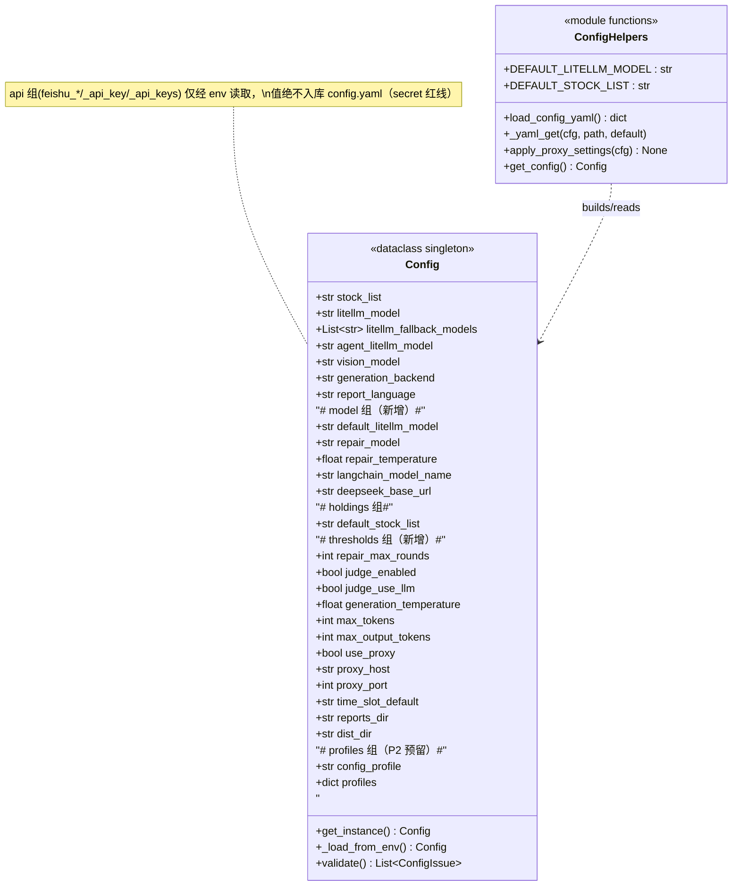

# U16 配置模块化 — 系统架构设计 + 任务分解

> 作者：架构师 高见远（Gao）｜增量改造对象：`D:\BaiduNetdiskWorkspace\Agent\workbuddy\workspace\projects\Daily stock analysis\dsa-test\`
> 性质：**运行系统的增量改造**（非从零新建）。基于 PM 许清楚审定的 U16 增量 PRD。
> 主理人已拍板 7 条决策，本设计严格遵循，不再追问。

---

## 0. 勘察结论速记（设计依据）

| 项 | 现状 | 本设计动作 |
|---|---|---|
| 统一配置层 | `src/config.py` 已有 `Config` dataclass（L702）+ 单例 `get_instance()`(L1188) / `_load_from_env()`(L1202) / `get_config()`(L3399) | **沿用**，扩展而非重写 |
| yaml 能力 | `requirements.txt:45 PyYAML>=6.0` 已依赖；`config.py:2116` 已有 `import yaml` 懒加载范式 | **无需新增依赖**，复用同一范式 |
| 配置注册表 | `src/core/config_registry.py`（Web 设置页元数据） | 仅追加新字段条目，不改结构 |
| env 原子读写 | `src/core/config_manager.py` | 不动（非定义层） |
| 旧名兜底 | `config.py:1425` `deepseek/deepseek-chat`；`:1441-1450` 弃用告警 | 改为 `DEFAULT_LITELLM_MODEL`，删告警 |
| 根目录无 `config.yaml` | 确认不存在 | 新建，仅非敏感默认值 |

**关键约束**：`Config._load_from_env()` 当前每个字段都是 `os.getenv(ENV, 硬编码默认)`。本设计在不破坏该范式的前提下，把"硬编码默认"替换为"config.yaml 值优先于硬编码"，而 `os.getenv` 天然仍优先于 yaml——从而**零成本**实现 `env ▶ yaml ▶ code` 三级优先级。

---

## 1. 实现方案 + 框架选型

### 1.1 扩展现有 `Config` dataclass（不引入 pydantic）

沿用 `@dataclass`，仅**新增字段分组**，不动既有字段语义。新增字段见 §3 类图。

### 1.2 `config.yaml` 加载与三级合并

新增模块级函数（放在 `config.py` 顶部常量区）：

```python
DEFAULT_LITELLM_MODEL = "deepseek/deepseek-v4-flash"   # 全系统唯一主模型常量（决策#7）
DEFAULT_STOCK_LIST = "600036,159915,603823,512400"     # 持仓默认（H1）
_CONFIG_YAML_CACHE: Optional[dict] = None

def load_config_yaml() -> dict:
    """加载仓库根目录 config.yaml（仅非敏感默认值）。失败/缺失返回 {}。"""
    global _CONFIG_YAML_CACHE
    if _CONFIG_YAML_CACHE is not None:
        return _CONFIG_YAML_CACHE
    path = Path(__file__).resolve().parent.parent / "config.yaml"
    data: dict = {}
    try:
        if path.exists():
            import yaml                      # 懒加载，复用现有范式
            data = yaml.safe_load(path.read_text(encoding="utf-8")) or {}
    except Exception as exc:                  # noqa: BLE001
        logger.warning("config.yaml 解析失败，忽略: %s", exc)
        data = {}
    _CONFIG_YAML_CACHE = data
    return data

def _yaml_get(yaml_cfg: dict, path: List[str], default):
    """按嵌套路径 ['model','repair_model'] 取值，缺失回退 default。"""
    cur = yaml_cfg
    for key in path:
        if not isinstance(cur, dict) or key not in cur or cur[key] is None:
            return default
        cur = cur[key]
    return cur
```

### 1.3 优先级落地方式（env 覆盖 yaml，yaml 覆盖 code）

在 `_load_from_env()` **开头**取一次 `yaml_cfg = load_config_yaml()`，再把所有字段代码默认改写为：

```python
# 旧：generation_backend = os.getenv('GENERATION_BACKEND', LITELLM_BACKEND_ID) ...
# 新（三层合并）：
_generation_backend_default = _yaml_get(yaml_cfg, ["analysis_style","generation_backend"], LITELLM_BACKEND_ID)
generation_backend = (os.getenv('GENERATION_BACKEND', _generation_backend_default) or LITELLM_BACKEND_ID).strip().lower()
```

- `os.getenv(ENV, yaml_or_code)`：**env 设了 → 用 env；env 没设 → 用 yaml；yaml 也没 → 用 code 默认**。天然满足 `env ▶ yaml ▶ code`。
- 新字段（repair/judge/thresholds）同样：`_yaml_get(yaml_cfg,[...],代码默认)` 作为 `os.getenv` 的默认值。
- 旧 env 名**全部保留**作兼容读取（决策#3）；新字段是"唯一真相源"，env 只是注入通道。

### 1.4 与现有单例的衔接

- 单例不变：`get_config()` → `Config.get_instance()` → `Config._load_from_env()`（仅首次构建）。
- yaml 在 `_load_from_env` 内加载并缓存（`_CONFIG_YAML_CACHE`），**不**触发二次 IO。
- 新增 `Config.validate()` 增强（P1）与 `if __name__ == "__main__"` 增加 `validate` 子命令（P2）。

### 1.5 代理逻辑去重（O5 / P1）

新增模块函数 `apply_proxy_settings(cfg: Config) -> None`：

```python
def apply_proxy_settings(cfg: Config) -> None:
    if os.getenv("GITHUB_ACTIONS") == "true":
        return                      # CI 永远跳过（与现状一致）
    if not cfg.use_proxy:
        return
    proxy_url = f"http://{cfg.proxy_host}:{cfg.proxy_port}"
    os.environ["http_proxy"] = proxy_url
    os.environ["https_proxy"] = proxy_url
    # NO_PROXY 国内域名去重逻辑仍保留（复用 config.py:1223-1247 已有集合）
```

仅在 `_load_from_env()` 末尾调用一次；`main.py`、`check_env.py` 的三处重复块删除，改为 `from src.config import apply_proxy_settings; apply_proxy_settings(get_config())`。

### 1.6 是否新增依赖

**否。** PyYAML 已在 `requirements.txt`，`import yaml` 懒加载范式已存在于 `config.py:2116`。零新增依赖。

---

## 2. 文件列表及相对路径

### 新增
- `config.yaml` — 仓库根目录，仅非敏感默认值（决策#2）。
- `docs/system_design_u16.md` — 本设计文档。
- `docs/class-diagram-u16.mermaid` / `docs/sequence-diagram-u16.mermaid` — 图（见 §3/§4）。
- `tests/test_config_u16.py` — 优先级合并 / 字段收敛回归（P1/P2 验收）。

### 修改
- `src/config.py`
  - 顶部：加 `DEFAULT_LITELLM_MODEL` / `DEFAULT_STOCK_LIST` 常量、`load_config_yaml()` / `_yaml_get()` / `apply_proxy_settings()`。
  - `Config` dataclass：新增 `model/holdings/thresholds/profiles` 各组字段（§3）。
  - `_load_from_env()`：接入 yaml 三层合并 + 新字段 env 兼容读取 + 末行调用 `apply_proxy_settings`；将 L1425 字面量改为 `DEFAULT_LITELLM_MODEL`，删除 L1441-1450 弃用告警。
  - `validate()`：类型校验增强（P1）。
  - `__main__`：`validate` 子命令（P2）。
- `src/analyzer.py` — M1/M7/T5/T6/T7 收敛：L4841-4843、L3122、L3325-3326、L3549。
- `scripts/emit_frontend_artifacts.py` — M2/T1-T4/O3 收敛：L60-61、L115、L116、L118-120。
- `scripts/run_vibe.py` — M9/A9/O1 收敛：L66、L356-357。
- `scripts/intraday_playbook.py` — H1 收敛：L301。
- `scripts/rename_reports.py` — O2 收敛：L8。
- `scripts/deploy_pages.py` — O4 收敛：L567。
- `main.py` — O5 去重：L40-46、L162-167 两处代理块改为调用 `apply_proxy_settings`。
- `scripts/check_env.py` — O5 去重：L26-31 代理块改为调用 `apply_proxy_settings`。
- `.github/workflows/daily-analysis-v2.yml` — M3/M6 提升为 `${{ vars.DEFAULT_MODEL || 'deepseek/deepseek-v4-flash' }}`（L36/L37/L46）。
- `.github/workflows/vibe-quant.yml` — M5 提升为同上（L41）。
- `src/core/config_registry.py` — 追加 repair/judge/thresholds 字段元数据（Web 设置页可见，P1）。

---

## 3. 数据结构和接口（类图）

> 仅展示与 U16 直接相关的字段/方法；既有字段省略。`[profiles]` 为 P2 预留，不实现切换。



**env → 字段映射表（旧名兼容保留，新字段为唯一真相源）**

| 新字段 | 兼容 env 名 | config.yaml 路径 | 代码默认 | 消除散点 |
|---|---|---|---|---|
| `default_litellm_model` | `LITELLM_MODEL` | `model.default_litellm_model` | `deepseek/deepseek-v4-flash` | M1–M5,M9 |
| `repair_model` | `REPAIR_MODEL` | `model.repair_model` | `""`(→default_litellm_model) | M7 |
| `repair_temperature` | `REPAIR_TEMPERATURE` | `model.repair_temperature` | `0.1` | T2 |
| `langchain_model_name` | `LANGCHAIN_MODEL_NAME` | `model.langchain_model_name` | `deepseek-chat` | M9 |
| `deepseek_base_url` | `DEEPSEEK_BASE_URL` | `model.deepseek_base_url` | `https://api.deepseek.com` | A9 |
| `stock_list` | `STOCK_LIST` | `holdings.stock_list` | `DEFAULT_STOCK_LIST` | H1,H2 |
| `generation_backend` | `GENERATION_BACKEND` | `analysis_style.generation_backend` | `litellm` | M6 |
| `repair_max_rounds` | `REPAIR_MAX_ROUNDS` | `thresholds.repair_max_rounds` | `1`(硬上限3) | T1 |
| `judge_enabled` | `JUDGE_ENABLED` | `thresholds.judge_enabled` | `true` | T3 |
| `judge_use_llm` | `JUDGE_USE_LLM` | `thresholds.judge_use_llm` | `false` | T4 |
| `generation_temperature` | `LLM_TEMPERATURE`(已存在) | `thresholds.generation_temperature` | `0.7` | T5 |
| `max_tokens` | — | `thresholds.max_tokens` | `2048` | T6 |
| `max_output_tokens` | — | `thresholds.max_output_tokens` | `8192` | T7 |
| `use_proxy` | `USE_PROXY` | `thresholds.use_proxy` | `false` | O5/T8 |
| `proxy_host` | `PROXY_HOST` | `thresholds.proxy_host` | `127.0.0.1` | T9 |
| `proxy_port` | `PROXY_PORT` | `thresholds.proxy_port` | `10809` | T8 |
| `time_slot_default` | `TIME_SLOT` | `thresholds.time_slot_default` | `1800` | O1,O2 |
| `reports_dir` | `REPORTS_DIR` | `thresholds.reports_dir` | `reports` | O3 |
| `dist_dir` | `DIST_DIR` | `thresholds.dist_dir` | `web/dist` | O4 |
| `config_profile` | `CONFIG_PROFILE` | (profiles 激活) | `""` | P2 |

---

## 4. 程序调用流程（时序图）

```mermaid
sequenceDiagram
    autonumber
    participant OS as 进程/CI env
    participant Y as config.yaml
    participant C as Config(_load_from_env)
    participant S as 单例 _instance
    participant B as 业务/脚本代码

    Note over OS,Y,C: 启动期：配置加载（仅首次）
    OS->>C: get_config() 首次调用
    C->>Y: load_config_yaml()（缓存）
    Y-->>C: dict 或 {}
    loop 每个字段
        C->>OS: os.getenv(ENV, _yaml_get(yaml,path,code默认))
        OS-->>C: env值 或 yaml值 或 code默认
    end
    C->>C: apply_proxy_settings()（CI跳过/use_proxy=false跳过）
    C->>S: 存入 _instance
    Note over C,S: 后续 get_config() 直接返回单例，不再读 yaml/env

    Note over B,S: 运行期：业务/脚本调用
    B->>S: get_config().default_litellm_model
    S-->>B: 唯一真相值
    B->>S: get_config().repair_max_rounds
    S-->>B: 已含 env>yaml>code 合并结果
    B->>S: get_config().reports_dir / dist_dir / time_slot_default
    S-->>B: 收敛后的路径/时段默认值
```

---

## 5. 任务列表（有序、含依赖、按实现顺序）

> 说明：T1–T2 是地基，必须最先完成；T3–T6 可**并行**（彼此仅依赖 T1–T2 的字段已存在）；T7（校验/子命令/注册表）依赖 T2；T8（P2 预留）独立；T9 为全量自检。每行含：ID / 改动文件 / 具体动作 / 验收点。

### T1 — P0 地基：常量 + 字段 + yaml 加载器（依赖：无）
- **改动文件**：`src/config.py`、`config.yaml`（新建）
- **具体动作**
  1. `config.py` 顶部加常量 `DEFAULT_LITELLM_MODEL="deepseek/deepseek-v4-flash"`、`DEFAULT_STOCK_LIST="600036,159915,603823,512400"`。
  2. 加 `load_config_yaml()`、`_yaml_get()`（见 §1.2）。
  3. `Config` dataclass 新增字段：`default_litellm_model`、`repair_model`、`repair_temperature`、`langchain_model_name`、`deepseek_base_url`、`default_stock_list`、`repair_max_rounds`、`judge_enabled`、`judge_use_llm`、`generation_temperature`、`max_tokens`、`max_output_tokens`、`use_proxy`、`proxy_host`、`proxy_port`、`time_slot_default`、`reports_dir`、`dist_dir`、`config_profile`、`profiles`（默认值见 §3 映射表；`repair_max_rounds` 在赋值时 `min(value,3)` 硬上限）。
  4. 新建 `config.yaml`，写入全部非敏感默认（结构见 §6 之外的附录：model/holdings/analysis_style/thresholds/profiles 各节），**严禁写入任何 secret**。
- **验收点**：`python -m py_compile src/config.py` 通过；`get_config()` 能返回新字段且默认值正确；`config.yaml` 被 `.gitignore` 排除 secret（本身不含 secret）。

### T2 — P0 优先级：_load_from_env 接入三层合并 + 代理集中（依赖：T1）
- **改动文件**：`src/config.py`
- **具体动作**
  1. `_load_from_env()` 开头 `yaml_cfg = load_config_yaml()`。
  2. 将既有字段（`generation_backend`、`stock_list`、`litellm_model` 等）与全部新增字段的代码默认改写为 `_yaml_get(yaml_cfg, [组,字段], 代码默认)`，再喂给 `os.getenv(ENV, …)`（env 仍优先）。
  3. `litellm_model` 默认来源改为 `default_litellm_model`（L1342-1343、L1397-1398、L1417-1426 路径保持，但兜底常量统一为 `DEFAULT_LITELLM_MODEL`）。
  4. **L1425** `litellm_model = 'deepseek/deepseek-chat'` → `litellm_model = DEFAULT_LITELLM_MODEL`；**删除 L1441-1450** 弃用告警（v4-flash 已是规范默认，无弃用可告）。
  5. 新增 `apply_proxy_settings(cfg)`（§1.5），在 `_load_from_env()` 末尾调用一次。
- **验收点**：设 `LITELLM_MODEL` env 覆盖 yaml；不设 env 时取 yaml；yaml 也不设时取 code 默认（三级各验证一例）；`GITHUB_ACTIONS=true` 时 `apply_proxy_settings` 不写 http_proxy。

### T3 — P0 模型名收敛：M1–M5/M7/M9/M10（依赖：T1–T2）
- **改动文件**：`src/analyzer.py`(L4841-4843)、`scripts/emit_frontend_artifacts.py`(L116)、`scripts/run_vibe.py`(L356-357)、`.github/workflows/daily-analysis-v2.yml`(L36/37/46)、`.github/workflows/vibe-quant.yml`(L41)、`src/config.py`(L1425，T2 已含)
- **具体动作**
  1. `analyzer.py:4841-4843`：`effective_model = (model or os.environ.get("REPAIR_MODEL") or os.environ.get("LITELLM_MODEL") or "deepseek/deepseek-v4-flash")` → `effective_model = model or cfg.repair_model or cfg.default_litellm_model`（需在该函数拿 `cfg = get_config()`）。
  2. `emit_frontend_artifacts.py:116`：`os.environ.get("LITELLM_MODEL", "deepseek/deepseek-v4-flash")` → `get_config().default_litellm_model`。
  3. `run_vibe.py:356-357`：`DEEPSEEK_BASE_URL=https://api.deepseek.com` → `f"DEEPSEEK_BASE_URL={cfg.deepseek_base_url}"`；`LANGCHAIN_MODEL_NAME=deepseek-chat` → `f"LANGCHAIN_MODEL_NAME={cfg.langchain_model_name}"`（cfg 来自 `get_config()`）。
  4. 两 workflow：`LITELLM_MODEL: deepseek/deepseek-v4-flash` → `LITELLM_MODEL: ${{ vars.DEFAULT_MODEL || 'deepseek/deepseek-v4-flash' }}`（决策#5；未设 vars 时写死 fallback 不失败）。
- **验收点**：全仓库 `grep -rn "deepseek/deepseek-v4-flash" src scripts .github` 仅剩 `DEFAULT_LITELLM_MODEL` 常量定义与 workflow 的 `||` fallback 字面量；无任何业务代码硬编码裸串；CI 未设 `vars.DEFAULT_MODEL` 仍可跑通（fallback 生效）。

### T4 — P0 repair/judge/holdings 收敛：T1–T4 / H1 / H2（依赖：T1–T2）
- **改动文件**：`scripts/emit_frontend_artifacts.py`(L60-61,L118-120)、`scripts/intraday_playbook.py`(L301)、`src/config.py`（字段已 T1 建）
- **具体动作**
  1. `emit_frontend_artifacts.py:60-61`：`JudgeConfig(enabled=os.environ.get("JUDGE_ENABLED","1")!="0", use_llm=os.environ.get("JUDGE_USE_LLM","0")=="1")` → `cfg=get_config(); JudgeConfig(enabled=cfg.judge_enabled, use_llm=cfg.judge_use_llm)`。
  2. `:118` `repair_max = min(int(os.environ.get("REPAIR_MAX_ROUNDS","1")),3)` → `repair_max = get_config().repair_max_rounds`（硬上限已在字段赋值处保证）。
  3. `:119` `repair_model = os.environ.get("REPAIR_MODEL") or model` → `repair_model = get_config().repair_model or get_config().default_litellm_model`。
  4. `:120` `repair_temp = float(os.environ.get("REPAIR_TEMPERATURE","0.1"))` → `repair_temp = get_config().repair_temperature`。
  5. `intraday_playbook.py:301` `os.environ.get('STOCK_LIST','600036,159915,603823,512400')` → `get_config().stock_list`（或 `default_stock_list`）。
- **验收点**：`emit_frontend_artifacts.py` 不再出现 `os.environ.get("JUDGE_*"|"REPAIR_*")` 裸读；`intraday_playbook.py` 默认持仓来自 config；`py_compile` 通过。

### T5 — P1 代理去重 O5（依赖：T1–T2）
- **改动文件**：`src/config.py`（已加 `apply_proxy_settings`）、`main.py`(L40-46,L162-167)、`scripts/check_env.py`(L26-31)
- **具体动作**
  1. `main.py` 两处代理块删除，替换为 `from src.config import apply_proxy_settings` + `apply_proxy_settings(get_config())`（保持"GITHUB_ACTIONS 跳过"语义，已内置）。
  2. `check_env.py:26-31` 同理替换为 `apply_proxy_settings(get_config())`。
- **验收点**：全仓库代理设置逻辑仅存在于 `config.py:apply_proxy_settings`；`grep -rn "USE_PROXY" src main.py scripts` 除兼容 env 读取外无重复实现；本地 `USE_PROXY=true` 启动验证 http_proxy 生效。

### T6 — P1 路径/时段/温度/令牌收敛 O1–O4 / T5–T7（依赖：T1–T2）
- **改动文件**：`scripts/emit_frontend_artifacts.py`(L115)、`scripts/rename_reports.py`(L8)、`scripts/deploy_pages.py`(L567)、`src/analyzer.py`(L3122,L3325-3326,L3549)
- **具体动作**
  1. `emit_frontend_artifacts.py:115` `os.environ.get("REPORTS_DIR", .../reports)` → `get_config().reports_dir`。
  2. `rename_reports.py:8` `os.environ.get("TIME_SLOT", now.strftime("%H%M"))` → `get_config().time_slot_default`（仍允许 env `TIME_SLOT` 覆盖：实际改为 `os.environ.get("TIME_SLOT") or get_config().time_slot_default`）。
  3. `deploy_pages.py:567` `os.environ.get('DIST_DIR', 'web/dist')` → `get_config().dist_dir`。
  4. `analyzer.py:3122` `generation_config.get('temperature', 0.7)` → `generation_config.get('temperature', cfg.generation_temperature)`。
  5. `analyzer.py:3325-3326` `generate_text(..., max_tokens=2048, temperature=0.7)` 默认改为 `cfg.max_tokens` / `cfg.generation_temperature`（调用处未传时回退 config）。
  6. `analyzer.py:3549` `"max_output_tokens": 8192` → `"max_output_tokens": cfg.max_output_tokens`。
- **验收点**：`emit/rename/deploy` 不再裸读 `REPORTS_DIR/DIST_DIR/TIME_SLOT`；`analyzer` 三处令牌/温度来自 config；`py_compile` 通过。

### T7 — P1 类型校验 + config validate 子命令 + 注册表条目（依赖：T2）
- **改动文件**：`src/config.py`、`src/core/config_registry.py`、`tests/test_config_u16.py`（新建）
- **具体动作**
  1. `Config.validate()` 增强：对 `repair_max_rounds`(≤3)、`proxy_port`(1-65535)、`generation_temperature`(0-2)、`time_slot_default`(4 位 HHMM)、`repair_temperature`(0-2) 做类型/范围校验，产出 `ConfigIssue`。
  2. `__main__` 增加 `validate` 分支：`python -m src.config validate` 打印问题并 `exit(1)` 当有 error。
  3. `config_registry.py` 追加 `repair_*`/`judge_*`/`generation_temperature`/`max_tokens`/`max_output_tokens`/`use_proxy`/`proxy_*`/`time_slot_default`/`reports_dir`/`dist_dir` 元数据（描述/示例/默认/help），供 Web 设置页。
  4. 新建 `tests/test_config_u16.py`：验证 env>yaml>code 三级、各散点收敛后取值、硬上限、代理去重。
- **验收点**：`python -m src.config validate` 退出码正确；`pytest tests/test_config_u16.py` 全绿；Web 设置页能看到新字段。

### T8 — P2 预留 profiles + CONFIG_PROFILE 开关（依赖：T1，独立可并行）
- **改动文件**：`config.yaml`、`src/config.py`
- **具体动作**
  1. `config.yaml` 增加 `[profiles]`（或 `profiles:` 节点）示例结构，含 `default` 占位；注释标明"本迭代不实现切换"。
  2. `Config` 已加 `config_profile`（读 `CONFIG_PROFILE`）、`profiles`（dict）；**仅解析存储，不实现切换逻辑**（决策#6）。
- **验收点**：`get_config().config_profile` 能读 `CONFIG_PROFILE`；切换逻辑确实不存在（grep 无 profile 选择分支）；不影响既有单例行为。

### T9 — 全量自检与文档（依赖：T1–T8）
- **改动文件**：`docs/system_design_u16.md`（本文件更新）、`tests/`
- **具体动作**
  1. 对全部改动文件 `python -m py_compile`。
  2. 跑 `pytest tests/`（至少 `test_config_u16.py` + 既有 `test_agent_models_api.py` 等不受影响）。
  3. 确认 `config.yaml` 未被 `.gitignore` 误伤导致不随仓库分发；同时确认**不会被 GH Pages 误部署**（它在仓库根，非 `web/dist`，见 §8 风险）。
  4. 本设计文档定稿，注明"需在 GitHub 仓库 Settings→Secrets and variables→Actions→Variables 新增 `DEFAULT_MODEL=deepseek/deepseek-v4-flash`"。
  5. **单 commit 多 fix**：所有 U16 改动作为一个 commit 提交（项目规则）。
- **验收点**：`py_compile` 全绿；相关测试绿；PR 描述含 vars 配置说明。

---

## 6. 依赖包列表

- **新增第三方包：无。**
- 已具备：`PyYAML>=6.0`（`requirements.txt:45`）——`config.yaml` 解析复用，懒加载范式同 `config.py:2116`。
- 标准库：`pathlib.Path`、`os`、`dataclasses`（均已在用）。

---

## 7. 共享知识（跨文件约定）

1. **字段命名约定**：dataclass 字段用 `snake_case`；config.yaml 用嵌套分组（`model`/`holdings`/`analysis_style`/`thresholds`/`profiles`）；yaml 叶子键与字段名一致。
2. **env 变量名映射**：见 §3 映射表——**旧 env 名全部保留**作兼容读取，新字段是唯一真相源；不要新建 env 名去替代旧名（避免破坏 CI/用户 `.env`）。
3. **默认值兜底规则**：`env ▶ config.yaml ▶ 代码默认` 三级；代码默认集中在 `_load_from_env()` 与常量区，禁止业务代码再写裸字面量。
4. **secret 不入库红线**：`feishu_*`、`*_api_key`、`*_api_keys`、`DEEPSEEK_API_KEY` 等**只经 env/secret 读取**，`config.yaml` 禁止出现任何密钥；`api` 组在类图中仅为"引用说明"，无 yaml 字段。
5. **f-string 安全**：`run_vibe.py` 用 f-string 模板写 `agent/.env`（运行时模板，正确）；约定——**含 f-string 的模板文件禁止用 `str.replace` 改写占位符**，新增/修改一律用 f-string 或 `.format()`，避免 `{}` 被误转义。
6. **自检与提交规则**：每个文件改完 `python -m py_compile <file>`；U16 全量改动**单 commit 多 fix** 一次提交；CI 的 XSS gate（`test_xss_escape.py`）与 deploy target gate 不受影响。
7. **单例约定**：业务代码一律 `from src.config import get_config; cfg = get_config()`；脚本若不便 import，仍可读兼容 env 名（但优先迁移到 `get_config()`）。

---

## 8. 待明确事项 / 风险

1. **config.yaml 被 GH Pages 误部署**：`config.yaml` 在仓库根，GH Pages 源为 `gh-pages` 分支的 `/`（来自 `web/dist`），根目录 `config.yaml` 不会进入 `web/dist`，**理论安全**；但建议工程师确认 `scripts/deploy_pages.py` 仅推送 `web/dist` 内容（不改本次范围，仅复核）。
2. **新增 `vars.DEFAULT_MODEL` 的部署步骤**：交付须在 PR 描述与文档注明——仓库 `Settings → Secrets and variables → Actions → Variables` 新增 `DEFAULT_MODEL`（值 `deepseek/deepseek-v4-flash`）；未设时 workflow 的 `||` fallback 保证不失败，但建议设上以统一管控。
3. **PyYAML 可用性**：已确认 `requirements.txt` 含 `PyYAML>=6.0`，CI `pip install -r requirements.txt` 会装；本地若极简环境未装，`load_config_yaml` 已 try/except 降级为 `{}`（仅丢失 yaml 层，不崩）。
4. **`deepseek/deepseek-chat` 弃用告警删除的影响**：L1441-1450 告警随默认改为 v4-flash 而失去意义，已建议删除；若产品希望保留"用户显式用 chat 时仍提示"，可改为仅在 `LITELLM_MODEL==deepseek/deepseek-chat` 显式设置时告警——**需 PM/主理人确认是否保留**，本设计默认删除（最小变更）。
5. **`config_registry.py` 追加条目的范围**：Web 设置页是否要暴露 `repair_*`/`judge_*` 由前端团队决定，本设计仅保证后端字段与注册表一致；若暂不暴露，T7 的注册表条目可降级为 P2。
6. **`stock_list` 默认与 `DEFAULT_STOCK_LIST` 关系**：`stock_list` 解析仍走既有 `STOCK_LIST` env + `split_stock_list`；`DEFAULT_STOCK_LIST` 仅作兜底默认（替代 `intraday_playbook.py` 裸串），不覆盖既有 `STOCK_LIST` 行为。
7. **热重载（P2 可选）**：本迭代不做；若后续要做，需在 `get_config()` 增加失效 `_instance` 的接口（如 `Config.reload()`），当前不实现。
