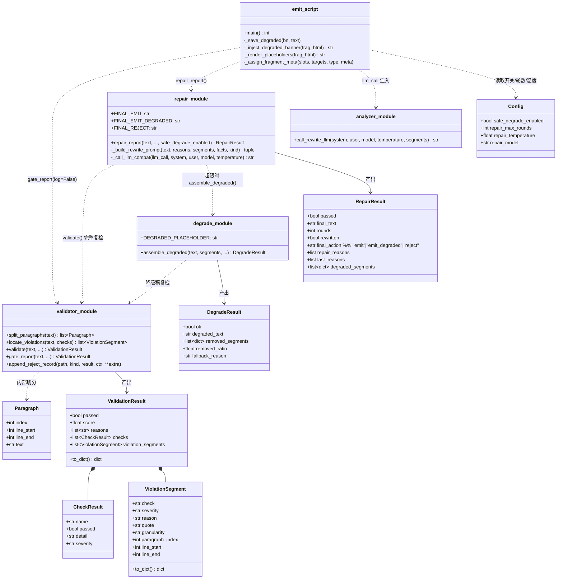
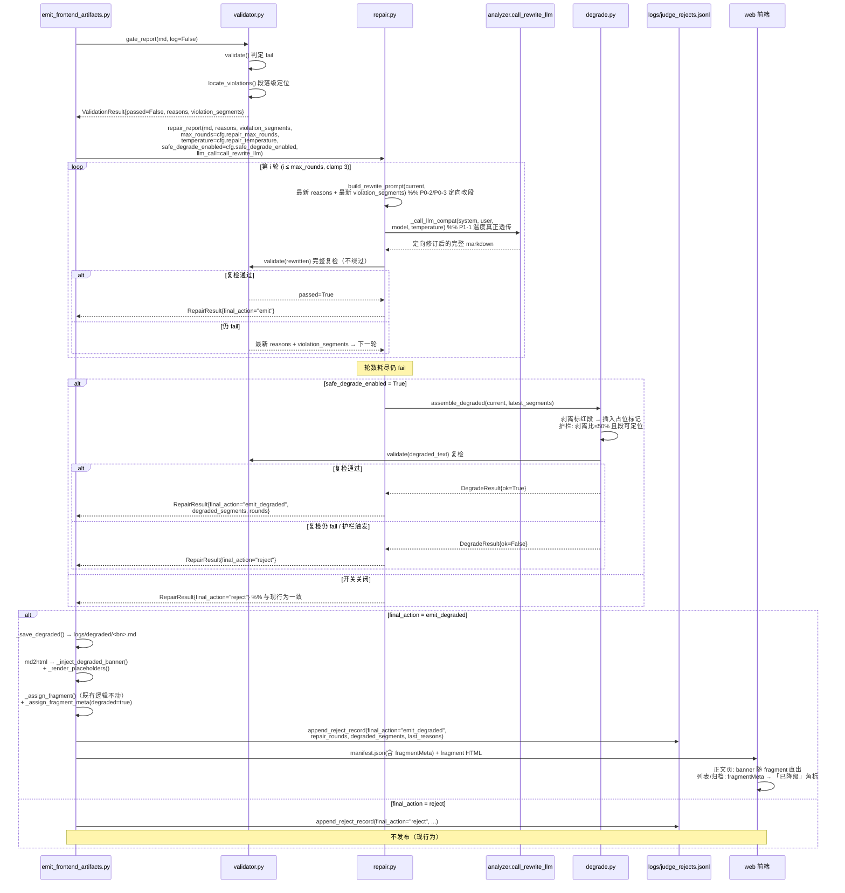
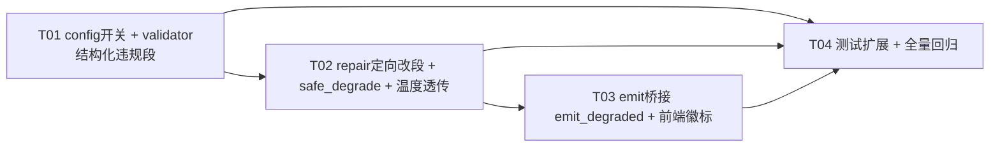

# 系统设计 — U3 修改策略（引导式修复 + 安全降级发布）

> - 项目：`u3_guided_repair_safe_degrade`
> - 上游输入：`docs/PRD_U3_modification_strategy.md`
> - 架构师：高见远（Gao）
> - 语言/栈：Python 3（标准库为主）+ Vite/TS 静态前端（`web/`）；**零新增第三方依赖**

---

## Part A: 系统设计

### 1. 实现方案（Implementation Approach）

#### 1.1 核心技术难点与对策

| 难点 | 对策 |
|---|---|
| ① 违规段定位：现有 checks 只对**全文**做正则，`reasons` 无位置信息 | 在 `validator.py` 内新增**段落切分器**（按空行切段，记录行号区间），把 5 类启发式检查改为「全文级结论不变 + 段落级复扫定位」双层：先按现有逻辑得出 pass/fail（**判定逻辑零改动，保证 19/19 回归**），fail 时再对每个段落复跑同一正则，产出结构化 `violation_segments`。定位不到的（如 LLM judge 整体评分低）输出**全文级 segment**（`paragraph_index=null`） |
| ② 定向改段但不引入 JSON patch 协议复杂度 | 本期采取「**整篇输出、定向修订**」策略：prompt 明确列出违规段原文 + 段号 + 原因，要求模型**仅重写这些段、其余逐字保留**，输出仍是完整 markdown（避免 patch 合并的解析失败风险，也天然兼容现有 `validate()` 全文复检）。sentence 级 patch 合并留作 P2-1 |
| ③ REPAIR_TEMPERATURE 断点 | 真实断点在 `repair.py`：`repair_report` 已接收 `temperature`/`model` 但调用 `llm_call(system, user)` 时丢弃。修复方式：用 `inspect.signature` 探测 `llm_call` 是否接受 `temperature`/`model` 关键字，接受则透传，否则退回两参调用（**兼容现有测试的 mock `fake_llm(system, user)`，不改 19 个既有用例**） |
| ④ safe_degrade 的质量底线 | 新增 `src/core/degrade.py`：按 `violation_segments` 剥离整段 → 插入占位标记 → **对降级稿再跑完整 `validate()`**，仍不通过（如全文级违规无法定位剥离）→ 回退 `reject`。另设护栏：剥离比例 > 50% 或无可定位段 → 直接 reject，杜绝「剥到只剩标题」的空壳降级 |
| ⑤ emit 桥接必须与刚合入的 BugFix 向后兼容 | **不触碰** `TYPE_PATTERNS` 放宽正则、`_resolve_slot_targets`、`_assign_fragment` 的既有语义；降级元数据走**新增可选结构** `slots[slot]["fragmentMeta"]`（manifest 加法字段，旧前端读不到也不报错）；徽标 banner 直接注入 fragment HTML 头部（正文页零 JS 改动即可见） |

#### 1.2 框架选型

- **不引入任何新 pip 包**：段落切分、正则定位、JSON 组装全部标准库（`re`/`json`/`dataclasses`/`inspect`）。`repair.py`/`validator.py`/`degrade.py` 保持「仅标准库 + 互相引用」的现有隔离原则，可被 tests 零网络导入。
- **前端不引入新 npm 包**：徽标 banner/占位条由 emit 阶段注入 fragment HTML + `states.css` 纯 CSS 实现；列表/归档角标读取 manifest 新增可选字段，TS 侧做 optional chaining。
- 架构模式：延续现有「**管道 + 状态机**」——gate → repair loop（状态机新增 `emit_degraded` 终态）→ emit 桥接 → 静态前端。

#### 1.3 PRD §5 待确认问题裁决（默认决策，已落地到本设计）

| # | 问题 | 裁决 |
|---|---|---|
| 1 | 发布流程 | **正常 emit + 前端徽标**，降级稿另存 `logs/degraded/` 备查（对齐 `logs/repaired/` 惯例），不单独建站 |
| 2 | 徽标覆盖范围 | **正文页 banner（emit 注入 fragment）+ 归档/列表页角标（manifest fragmentMeta）都做** |
| 3 | 段级定位精度 | **段落级（paragraph）**；segment schema 预留 `granularity` 字段，sentence 级为 P2-1 增强 |
| 4 | 被移除段可见性 | **展示占位条**「【本段因触发合规红线已安全降级移除】」（透明原则） |
| 5 | 运营告警 | 本期**仅 jsonl 留痕**（`final_action=emit_degraded` + `degraded_segments`），告警后续 |
| 6 | 置信度粒度 | 统一「**减置信版**」标识；fragmentMeta 预留 `confidence` 字段供 P2-2 分级 |
| 7 | 开关回退 | `safe_degrade_enabled` 走 env ▶ yaml ▶ code 三级（U16 惯例），**零代码、改 config/env 即回退 reject-only** |

---

### 2. 文件列表（File List）

| 文件（相对 dsa-test/） | 改/新增 | 说明 |
|---|---|---|
| `src/config.py` | 改 | 新增 `safe_degrade_enabled`（默认 True，env `SAFE_DEGRADE_ENABLED` ▶ yaml `thresholds.safe_degrade_enabled` ▶ code）；`repair_max_rounds` 代码默认 1→**2**（clamp≤3 已存在，保留） |
| `config.yaml`（若仓库存在） | 改 | `thresholds` 组补 `safe_degrade_enabled: true` / `repair_max_rounds: 2` 示例注释 |
| `src/core/validator.py` | 改 | 新增 `ViolationSegment` dataclass、`split_paragraphs()`、`locate_violations()`；`ValidationResult` 增 `violation_segments` 字段（默认空列表，`to_dict` 同步）；**现有判定逻辑与阈值零改动** |
| `src/core/prompts_repair.py` | 改 | `REPAIR_SYSTEM`/`REPAIR_USER_TEMPLATE` 由「整篇重新生成」改为「按 violation_segments 定向修订、未标红段逐字保留」；新增 `{violation_segments_block}` 槽位 |
| `src/core/repair.py` | 改 | `repair_report` 状态机升级：定向改段 prompt、**每轮回传最新 `res.reasons`/`res.violation_segments`**、llm_call 透传 temperature/model（inspect 探测降级兼容）、超限走 safe_degrade 分支；`RepairResult` 增 `final_action="emit_degraded"` 枚举、`degraded_segments`、`last_reasons`；新增模块常量 `FINAL_EMIT/FINAL_EMIT_DEGRADED/FINAL_REJECT` |
| `src/core/degrade.py` | **新增** | `assemble_degraded()`：剥离标红段 → 插占位标记 `DEGRADED_PLACEHOLDER` → 复检 → 护栏（剥离比>50% 或无可定位段 → 不可降级）；仅依赖标准库 + validator |
| `src/analyzer.py` | 改 | `call_rewrite_llm` 签名增 `segments: list \| None = None`（预留 P2-1，本期仅并入 user prompt 尾部提示，不做 patch 合并）；temperature 参数已存在——本次确保被 repair 侧真正传入（见 repair.py） |
| `scripts/emit_frontend_artifacts.py` | 改（**叠加式**） | 识别 `rres.final_action == "emit_degraded"`：降级稿存 `logs/degraded/<bn>.md`、fragment 头部注入 banner div、占位标记转占位条 div、`_assign_fragment` 后追加 `fragmentMeta`（新增可选 manifest 字段）、jsonl 写 `final_action=emit_degraded` + `repair_rounds` + `degraded_segments`。**不改 TYPE_PATTERNS/_resolve_slot_targets/_assign_fragment 既有语义** |
| `web/src/styles/states.css` | 改 | 新增 `.dsa-degraded-banner`（琥珀 `#FEF3C7` 底/`#92400E` 字）、`.dsa-degraded-placeholder`、`.dsa-degraded-badge` 样式；禁纯红、禁动画 |
| `web/src/components/cards.ts` | 改 | 时段卡片读取 `fragmentMeta?.[type]?.degraded` → 渲染「已降级」角标（optional，旧 manifest 无字段则不渲染） |
| `web/src/pages/archive.ts`（及 `components/archive-data.ts` 若需） | 改 | 归档列表项角标「已降级」，同上 optional 读取 |
| `tests/test_repair_loop.py` | 改（扩展） | 新增用例：定向改段 prompt 含段指针、每轮回传最新原因、temperature 透传断言；**既有 19 用例不动** |
| `tests/test_safe_degrade.py` | **新增** | degrade 组装、复检回退、护栏（剥离比/不可定位）、`safe_degrade_enabled=False` 回退 reject、终态枚举三分支 |
| `tests/test_emit_degraded_manifest.py` | **新增** | emit 桥接：emit_degraded → fragment 含 banner/占位条、manifest fragmentMeta、jsonl 终态字段；并回归 BugFix 的无时段日报映射不受影响 |

---

### 3. 数据结构与接口

#### 3.1 结构化违规段 schema（validator 输出，跨文件契约）

```json
{
  "violation_segments": [
    {
      "check": "red_line",
      "severity": "critical",
      "reason": "含具体买入建议与价位",
      "quote": "建议现价买入，目标价 15.80 元",
      "location": {
        "granularity": "paragraph",
        "paragraph_index": 3,
        "line_start": 12,
        "line_end": 15
      }
    },
    {
      "check": "llm_judge",
      "severity": "critical",
      "reason": "LLM 评分 0.31 低于阈值",
      "quote": null,
      "location": { "granularity": "document", "paragraph_index": null,
                    "line_start": null, "line_end": null }
    }
  ]
}
```

- `check` ∈ `red_line | self_consistency | impossible_move | ungrounded | numeric_source | llm_judge`（与现有 `CheckResult.name` 一一对应）
- `severity` ∈ `critical | warn`（沿用现有语义）
- `quote`：违规命中文本摘录（≤80 字，供 prompt 引用与前端占位定位）
- `granularity` ∈ `paragraph | document`（`sentence` 预留 P2-1）；`document` 级段**不可被 degrade 剥离**（触发回退 reject）

#### 3.2 类图（同步存 `docs/class-diagram-u3-modification.mermaid`）



#### 3.3 关键接口签名（新旧对照）

**`validator.validate` / `gate_report`**：签名不变（零破坏）。`ValidationResult` 加法式新增 `violation_segments: list[ViolationSegment] = field(default_factory=list)`；fail 时内部调用 `locate_violations()` 填充。

**`repair.repair_report`（新签名，全部加法参数）**：

```python
FINAL_EMIT = "emit"
FINAL_EMIT_DEGRADED = "emit_degraded"
FINAL_REJECT = "reject"

def repair_report(
    text: str,
    *,
    reasons: list,
    violation_segments: list | None = None,   # 新增：首轮 gate 的结构化违规段
    source_facts: dict | None = None,
    report_kind: str = "stock",
    model: str | None = None,
    max_rounds: int = 2,                       # 默认由调用方传 cfg.repair_max_rounds（默认 2）
    llm_call: Callable,                        # 兼容 (s,u) 与 (s,u,*,model,temperature)
    config: JudgeConfig | None = None,
    llm_judge: Callable | None = None,
    temperature: float = 0.1,                  # 本次真正透传给 llm_call
    safe_degrade_enabled: bool = True,         # 新增：P0-7 开关，由 emit 传 cfg 值
) -> RepairResult
```

行为要点：
1. 每轮 `_build_rewrite_prompt(current, latest_reasons, latest_segments, ...)`——**latest_* 取上一轮 `validate()` 的最新结果**（P0-3；首轮用入参）。
2. `_call_llm_compat`：`inspect.signature(llm_call)` 含 `temperature`（或 `**kwargs`）→ `llm_call(system, user, model=model, temperature=temperature)`；否则 `llm_call(system, user)`（兼容既有 mock）。
3. 轮数耗尽仍 fail：若 `safe_degrade_enabled` → `assemble_degraded(current_best, latest_segments)`；`ok=True` → `final_action="emit_degraded"`、`final_text=degraded_text`、`degraded_segments=removed_segments`；`ok=False` 或开关关 → 现行 `reject`（原文回传，行为与今天完全一致）。
4. `llm_call` 抛错：不变，安全降级——但在抛错前若已有可用 `latest_segments` 且开关开，同样尝试 degrade 后再 reject（尽力保底交付）。

**`degrade.assemble_degraded`**：

```python
DEGRADED_PLACEHOLDER = "【本段因触发合规红线已安全降级移除】"

def assemble_degraded(
    text: str,
    violation_segments: list,          # 仅剥离 granularity=="paragraph" 的段
    *,
    source_facts: dict | None = None,
    report_kind: str = "stock",
    config: JudgeConfig | None = None,
    max_removed_ratio: float = 0.5,    # 护栏：剥离比上限
) -> DegradeResult
```

**`analyzer.call_rewrite_llm`（加法参数）**：

```python
def call_rewrite_llm(
    system_prompt: str,
    user_prompt: str,
    *,
    model: str | None = None,
    temperature: float = 0.1,
    segments: list | None = None,   # 预留 P2-1；本期仅在 user prompt 尾部附段指针提示
) -> str
```

**manifest 加法字段（emit → 前端契约）**：

```json
{
  "slots": {
    "0915": {
      "label": "…", "name": "…",
      "fragments": { "report": "report_0915_20250731.html" },
      "fragmentMeta": {
        "report": { "degraded": true, "confidence": "reduced", "removedSegments": 2 }
      }
    }
  }
}
```

`fragmentMeta` 整体可缺省；前端一律 `slot.fragmentMeta?.[type]?.degraded` 读取，旧 manifest 完全兼容。

**jsonl 终态记录（`logs/judge_rejects.jsonl`，经 `append_reject_record(**extra)` 加法写入）**：

```json
{ "ts": "...", "kind": "report", "passed": false, "score": 0.0,
  "reasons": ["..."], "checks": [...], "context": {"file": "..."},
  "final_action": "emit_degraded", "repair_rounds": 3, "rewritten": true,
  "repair_reasons": ["首轮原因..."], "last_reasons": ["末轮原因..."],
  "degraded_segments": [ { "check": "red_line", "paragraph_index": 3, "reason": "..." } ] }
```

---

### 4. 程序调用流程（同步存 `docs/sequence-diagram-u3-modification.mermaid`）



### 5. Anything UNCLEAR（假设与说明）

1. **「当前最佳稿」选择**：degrade 以**最后一轮重写稿**（`current`）为底稿——它经历过定向修订、通常违规面最小；若最后一轮 `validate()` 的 segments 为空但仍 fail（极端：只剩 document 级违规），回退 reject。
2. `reasons` 与 `violation_segments` 并存：`reasons` 文本保留为人读/日志兼容通道，`violation_segments` 是机器通道，两者由同一次 validate 产生，不会分叉。
3. `_load_source_facts` 侧车缺失时（现状常见），定向修订仅靠 reasons+segments 自纠——与现行退化行为一致。
4. BugFix 兼容：本设计对 emit 的全部改动位于「repair 返回之后」的分支与 manifest 组装尾部，不与 `_resolve_slot_targets`/`_assign_fragment`/正则放宽发生交集；无时段大盘日报（映射 5 时段）若降级，其 `fragmentMeta` 同样按 `is_daily_fallback` 不覆盖已有带时段条目的 meta。

---

## Part B: 任务分解

### 6. 依赖包列表

**无新增 pip 包。** 全部实现使用标准库（`re`/`json`/`dataclasses`/`inspect`/`pathlib`）。`json_repair` 不需要（本期不做 JSON patch 协议，模型输出仍为完整 markdown）。前端无新增 npm 包（纯 CSS + optional chaining）。CI 现有环境即可运行全部测试。

### 7. 任务列表（≤5，按依赖排序）

| 任务 | 名称 | 源文件 | 依赖 | 优先级 |
|---|---|---|---|---|
| **T01** | 基础设施：config 开关 + validator 结构化违规段（P0-1/P0-7/P1-2） | `src/config.py`(改)、`config.yaml`(改,若存在)、`src/core/validator.py`(改) | — | P0 |
| **T02** | 修复核心：定向改段 + 最新原因回传 + safe_degrade 组装 + 温度透传（P0-2/P0-3/P0-4/P1-1） | `src/core/prompts_repair.py`(改)、`src/core/repair.py`(改)、`src/core/degrade.py`(**新增**)、`src/analyzer.py`(改) | T01 | P0 |
| **T03** | 发布桥接 + 前端徽标：emit_degraded 终态 + banner/占位条/角标（P0-5/P0-6） | `scripts/emit_frontend_artifacts.py`(改,叠加式)、`web/src/styles/states.css`(改)、`web/src/components/cards.ts`(改)、`web/src/pages/archive.ts`(改)、`web/src/components/archive-data.ts`(改,如需) | T02 | P0 |
| **T04** | 测试扩展 + 全量回归（验收标准全覆盖） | `tests/test_repair_loop.py`(改,扩展)、`tests/test_safe_degrade.py`(**新增**)、`tests/test_emit_degraded_manifest.py`(**新增**) | T01,T02,T03 | P0 |

**各任务验收点**：

- **T01**：`Config().safe_degrade_enabled` 三级优先级生效（`SAFE_DEGRADE_ENABLED=0` 可关）；`repair_max_rounds` 默认 2、`>3` 仍 clamp+报 ConfigIssue；对红线样本 `validate()` 返回的 `violation_segments` 至少 1 条 paragraph 级指针且 `to_dict()` 含该字段；**现有 validator/repair 相关单测全绿（判定结果与 score 不变）**。
- **T02**：定向 prompt 含段号+原文引用+「未标红段逐字保留」指令；mock 多轮场景断言第 2 轮 prompt 含第 1 轮复检的**最新**原因；`inspect` 兼容两种 llm_call 签名（现有 19 用例的 `fake_llm(system, user)` 不改仍过）；轮耗尽 + 开关开 → `final_action="emit_degraded"` 且降级稿复检 passed；开关关 → 与现行 reject 行为逐字段一致。
- **T03**：构造降级返回 → fragment HTML 首节点为 `.dsa-degraded-banner`（琥珀系）、占位标记转 `.dsa-degraded-placeholder`；manifest 含 `fragmentMeta.{type}.degraded=true`；旧 manifest（无 fragmentMeta）前端不报错不渲染角标；jsonl 记录含 `final_action=emit_degraded`/`repair_rounds`/`degraded_segments`；**BugFix 回归：无时段 `market_review_YYYYMMDD.md` 仍映射 5 时段、带时段报告优先级不变**。
- **T04**：新增用例覆盖三终态枚举、degrade 护栏（剥离比>50%→reject、document 级违规→reject）、temperature 透传断言；`pytest tests/test_repair_loop.py tests/test_safe_degrade.py tests/test_emit_degraded_manifest.py` 全绿；U3 既有 **19/19 不回退**。

### 8. 共享知识（跨文件约定）

1. **`final_action` 枚举唯一定义点**：`src/core/repair.py` 模块常量 `FINAL_EMIT="emit"` / `FINAL_EMIT_DEGRADED="emit_degraded"` / `FINAL_REJECT="reject"`；emit 脚本与测试 import 常量比较，jsonl/manifest 持久化为字符串字面量（消费方按字符串解析）。
2. **`violation_segments` 字段名全链路一致**：validator 产出 → repair 入参/回传 → degrade 入参 → jsonl `degraded_segments`（剥离子集）→ 各文件不得改名/改嵌套结构；segment 字段集合以 §3.1 schema 为准（新增字段只加不减）。
3. **占位标记约定**：`degrade.DEGRADED_PLACEHOLDER` 是唯一文案源（markdown 层独占一段插入）；emit 的 `_render_placeholders()` 按该常量精确匹配转 `<div class="dsa-degraded-placeholder">`，前端 CSS 类名 `dsa-degraded-*` 前缀统一。
4. **banner 注入点约定**：只在 emit 阶段注入 fragment HTML 最前（`_inject_degraded_banner`），前端各页面**不**自行判断是否插 banner（避免双 banner）；列表/归档角标唯一数据源是 `manifest.slots[*].fragmentMeta`。
5. **config 命名约定**（U16 三级优先级 env ▶ yaml ▶ code）：env `SAFE_DEGRADE_ENABLED` ↔ yaml `thresholds.safe_degrade_enabled` ↔ 字段 `safe_degrade_enabled`；repair 相关沿用既有 `REPAIR_MAX_ROUNDS`/`REPAIR_TEMPERATURE`/`REPAIR_MODEL`。
6. **llm_call 兼容协议**：注入的 callable 可为 `(system, user)` 或 `(system, user, *, model=None, temperature=0.1, ...)`；repair 用 `inspect.signature` 探测，测试 mock 无需升级。
7. **降级稿落盘**：`logs/degraded/<bn>.md`（对齐 `logs/repaired/` 惯例，均不入 `reports/` 防重处理）。

### 9. 任务依赖图



### 10. 待明确事项（裁决后仍建议确认）

1. **降级率告警阈值**（后续）：`emit_degraded` 占比多少触发人工介入（本期仅 jsonl 留痕，建议运营观察 2 周后定阈值）。
2. **`max_removed_ratio=0.5` 护栏值**：50% 为架构默认，若用户希望更保守（如 30%）仅需改 `assemble_degraded` 默认参或后续提升为 config 字段。
3. **`repair_max_rounds` 生产默认取 2 还是 3**：代码默认 2（时效稳妥）；workflow 已放宽 30min，若拦截样本显示 2 轮修复率低，可仅改 env `REPAIR_MAX_ROUNDS=3`。
4. **document 级违规（LLM judge 低分）不可降级**：本设计回退 reject（无法定位剥离面）。若后续希望此类也保底，需引入「LLM judge 输出段级理由」的 prompt 升级，属 P2。
