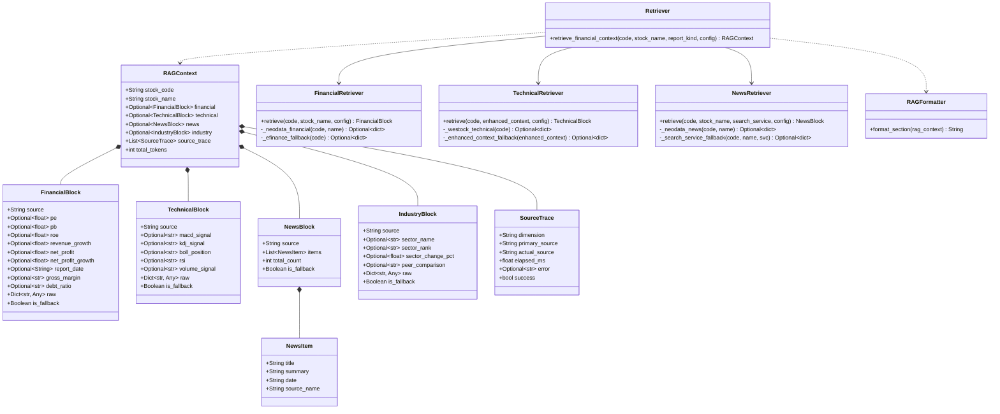
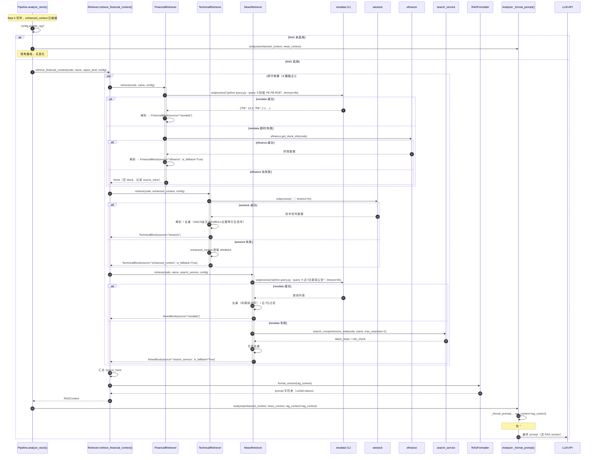
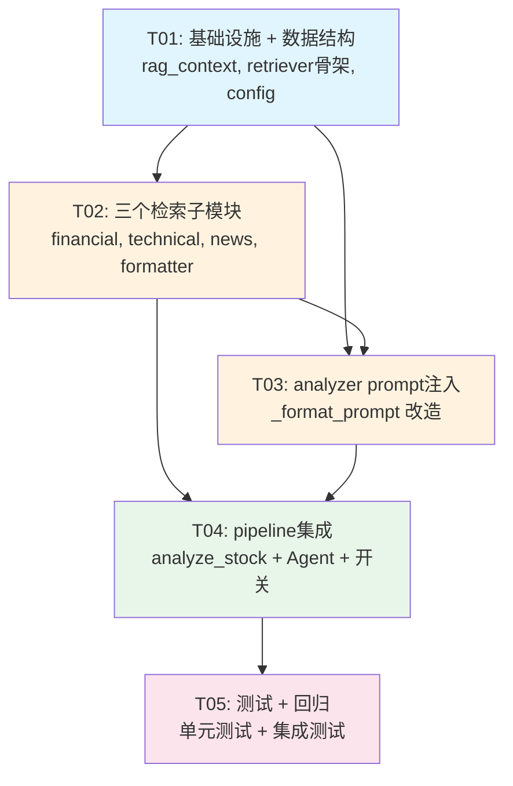

# U6 RAG（检索增强生成）— 系统架构设计 + 任务分解

> 作者：架构师 高见远（Gao）｜增量改造对象：`D:\BaiduNetdiskWorkspace\Agent\workbuddy\workspace\projects\Daily stock analysis\dsa-test\`
> 性质：**运行系统的增量改造**（非从零新建）。基于 PM 许清楚审定的 U6 PRD。
> 主理人已拍板 6 条决策（Q1-Q6），本设计严格遵循，不再追问。

---

## 0. 勘察结论速记（设计依据）

| 项 | 现状 | 本设计动作 |
|---|---|---|
| `analyze_stock()` 流程 | Step 1→4 数据获取 → Step 5 获取分析上下文 → Step 6 增强 context → Step 7 调 LLM | **在 Step 6 与 Step 7 之间插入 RAG 检索**（约 L698→L699 之间） |
| `_format_prompt()` | 结构为 `基础信息` → `技术面数据` → `舆情情报` → `分析任务` | **在 `基础信息`（含 market_phase/daily_market/continuity/market_structure）之后、`技术面数据` 之前注入 `## 🔍 外部数据检索（RAG Grounding）`** |
| `GeminiAnalyzer.analyze()` | 签名：`analyze(self, context, news_context, ...)` | **新增可选参数 `rag_context: RAGContext | None = None`**，透传给 `_format_prompt()` |
| Agent 路径 | `_analyze_with_agent()` 构建 `initial_context` → `executor.run()` | **在 `initial_context` 中新增 `rag_context` 键**，Agent Executor 在 `_build_user_message` 中注入 |
| `Config` 开关模式 | `enable_realtime_quote: bool = True`，env `ENABLE_REALTIME_QUOTE` | **新增 `enable_rag: bool = True`**，env `ENABLE_RAG`，沿用三级优先级 |
| neodata 调用 | CLI 子进程 `python query.py --query "..."`，12h TTL，30s 默认超时 | **通过 subprocess 调用**，加入 8s 超时控制 |
| westock 调用 | `westock-data` Node builtin skill，已在 Agent 路径使用 | **新增子进程调用封装**，加入 5s 超时控制 |
| efinance | `data_provider/` 已有封装，通过 `DataFetcherManager` | **复用**，不重复建设 |
| search_service | `search_service.search_comprehensive_intel()` 返回 `SearchResponse` | **作为 RAG 新闻检索回退** |

**关键约束**：RAG 模块是**增量、独立、失败不阻塞**的。任何数据源故障/超时自动降级，绝不阻断 `analyze_stock()` 主流程。新增模块 `src/rag/` 与既有 `data_provider/` 职责分离：data_provider 管行情/筹码/基本面（Step 1-2.5），rag 管外部数据检索注入（Step 5.5）。

---

## 1. 实现方案 + 框架选型

### 1.1 核心挑战

1. **外部数据源多样化且不稳定** — neodata / westock / efinance / search_service 可用性不一
2. **prompt token 预算有限** — 总计 ≤1500 tokens，需精确截断和格式化
3. **向后兼容** — 非 RAG 路径的 prompt 和行为不变
4. **两条分析路径共享** — legacy（analyzer.analyze）和 Agent（executor.run）共用 RAG 检索

### 1.2 框架与库选型

| 决策 | 结论 | 理由 |
|------|------|------|
| 新依赖 | **零新增** | 纯 Python 标准库 + subprocess 调用现有 CLI |
| neodata 调用方式 | `subprocess.run(["python", query_script, "--query", "..."], timeout=8)` | 复用已有 CLI，无需新增 SDK |
| westock 调用方式 | `subprocess.run(["node", westock_script, ...])` | 确认 `westock-data` 有 CLI 入口后再定；P0 可先用 enhanced_context 中的基础数据 |
| efinance | 复用 `data_provider/` 已有封装 | 不重复建设，避免与现有行情链路冲突 |
| 数据类型 | Python `dataclass` | 与项目 `AnalysisResult` / `Config` 风格一致 |
| 超时控制 | `subprocess.run(timeout=N)` + `try/except` | 标准库，零依赖 |

### 1.3 架构模式

```
┌─────────────────────────────────────────────────────────────┐
│                    pipeline.analyze_stock()                   │
│                                                              │
│  Step 1-5: 数据获取（行情/筹码/基本面/趋势/上下文）               │
│                 ↓                                             │
│  Step 5.5: RAG 检索 ←── NEW (src/rag/retriever.py)           │
│     ├── financial.py  (neodata → efinance fallback)          │
│     ├── technical.py  (westock → enhanced_context fallback)  │
│     └── news.py       (neodata → search_service fallback)    │
│                 ↓                                             │
│  Step 7: analyze() / executor.run() ← RAGContext 注入 prompt │
│                 ↓                                             │
│              AnalysisResult                                   │
└─────────────────────────────────────────────────────────────┘
```

设计原则：
- **Facade 模式** — `retriever.retrieve_financial_context()` 对外暴露单一入口，内部组合 3 个子检索器
- **Strategy 模式** — 各子检索器有首选 → 回退两级策略链
- **Fail-open** — 任何子检索器异常返回空 block，不抛出

---

## 2. 文件列表

| 路径 | 操作 | 说明 |
|------|------|------|
| `src/rag/__init__.py` | **新增** | 包初始化，导出公共符号 |
| `src/rag/rag_context.py` | **新增** | `RAGContext` + 子 block dataclass (`FinancialBlock`, `TechnicalBlock`, `NewsBlock`, `IndustryBlock`, `SourceTrace`) |
| `src/rag/retriever.py` | **新增** | 入口 `retrieve_financial_context()`，组合 3 子模块 + 超时降级 |
| `src/rag/financial.py` | **新增** | 财报检索：neodata → efinance fallback |
| `src/rag/technical.py` | **新增** | 技术信号检索：westock → enhanced_context fallback |
| `src/rag/news.py` | **新增** | 新闻检索：neodata → search_service fallback |
| `src/rag/formatter.py` | **新增** | `format_rag_prompt_section()` 将 RAGContext 转为 prompt 字符串（≤1500 tokens） |
| `src/analyzer.py` | **改动** | `_format_prompt()` 新增 `rag_context` 参数，`analyze()` 透传 |
| `src/core/pipeline.py` | **改动** | `analyze_stock()` Step 5→7 之间插入 RAG 检索； `_analyze_with_agent()` 注入 RAG 到 initial_context |
| `src/config.py` | **改动** | `Config` 新增 `enable_rag` / `rag_neodata_timeout` / `rag_westock_timeout` 等字段 |
| `src/core/config_registry.py` | **改动** | 追加 RAG 新字段到 Web 设置页元数据 |
| `config.yaml` | **改动** | 新增 `rag` section（非敏感默认值） |
| `tests/test_rag_retriever.py` | **新增** | RAG 检索单元测试 |
| `tests/test_rag_formatter.py` | **新增** | RAG prompt 格式化测试 |
| `tests/test_rag_integration.py` | **新增** | RAG → pipeline 集成测试 |

---

## 3. 数据结构与接口（类图）



---

## 4. 程序调用流程（时序图）



---

## 5. Anything UNCLEAR

| # | 事项 | 假设 / 裁决 |
|---|------|-------------|
| U1 | westock-data 的 CLI 调用方式 | 假设 westock-data skill 提供可被 `subprocess` 调用的脚本入口。若当前仅有 Node API 无 CLI，P0 先用 enhanced_context fallback，P1 补充 CLI 封装。 |
| U2 | neodata 返回的 JSON schema 不稳定 | 所有 neodata 响应解析必须包装在 `try/except` 中，解析失败走 fallback。不对 neodata 返回结构做强假设。 |
| U3 | `search_service` 的 fallback 优先级 | neodata 新闻失败后，先用 search_comprehensive_intel 的 latest_news + risk_check 维度（取最近500字摘要）；若 search_service 也不可用则 NewsBlock=None。 |
| U4 | 大盘 RAG 检索范围 | P0 仅做：从 neodata 检索"宏观概览"类查询（如"上证指数近期宏观环境"），超时 8s，失败不注入。不纳入本设计核心流程，P1 完善。 |
| U5 | 新闻去重时机 | 第一阶段仅标题前 20 字符去重，不涉及语义去重。 |
| U6 | Token 预算计算 | 使用 `len(prompt_string)` 作为近似（中文约 1 token/字符），不得引入 tokenizer 依赖。若超 1500 字符截断最后一条 record。 |

---

## Part B: 任务分解

### 6. Required Packages

```
无新增第三方依赖。所有依赖均为 Python 标准库（subprocess, dataclasses, typing, logging, time, json）。
```

---

### 7. Task List（按实现顺序，≤5 个任务）

| Task ID | Task Name | Source Files | Dependencies | Priority |
|---------|-----------|-------------|-------------|----------|
| **T01** | **项目基础设施 + RAG 数据结构** | `src/rag/__init__.py`, `src/rag/rag_context.py`, `src/rag/retriever.py`, `src/config.py`（enable_rag 等字段）, `config.yaml`（rag section） | — | P0 |
| **T02** | **财报 + 技术信号 + 新闻三个检索子模块** | `src/rag/financial.py`, `src/rag/technical.py`, `src/rag/news.py`, `src/rag/formatter.py` | T01 | P0 |
| **T03** | **analyzer prompt 注入 + grounding 约束扩展** | `src/analyzer.py`（`_format_prompt()` 新增 rag 参数 + 注入 section + grounding 约束文字） | T01, T02 | P0 |
| **T04** | **pipeline 集成 + config 开关 + Agent 路径** | `src/core/pipeline.py`（`analyze_stock()` 插入 RAG Step + `_analyze_with_agent()` 注入）, `src/core/config_registry.py` | T01, T02, T03 | P0 |
| **T05** | **测试 + 回归验证** | `tests/test_rag_retriever.py`, `tests/test_rag_formatter.py`, `tests/test_rag_integration.py` | T01, T02, T03, T04 | P0 |

---

### 各任务详细说明

#### T01: 项目基础设施 + RAG 数据结构

**产出**：
- `src/rag/__init__.py` — 导出 `RAGContext`, `retrieve_financial_context`, `format_rag_prompt_section`
- `src/rag/rag_context.py` — 全部 dataclass（`RAGContext`, `FinancialBlock`, `TechnicalBlock`, `NewsBlock`, `NewsItem`, `IndustryBlock`, `SourceTrace`）
- `src/rag/retriever.py` — 入口函数 `retrieve_financial_context()` **骨架**（含超时降级框架，子模块调用用占位/`NotImplementedError`）
- `src/config.py` — `Config` 新增字段：
  ```python
  enable_rag: bool = True                                    # RAG 总开关
  rag_neodata_timeout_seconds: float = 8.0                   # neodata 超时
  rag_westock_timeout_seconds: float = 5.0                   # westock 超时
  rag_news_dedup_title_chars: int = 20                       # 新闻去重前缀长度
  rag_max_prompt_tokens: int = 1500                          # prompt token 预算
  ```
- `config.yaml` — 新增：
  ```yaml
  rag:
    enable: true
    neodata_timeout_seconds: 8.0
    westock_timeout_seconds: 5.0
    news_dedup_title_chars: 20
    max_prompt_tokens: 1500
  ```

#### T02: 三个检索子模块 + 格式化器

**产出**：
- `src/rag/financial.py` — `FinancialRetriever.retrieve()`
  - 首选 neodata CLI（query: `"{stock_name} {stock_code} 最新财报 市盈率 市净率 ROE 营收增速 净利润"`)
  - 回退 efinance（通过 `data_provider` 已有封装）
  - 返回 `FinancialBlock`
- `src/rag/technical.py` — `TechnicalRetriever.retrieve()`
  - 首选 westock（MACD金叉/死叉、KDJ、BOLL位置、RSI等衍生信号）
  - 回退 enhanced_context（提取 MA、BIAS 等基础数据）
  - **去重**：只取 enhanced_context 中没有的衍生信号（MA 和 BIAS 已存在于 prompt `## 📈 技术面数据` 中）
  - 返回 `TechnicalBlock`
- `src/rag/news.py` — `NewsRetriever.retrieve()`
  - 首选 neodata CLI（query: `"{stock_name} {stock_code} 近7日新闻公告 重大事件"`)
  - 回退 search_service.search_comprehensive_intel（取 latest_news + risk_check 维度，摘要限 200 字/条）
  - **去重**：标题前 20 字符去重 + 与 search_service 结果合并去重
  - 返回 `NewsBlock`
- `src/rag/formatter.py` — `RAGFormatter.format_section()`
  - 将 `RAGContext` 转为 Markdown 表格 `## 🔍 外部数据检索（RAG Grounding）`
  - 财报 ≤400 字符、技术 ≤500 字符、动态（新闻+板块）≤600 字符
  - 总计 ≤1500 字符

#### T03: analyzer prompt 注入

**产出**：
- `src/analyzer.py` 改动：
  - `analyze()` 签名新增 `rag_context: RAGContext | None = None`
  - `_format_prompt()` 签名新增 `rag_context: RAGContext | None = None`
  - **注入位置**：`## 📊 股票基础信息`（含 market_phase/daily_market/continuity/market_structure/analysis_context_pack）之后、`## 📈 技术面数据` 之前
  - **注入逻辑**：
    ```python
    if rag_context is not None and any([rag_context.financial, rag_context.technical, rag_context.news]):
        prompt += format_rag_prompt_section(rag_context)
    ```
  - **Grounding 约束扩展**：在 "技术面一致性" 约束行后追加：
    ```
    - **RAG 数据一致性**：所有数字结论须与行情源及 RAG 检索数据一致；RAG section 中的数据不得与你的分析矛盾
    ```
  - **向后兼容**：`rag_context` 默认 `None`，不传时行为与现状完全一致
- `analyze()` 内部 `_format_prompt()` 调用处传入 `rag_context`

#### T04: pipeline 集成 + config 开关 + Agent 路径

**产出**：
- `src/core/pipeline.py` 改动：
  - **Legacy 路径** (`analyze_stock()`)：在 Step 6（`_enhance_context`）完成后、Step 7（`_build_legacy_analysis_artifacts` / `analyzer.analyze()`）之前插入：
    ```python
    # Step 5.5: RAG 检索
    rag_context = None
    if getattr(self.config, 'enable_rag', False):
        try:
            from src.rag.retriever import retrieve_financial_context
            rag_context = retrieve_financial_context(
                code=code,
                stock_name=stock_name,
                report_kind=report_type.value,
                enhanced_context=enhanced_context,
                search_service=self.search_service,
                config=self.config,
            )
        except Exception as e:
            logger.warning(f"[RAG] 检索失败（降级，不阻塞）: {e}")
            rag_context = None
    ```
    然后 `analyzer.analyze()` 调用处传入 `rag_context=rag_context`
  - **Agent 路径** (`_analyze_with_agent()`)：在 `executor.run()` 调用前，将 `rag_context` 注入 `initial_context["rag_context"]`
- `src/core/config_registry.py` — 追加 RAG 新字段的 Web 元数据条目

#### T05: 测试 + 回归验证

**产出**：
- `tests/test_rag_retriever.py` — 单元测试：
  - Mock neodata/efinance/westock/search_service
  - 验证 fallback 链（首选可用→走首选，首选失败→走fallback，全失败→返回空block）
  - 验证超时降级（neodata 8s / westock 5s）
  - 验证新闻去重（标题前20字符）
- `tests/test_rag_formatter.py` — 格式化测试：
  - 验证 token 预算（总计 ≤1500，分块 ≤400/500/600）
  - 验证空 block 不注入
  - 验证 source_trace 不注入 prompt（仅日志用）
- `tests/test_rag_integration.py` — 集成测试：
  - 验证 RAG 关闭时不调用 retriever
  - 验证 _format_prompt 中 RAG section 位置正确
  - 回归测试：无 rag_context 时 prompt 与 master 一致

---

### 8. Shared Knowledge

```
# ── RAG 模块约定 ──

## RAGContext 字段名约定
- financial: 财报关键指标（PE/PB/ROE/营收增速/净利润等）
- technical: 衍生技术信号（MACD金叉/KDJ/BOLL位置等，不含 MA/BIAS 等已有数据）
- news: 近7日新闻标题+摘要列表
- industry: 行业/板块对比（P1，当前可为 None）
- source_trace: 每个维度的数据来源追踪（用于日志/监控，不注入 prompt）

## prompt section 锚定标记
- RAG section 标记为 `## 🔍 外部数据检索（RAG Grounding）`
- 位置固定在 `## 📈 技术面数据` 之前
- 若 RAG 无数据则整个 section 不出现

## 去重规则
- 新闻去重：标题前 20 字符（UTF-8 字符，非字节）
- 技术去重：RAG 不返回 enhanced_context 中已存在的 MA/BIAS 等基础指标
  - 已有字段（不检索）：ma5, ma10, ma20, bias_ma5, bias_ma10, current_price
  - 重新检索（仅衍生）：MACD金叉/死叉, KDJ超买/超卖, BOLL上轨/下轨位置, RSI, WR

## prompt 格式
- 使用 Markdown 表格，每行最多 80 字符宽
- 日期格式 YYYY-MM-DD
- 数值保留 2 位小数

## 错误处理
- 所有检索调用包装 `try/except Exception`
- 超时使用 `subprocess.run(timeout=N)`
- 失败日志级别 WARNING，不设 ERROR（避免告警风暴）
- 失败时 block=None 且 source_trace 记录 error 和 elapsed_ms

## 配置优先级
enable_rag: env ENABLE_RAG > config.yaml rag.enable > Config code default (True)
```

---

### 9. Task Dependency Graph


