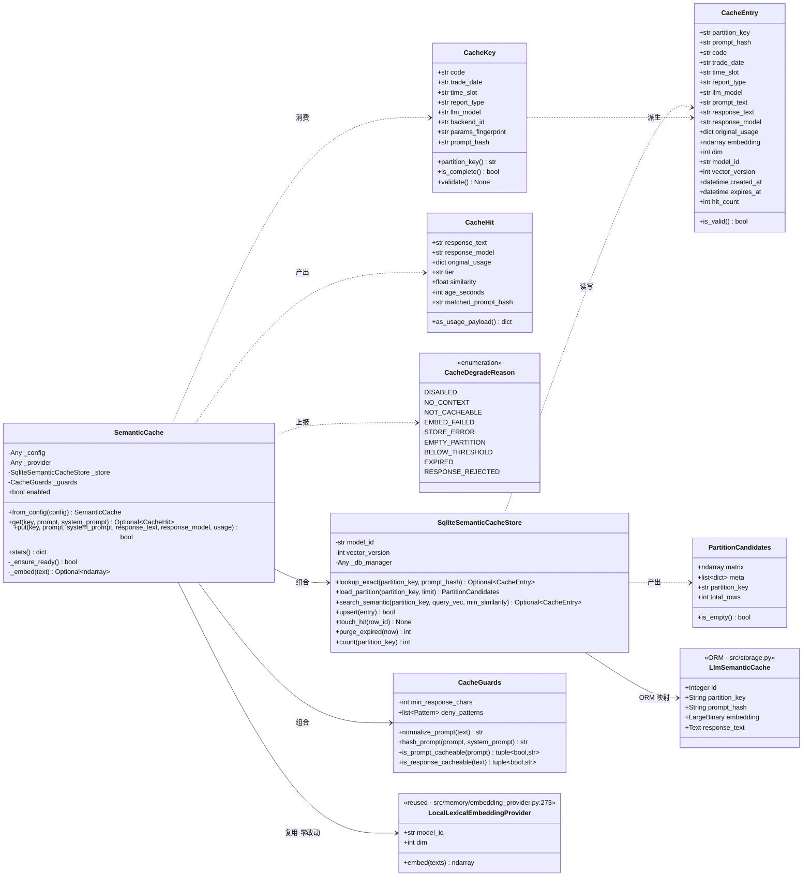
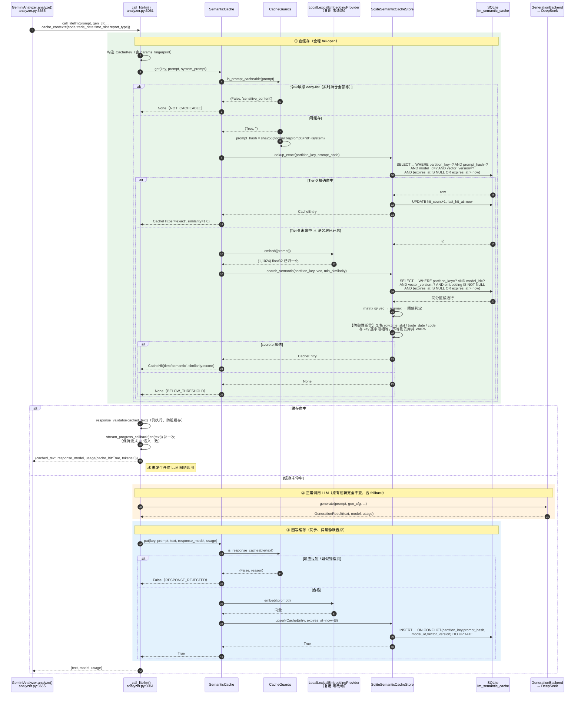
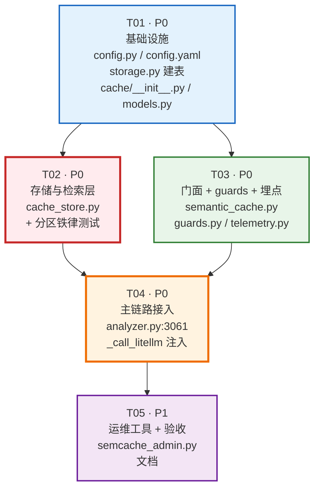

# U12 语义缓存 — 系统架构设计（架构评审稿）

| 项 | 值 |
|---|---|
| 文档版本 | v1.0（架构评审稿） |
| 架构师 | 高见远（Gao） |
| 基线 commit | `755597ee`（`origin/master`，P1.6 已合并；U14 已落地） |
| Python 运行时 | `C:/Users/29096/.workbuddy/binaries/python/versions/3.13.12/python.exe` |
| 阶段 | 设计评审 — **本次不改任何源码** |
| 状态 | 待用户拍板（见 §11 待明确事项） |

---

## 0. 事实核实清单（设计前置，已逐条读码验证）

> 本节是全文所有结论的证据基础。**其中 3 条与任务书初始设定不符，已修正并直接影响架构决策。**

| # | 待核实事项 | 核实结果 | 证据位置 | 是否符合预期 |
|---|---|---|---|---|
| F1 | LLM 调用唯一 chokepoint | `GeminiAnalyzer._call_litellm()`，**确为单点 wrapper**，全库仅 2 处业务调用 | `src/analyzer.py:3061`；调用方 `:3432`(`generate_text`)、`:3655`(`analyze`) | ✅ 符合 |
| F2 | `SqliteVectorStore` 检索 API | `search(RecallQuery) -> RecallResult`；`load_candidates()` 拉候选矩阵 | `src/memory/vector_store.py:561` / `:369` | ✅ 符合 |
| F3 | **该 store 是否支持 `time_slot` 过滤** | ❌ **不支持**。`_query_candidates()` 的 SQL 过滤仅 `model_id` / `vector_version` / `embedding IS NOT NULL` / `code` / `trade_date >= cutoff` / `report_type`。**`time_slot` 从未进入 WHERE 子句** | `src/memory/vector_store.py:418-430`；`grep time_slot` 仅命中写入与解码路径（`:278,:328,:412,:514,:687`） | 🔴 **不符合，致命** |
| F4 | `RecallQuery.time_slot` 用途 | 字段存在且 `validate()` 会归一化（`:249-250`），但**下游无任何消费者**——是一个"声明了却没实现"的过滤维度 | `src/memory/models.py:211`；`vector_store.py` 全文无引用 | 🔴 **不符合** |
| F5 | 候选矩阵缓存键 | `_cache_key()` = `(model_id, vector_version, scope, code, cutoff, report_type, max_candidates)`，**不含 `time_slot`** | `src/memory/vector_store.py:350-360` | 🔴 **不符合，放大 F3 风险** |
| F6 | `trade_date` 过滤口径 | 仅 `>= cutoff` 的**范围**过滤，非精确等值 | `src/memory/vector_store.py:428` | 🔴 与 U12 需求不符 |
| F7 | `LocalLexicalEmbeddingProvider.embed()` 签名 | `embed(texts: Sequence[str]) -> np.ndarray`，返回 `(n, dim)`、`float32`、**已 L2 归一化** | `src/memory/embedding_provider.py:315-322` | ✅ 符合 |
| F8 | 向量维度 / model_id | `DEFAULT_LOCAL_DIM = 1024`；`LOCAL_MODEL_ID = "local:lexical-v1"`；`VECTOR_VERSION = 1` | `src/memory/models.py:35,38,48` | ✅ 符合 |
| F9 | 相似度口径 | 落盘已归一化 ⇒ **余弦退化为点积** `matrix @ vector`；阈值过滤 `scores >= min_similarity`；再叠加半衰期时间衰减 | `src/memory/vector_store.py:652-654,:671-674` | ✅ 符合 |
| F10 | **`ltm_min_similarity` 实际运行值** | 代码默认 **0.75**（`src/config.py:1291`），但 `config.yaml:144` 覆盖为 **0.25** ⇒ 运行时确为 **0.25** | `src/config.py:1291,2416-2419`；`config.yaml:144` | ⚠️ 用户所述正确，但需知晓双来源 |
| F11 | `analysis_memory_vector` 表结构 | `history_id NOT NULL`（无 FK）；唯一键 `(history_id, model_id, vector_version)`；`time_slot`/`trade_date` 均已建索引 | `src/storage.py:367-411` | ⚠️ 见 §1.2 冲突分析 |
| F12 | 建表机制 | `Base.metadata.create_all()`，**无需 migration 脚本** | `src/storage.py:1342`、`:381` | ✅ 新增表零成本 |
| F13 | `provider_cache.py` 性质 | 文件 docstring 即 `"Provider prompt-cache capability registry and safe hint lowering"`——供应商侧 KV-cache/prompt-cache 的**能力注册表与 hint 下发**，与 LLM 结果缓存无关 | `src/llm/provider_cache.py:1-40` | ✅ 与任务书澄清一致 |
| F14 | `audit_context` 是否含缓存分区所需字段 | ❌ **不含** `code`/`trade_date`/`time_slot`。只有 `language`/`market_group`/`analysis_mode`/`skill_config`/`transport`/`dynamic_markers` | `src/analyzer.py:3597-3616` | 🔴 需新增显式参数，见 §4.2 |
| F15 | `src/cache/` 包是否存在 | 不存在 ⇒ U12 为全新包 | `ls src/cache` → NOT EXIST | ✅ |

### 0.1 三条"不符合"的架构含义（必须理解，否则设计必错）

```
F3 + F4 + F5 + F6 联合结论：
────────────────────────────────────────────────────────────
铁律 #1「严禁跨时槽命中」 无法 由现有 SqliteVectorStore 保证。

现有 store 若被 U12 直接复用：
  ① SQL 会把「同一股票、同一 report_type、90 天窗口内」的
     所有时槽向量一并拉进候选矩阵；
  ② 即便在 Python 侧补一层 time_slot 后过滤，
     _MatrixCache 的 key 不含 time_slot，
     下一次不同时槽的查询会命中同一份「分区盲」的缓存矩阵；
  ③ trade_date 是 >= 范围过滤，跨交易日命中同样拦不住。

⇒ 直接复用 = 早盘结论被当作盘后结论返回给用户。
   这是 U12 全部铁律里后果最严重的一条。
────────────────────────────────────────────────────────────
```

---

## 1. 实现方案与框架选型

### 1.1 `provider_cache.py` 与 U12 的关系澄清（防止实现期走错）

| 维度 | `src/llm/provider_cache.py`（既有） | U12 语义缓存（新增） |
|---|---|---|
| 本质 | **供应商侧 prompt-cache 指令注册表** | **应用侧 LLM 结果缓存** |
| 缓存主体 | 供应商（DeepSeek KV-cache / Anthropic breakpoint / OpenAI prompt cache） | 本项目自己的 SQLite |
| 缓存内容 | 无——只下发 hint、探测能力 | LLM 完整响应文本 + 元数据 |
| 省钱机制 | 降低 **input token 单价**（仍发起请求） | **完全不发起请求**（省 input+output 全额） |
| 触发时机 | 请求组装时注入参数 | 请求发起**前**拦截 |
| 代码关系 | **零耦合** | 不 import、不继承、不复用其任何对象 |

> ⚠️ **工程实现红线**：U12 不得修改 `provider_cache.py`，不得在其中新增方法，不得复用其 `CacheActivation` / `ApiSurface` 等类型。两者唯一的共同点是名字里都有 "cache"。

### 1.2 核心决策：存储层「extend vs new」

**结论：`extend` embedding 层（100% 复用），`new` 存储层（新表 + 新轻量 store）。**

#### 方案对比

| 维度 | A. 复用 `analysis_memory_vector` 表 + 复用 `SqliteVectorStore` | B. 新表 `llm_semantic_cache` + 新轻量 store（**推荐**） |
|---|---|---|
| 铁律#1 跨时槽拦截 | 🔴 **做不到**（F3/F5），必须改 `vector_store.py` 的 SQL 与 `_cache_key` | 🟢 SQL 原生 `WHERE time_slot=? AND trade_date=?` |
| 对已合并 U14 的回归风险 | 🔴 高——改动 U14 关键路径的 SQL 与缓存键 | 🟢 零——U14 文件一行不动 |
| 物理隔离强度 | 🟡 逻辑隔离（同表不同 `model_id`） | 🟢 **物理隔离（不同表）**，强于要求 |
| `history_id NOT NULL` 冲突 | 🔴 缓存条目无 history，须塞合成 ID，语义污染（F11） | 🟢 无此字段 |
| 字段贴合度 | 🔴 缺 `prompt_hash`/`response_text`/`hit_count`/`expires_at`；`conclusion_text` 一列塞不下 prompt+response | 🟢 按缓存语义建模 |
| 迁移成本 | 🟢 零 | 🟢 零（`create_all()` 自动建表，F12） |
| 代码复用率 | 100% | ~70%（embedding 全复用、编解码全复用、排序范式复用） |

#### 决策理由（三条，按权重排序）

1. **正确性压倒复用率**。铁律 #1 是安全性约束，不是性能约束。方案 A 要满足它必须动 `vector_store.py` 的 `_query_candidates()` 与 `_cache_key()`——而这两个函数是 U14 刚合并的核心路径，改错即同时炸掉 U14 召回与 U12 缓存。方案 B 把 U12 的正确性关进自己的表，**U14 与 U12 的失败域完全解耦**。
2. **物理隔离铁律 #4 的最强实现是"不同表"**，而非"同表不同 `model_id`"。任务书要求"不同 collection / 不同 `model_id` 命名空间"——新表天然满足且更强；同时新表仍保留 `model_id` 列（值 `local:semcache-v1`）用于 **embedding 版本治理**（换 embedding 算法时靠它灰度/回滚），双保险。
3. **建表零成本**（F12）。U14 自己的设计注释就写明"建表依赖 `Base.metadata.create_all()`，无需 migration 脚本"。新增一张表的成本 ≈ 在 `storage.py` 加一个 ORM 类，与方案 A 改 SQL 的成本相当，但风险低一个数量级。

#### 明确复用清单（禁止另起一套）

| 复用对象 | 位置 | 复用方式 | 改动 |
|---|---|---|---|
| `LocalLexicalEmbeddingProvider` | `src/memory/embedding_provider.py:273` | 直接实例化，`embed()` 原样调用 | **零** |
| `encode_vector()` / `decode_vector()` | `src/memory/vector_store.py:81` / `:87` | 作为纯函数 import | **零** |
| 点积排序范式 | `vector_store.py:652` `matrix @ vector` | 照抄口径（已归一化⇒不重复归一化） | 复刻 |
| `normalize_time_slot()` / `normalize_trade_date()` | `src/memory/models.py:142` / `:156` | 直接 import | **零** |
| `DEFAULT_LOCAL_DIM` / `VECTOR_VERSION` | `src/memory/models.py:35,48` | 直接 import | **零** |
| SQLite / SQLAlchemy / numpy | 既有依赖 | — | **零新增依赖** |

### 1.3 缓存分层：Tier-0 精确 + Tier-1 语义（关键设计）

这是本设计相对任务书的**主动增强**，理由见 §7 阈值决策。

```
                    ┌─────────────────────────────┐
   请求 prompt ───▶ │ Tier-0：prompt_hash 精确命中 │──── 命中 ──▶ 直接返回（零风险）
                    └──────────┬──────────────────┘
                               │ 未命中
                    ┌──────────▼──────────────────┐
                    │ Tier-1：同分区内语义相似检索  │──── ≥阈值 ──▶ 返回（需高阈值把关）
                    └──────────┬──────────────────┘
                               │ 未命中
                               ▼
                        正常调用 LLM → 回写两层
```

| 层 | 判据 | 误命中风险 | 建议默认 |
|---|---|---|---|
| Tier-0 | `sha256(规范化 prompt)` 完全相等 + 同分区 | **零** | ✅ 默认开启 |
| Tier-1 | 余弦相似度 ≥ `sem_cache_min_similarity` + 同分区 | 中（取决于阈值） | ⚠️ 默认关闭，灰度后开 |

**为何必须分层**：定时任务（09:00/09:30/12:00/14:30/18:00）对同一批持仓股反复分析，**同一时槽内的重试、失败重跑、多标的批次重叠**产生的是**字节级完全相同**的 prompt。Tier-0 单独就能吃掉绝大部分可省成本，且**零误命中风险**。Tier-1 是锦上添花，风险却高一个量级——不应把它作为 U12 的唯一形态一次性上线。

---

## 2. 文件列表（相对路径）

### 2.1 新增文件

| # | 路径 | 职责 | 约行数 |
|---|---|---|---|
| N1 | `src/cache/__init__.py` | 包导出：`SemanticCache` / `CacheHit` / `build_semantic_cache` | ~40 |
| N2 | `src/cache/models.py` | 数据契约：`CacheKey` / `CacheEntry` / `CacheHit` / `CacheMiss` / `CacheDegradeReason` / 常量（`SEMCACHE_MODEL_ID` 等） | ~220 |
| N3 | `src/cache/cache_store.py` | `SqliteSemanticCacheStore`——分区强过滤 SQL + 点积检索 + 幂等 upsert + TTL 清理 | ~330 |
| N4 | `src/cache/semantic_cache.py` | `SemanticCache` 门面（唯一对外入口）：`get()` / `put()` / `stats()`；全方法 fail-open | ~280 |
| N5 | `src/cache/guards.py` | 可缓存性判据：敏感内容 deny-list、响应质量门槛、prompt 规范化 | ~150 |
| N6 | `src/cache/telemetry.py` | 命中/未命中 JSONL 埋点（对齐 `src/memory/telemetry.py` 风格） | ~90 |
| N7 | `scripts/semcache_admin.py` | 运维 CLI：`--stats` / `--purge-expired` / `--purge-all` / `--inspect` | ~140 |
| N8 | `tests/test_semantic_cache_partition.py` | **铁律测试**：跨时槽/跨交易日/跨标的/跨模型绝不命中 | ~260 |
| N9 | `tests/test_semantic_cache_store.py` | 存储层：upsert 幂等、TTL、检索、编解码 | ~200 |
| N10 | `tests/test_semantic_cache_facade.py` | 门面层：fail-open 降级矩阵、guards、Tier-0/Tier-1 | ~240 |
| N11 | `tests/test_analyzer_cache_integration.py` | 主链路：命中不调 LLM、未命中回写、异常静默降级 | ~180 |

### 2.2 修改文件

| # | 路径 | 改动内容 | 侵入度 |
|---|---|---|---|
| M1 | `src/storage.py` | 新增 ORM 类 `LlmSemanticCache`（§3.3 建表 DDL）；加入 `__all__` | 低（纯新增） |
| M2 | `src/config.py` | 新增 8 个 `sem_cache_*` 字段（`:1300` 附近）+ 对应 env/yaml 解析（`:2440` 附近） | 低（纯新增） |
| M3 | `config.yaml` | 新增 `sem_cache:` 段（`ltm:` 段之后） | 低（纯新增） |
| M4 | `src/analyzer.py` | ① `_call_litellm()` 新增 `cache_context` 可选 kwarg；② 函数头部查缓存、尾部回写；③ `analyze()` 调用点（`:3655`）传入 `cache_context` | **中——唯一触碰主链路处，见 §4.2** |

> **`src/memory/**` 与 `src/llm/**` 全部零改动**——U14 与 provider_cache 不受任何影响。

---

## 3. 数据结构与接口

### 3.1 类图



### 3.2 `SemanticCache` 公开方法签名（工程实现契约）

```python
# src/cache/semantic_cache.py

class SemanticCache:
    """LLM 结果语义缓存门面 —— 唯一对外入口。

    铁律：get / put / stats 三个公开方法【永不向外抛异常】。
    任何内部故障一律静默降级为「未命中 / 未写入」，主链路照常走 LLM。
    """

    @classmethod
    def from_config(cls, config: Any = None) -> "SemanticCache": ...

    def get(
        self,
        key: CacheKey,
        prompt: str,
        *,
        system_prompt: Optional[str] = None,
    ) -> Optional[CacheHit]:
        """在 key 指定的分区内查缓存。

        Returns:
            CacheHit  —— 命中（tier='exact' | 'semantic'）
            None      —— 未命中 / 已禁用 / 任何异常降级
        """

    def put(
        self,
        key: CacheKey,
        prompt: str,
        response_text: str,
        *,
        system_prompt: Optional[str] = None,
        response_model: str = "",
        usage: Optional[Dict[str, Any]] = None,
    ) -> bool:
        """回写缓存。Returns: 是否真正落盘（被 guards 拒绝或异常时 False）。"""

    def stats(self) -> Dict[str, Any]:
        """运行期统计（enabled / hits_exact / hits_semantic / misses / writes / degrades）。"""
```

### 3.3 建表 DDL（`src/storage.py` 新增 ORM）

```python
class LlmSemanticCache(Base):
    """U12 LLM 语义缓存表 —— 与 U14 analysis_memory_vector 物理隔离。

    分区语义：一行 = 某 (标的, 交易日, 时槽, 报告类型, 模型, 生成参数) 分区下
    的一次 LLM 请求-响应对及其 prompt 向量。
    """
    __tablename__ = 'llm_semantic_cache'

    id            = Column(Integer, primary_key=True, autoincrement=True)

    # ── 分区维度（铁律 #1 的物理载体）─────────────────────────
    partition_key = Column(String(64), nullable=False, index=True)   # sha256 复合分区指纹
    code          = Column(String(16), nullable=False, index=True)
    trade_date    = Column(String(10), nullable=False, index=True)   # YYYY-MM-DD（精确等值）
    time_slot     = Column(String(4),  nullable=False, index=True)   # HHMM（精确等值）
    report_type   = Column(String(16), nullable=False, default='daily')
    llm_model     = Column(String(128), nullable=False, default='')
    backend_id    = Column(String(32),  nullable=False, default='')
    params_fp     = Column(String(32),  nullable=False, default='')  # 生成参数指纹

    # ── 内容 ────────────────────────────────────────────────
    prompt_hash   = Column(String(64), nullable=False, index=True)   # sha256(规范化 prompt+system)
    prompt_text   = Column(Text)                                     # 可选留存，便于审计/调参
    response_text = Column(Text, nullable=False)
    response_model= Column(String(128), default='')
    usage_json    = Column(Text)                                     # 原始 usage，命中时可回放

    # ── 向量（Tier-1 用）────────────────────────────────────
    embedding     = Column(LargeBinary)      # np.float32.tobytes()，已 L2 归一化
    dim           = Column(Integer, default=0)
    model_id      = Column(String(64), nullable=False, index=True)   # 'local:semcache-v1'
    vector_version= Column(Integer, nullable=False, default=1, index=True)

    # ── 生命周期 ────────────────────────────────────────────
    created_at    = Column(DateTime, default=datetime.now, index=True)
    expires_at    = Column(DateTime, index=True)
    hit_count     = Column(Integer, default=0)
    last_hit_at   = Column(DateTime)

    __table_args__ = (
        # Tier-0 精确命中的唯一键，同时是幂等 upsert 的冲突键
        UniqueConstraint('partition_key', 'prompt_hash', 'model_id', 'vector_version',
                         name='uq_semcache_partition_prompt'),
        # Tier-1 分区扫描的覆盖索引
        Index('ix_semcache_partition_lookup',
              'partition_key', 'model_id', 'vector_version', 'expires_at'),
    )
```

---

## 4. 程序调用流程

### 4.1 主时序图



### 4.2 主链路注入点（最小侵入方案）

**注入位置**：`src/analyzer.py:3061` `_call_litellm()` —— F1 已证实为唯一 chokepoint。

**为何不能只靠 `audit_context`**：F14 证实 `legacy_audit_context` 不含 `code` / `trade_date` / `time_slot`，无法构造分区键。故需新增一个显式可选参数。

```python
# src/analyzer.py:3061 —— 改动示意（伪代码，实际实现见 T04）

def _call_litellm(
    self,
    prompt: str,
    generation_config: dict,
    *,
    system_prompt: Optional[str] = None,
    stream: bool = False,
    stream_progress_callback: Optional[Callable[[int], None]] = None,
    response_validator: Optional[Callable[[str], None]] = None,
    audit_context: Optional[Dict[str, Any]] = None,
    cache_context: Optional[Dict[str, Any]] = None,   # ← 唯一新增参数
) -> Tuple[str, str, Dict[str, Any]]:

    # ───── 缓存前置（新增，整段包在 try/except 内，绝不外抛）─────
    cache, cache_key = self._resolve_semantic_cache(cache_context, generation_config)
    if cache is not None and cache_key is not None:
        try:
            hit = cache.get(cache_key, prompt, system_prompt=system_prompt)
        except Exception:            # 双保险：门面已 fail-open，此处再兜一层
            hit = None
        if hit is not None:
            if response_validator is not None:
                try:
                    response_validator(hit.response_text)
                except Exception:
                    hit = None       # 脏缓存 → 视为未命中，继续走 LLM
            if hit is not None:
                if stream and stream_progress_callback:
                    try:
                        stream_progress_callback(len(hit.response_text))
                    except Exception:
                        pass
                return hit.response_text, hit.response_model, hit.as_usage_payload()

    # ───── 原有逻辑：preflight / backend / fallback，一行不改 ─────
    preflight_error = self.get_generation_backend_config_error()
    ...
    # （原 3073-3168 行完整保留）

    # ───── 缓存回写（新增，异常静默）─────
    if cache is not None and cache_key is not None:
        try:
            cache.put(cache_key, prompt, result.text,
                      system_prompt=system_prompt,
                      response_model=result.model, usage=result.usage)
        except Exception:
            pass

    return result.text, result.model, result.usage
```

**调用点改动**（仅 1 处）：

| 调用点 | 位置 | 改动 | 缓存行为 |
|---|---|---|---|
| `analyze()` | `analyzer.py:3655` | 新增 `cache_context={"code":code, "name":name, "trade_date":..., "time_slot":..., "report_type":...}` | ✅ 参与缓存 |
| `generate_text()` | `analyzer.py:3432` | **不改** | ❌ 天然不缓存（`cache_context=None`）——市场综述类请求上下文不足以安全分区，**默认不缓存是正确的保守选择** |

> **侵入度评估**：`_call_litellm` 净增约 25 行（两个可选代码块 + 一个 helper），原有 108 行逻辑**零修改**；`analyze()` 增 1 个 kwarg。无任何业务代码需要感知缓存的存在。

---

## 5. 跨时槽分区机制（铁律 #1，重点）

### 5.1 三层防御（"分区键设计 + 查询强过滤 + 结果复核"三者结合）

```
┌─ 第 1 层：分区键设计（写入侧）──────────────────────────────────┐
│  partition_key = sha256(                                        │
│      f"{code}|{trade_date}|{time_slot}|{report_type}"           │
│      f"|{llm_model}|{backend_id}|{params_fingerprint}"          │
│      f"|{SEMCACHE_MODEL_ID}|{VECTOR_VERSION}"                   │
│  )                                                              │
│  ⇒ 任一维度不同 ⇒ partition_key 不同 ⇒ 物理上落在不同分区       │
└─────────────────────────────────────────────────────────────────┘
                              ▼
┌─ 第 2 层：查询强过滤（SQL 侧，不可省略）────────────────────────┐
│  WHERE partition_key = :pk                                      │
│    AND time_slot     = :time_slot    ← 冗余但必须，防哈希碰撞    │
│    AND trade_date    = :trade_date   ← 冗余但必须               │
│    AND code          = :code         ← 冗余但必须               │
│    AND model_id      = :model_id                                │
│    AND vector_version= :vector_version                          │
│    AND (expires_at IS NULL OR expires_at > :now)                │
└─────────────────────────────────────────────────────────────────┘
                              ▼
┌─ 第 3 层：结果复核（Python 侧，防御性断言）─────────────────────┐
│  命中行返回前，逐字段复核 row.time_slot == key.time_slot 等；    │
│  不等 ⇒ 丢弃该行 + logger.error（这是"不可能发生"的情况，        │
│  一旦发生说明有严重 bug，必须留痕而非静默）                       │
└─────────────────────────────────────────────────────────────────┘
```

> **为何第 2 层"冗余"却必须保留**：`partition_key` 是 sha256 摘要，理论碰撞概率虽可忽略，但**它的输入是我们自己拼的字符串——拼错、少拼一个字段、字段值为空串，都会导致不同语义映射到同一 key**。等值列过滤是对"拼 key 逻辑写错"这一现实风险的兜底，代价仅是索引里多几列。**铁律级约束值得付出冗余成本。**

### 5.2 具体 SQL / 过滤伪代码

```python
# src/cache/cache_store.py

def _base_partition_filter(self, stmt, key: CacheKey, now: datetime):
    """所有查询路径的公共强过滤 —— 【任何情况下都不得省略任何一条】。"""
    M = self._model()   # LlmSemanticCache
    return stmt.filter(
        M.partition_key  == key.partition_key(),
        M.code           == key.code,          # 铁律#3：跨标的不命中
        M.trade_date     == key.trade_date,    # 铁律#1：跨交易日不命中
        M.time_slot      == key.time_slot,     # 铁律#1：跨时槽不命中
        M.report_type    == key.report_type,   # 铁律#3：跨请求类型不命中
        M.llm_model      == key.llm_model,     # 跨模型不命中
        M.params_fp      == key.params_fingerprint,
        M.model_id       == self.model_id,     # 铁律#4：命名空间隔离
        M.vector_version == self.vector_version,
        or_(M.expires_at.is_(None), M.expires_at > now),
    )


def lookup_exact(self, key: CacheKey, now: datetime) -> Optional[CacheEntry]:
    """Tier-0：精确 prompt_hash 命中。"""
    M = self._model()
    with self._get_db().session_scope() as s:
        stmt = self._base_partition_filter(s.query(M), key, now)
        row  = stmt.filter(M.prompt_hash == key.prompt_hash).first()
        if row is None:
            return None
        if not self._assert_partition(row, key):      # 第 3 层防御
            return None
        return self._to_entry(row)


def search_semantic(self, key, query_vec, min_similarity, now) -> Optional[CacheEntry]:
    """Tier-1：同分区内点积检索。候选集天然极小（同标的同时槽同日）。"""
    M = self._model()
    with self._get_db().session_scope() as s:
        stmt = self._base_partition_filter(s.query(M), key, now)
        rows = stmt.filter(M.embedding.isnot(None)).limit(self.max_candidates).all()
    if not rows:
        return None

    matrix, meta = self._decode(rows)          # 复用 decode_vector()
    if matrix is None or matrix.shape[1] != query_vec.size:
        return None                            # 维度不符 ⇒ 降级，绝不混算

    scores = matrix @ query_vec                # 已归一化 ⇒ 点积即余弦（对齐 F9）
    best   = int(np.argmax(scores))
    if float(scores[best]) < float(min_similarity):
        return None

    entry = meta[best]
    if not self._assert_partition(entry, key): # 第 3 层防御
        return None
    return self._to_entry_from_meta(entry, similarity=float(scores[best]))


def _assert_partition(self, row, key: CacheKey) -> bool:
    """防御性断言：命中行的分区维度必须与请求逐字段相等。"""
    for field in ("code", "trade_date", "time_slot", "report_type", "llm_model"):
        if str(getattr(row, field, "") or "") != str(getattr(key, field, "") or ""):
            logger.error(
                "[U12] 分区越界拦截！field=%s row=%r key=%r —— 已丢弃该命中，"
                "这不应发生，请排查 partition_key 构造逻辑",
                field, getattr(row, field, None), getattr(key, field, None),
            )
            return False
    return True
```

### 5.3 铁律验收用例（`tests/test_semantic_cache_partition.py` 必测项）

| 用例 | 写入 | 查询 | 期望 |
|---|---|---|---|
| P1 跨时槽 | `600036 / 2026-08-04 / 0930` | `600036 / 2026-08-04 / 1800` | **MISS** |
| P2 跨时槽（相邻） | `.../0900` | `.../0930` | **MISS** |
| P3 跨交易日 | `600036 / 2026-08-04 / 0930` | `600036 / 2026-08-05 / 0930` | **MISS** |
| P4 跨标的 | `600036 / ... / 0930` | `000001 / ... / 0930` | **MISS** |
| P5 跨报告类型 | `report_type=daily` | `report_type=weekly` | **MISS** |
| P6 跨 LLM 模型 | `deepseek-chat` | `deepseek-reasoner` | **MISS** |
| P7 跨生成参数 | `temperature=0.3` | `temperature=0.9` | **MISS** |
| P8 完全同分区同 prompt | `600036/2026-08-04/0930` | 同上 | **HIT (exact)** |
| P9 LTM 表零污染 | 写 100 条缓存 | `SELECT count(*) FROM analysis_memory_vector` | **== 0** |
| P10 LTM 召回不受影响 | 写缓存后 | `LongTermMemory.recall_for_stock()` | 结果与写缓存前**逐字节一致** |
| P11 分区键碰撞兜底 | 手工伪造 `partition_key` 相同但 `time_slot` 不同的脏行 | 查询 | **MISS** + `logger.error` 留痕 |

---

## 6. 物理隔离方案与证据

### 6.1 隔离矩阵

| 隔离维度 | U14 长期记忆（LTM） | U12 语义缓存（SemCache） | 隔离强度 |
|---|---|---|---|
| **物理表** | `analysis_memory_vector` | `llm_semantic_cache` | 🟢 **表级（最强）** |
| `model_id` 命名空间 | `local:lexical-v1`（`models.py:38`） | `local:semcache-v1`（新常量） | 🟢 命名空间级 |
| `vector_version` | `VECTOR_VERSION = 1` | `SEMCACHE_VECTOR_VERSION = 1`（独立常量，独立演进） | 🟢 版本级 |
| 代码包 | `src/memory/**` | `src/cache/**` | 🟢 包级 |
| 门面入口 | `LongTermMemory`（`recall.py:41`） | `SemanticCache`（新） | 🟢 无调用关系 |
| 写入路径 | `MemoryWriter.stage()` → `flush()`（run 末尾批量） | `SemanticCache.put()`（调用点同步） | 🟢 独立 |
| 配置前缀 | `ltm_*` | `sem_cache_*` | 🟢 独立 |
| 相似度阈值 | `0.25`（config.yaml:144） | `0.95`（建议，见 §7） | 🟢 独立 |
| 语义 | 召回历史情境 → **注入 prompt** | 复用历史响应 → **跳过 LLM** | — |

### 6.2 隔离证据（可执行验证）

```sql
-- 证据 1：U12 从不写 LTM 表 —— 跑完任意含缓存写入的分析后执行
SELECT COUNT(*) FROM analysis_memory_vector WHERE model_id LIKE '%semcache%';
-- 期望：0（U12 的 model_id 只出现在 llm_semantic_cache 表）

-- 证据 2：U12 表中不含 LTM 的向量
SELECT COUNT(*) FROM llm_semantic_cache WHERE model_id = 'local:lexical-v1';
-- 期望：0

-- 证据 3：两表 schema 无交集依赖（无 FK、无 JOIN）
-- 代码级证据：grep -rn "analysis_memory_vector" src/cache/  → 无任何命中
--             grep -rn "llm_semantic_cache"    src/memory/ → 无任何命中
```

```bash
# 证据 4：静态依赖检查（应纳入 CI）
grep -rn "from src.memory.vector_store import" src/cache/
#   允许命中：encode_vector / decode_vector（纯函数）
#   禁止命中：SqliteVectorStore / build_vector_store
grep -rn "src.cache" src/memory/
#   期望：零命中（LTM 绝不反向依赖缓存）
```

> **关键论证**：`SqliteVectorStore` 的版本双过滤（`vector_store.py:420-421`）已经能保证"不同 `model_id` 不混算"。但**它保证的是"不混算"，不是"不共表"**。U12 选择表级隔离，是因为铁律 #4 的真实诉求是"绝不可污染 LTM"——而共表意味着任何一次 U12 的误写（比如 `model_id` 拼错成 `local:lexical-v1`）都会**直接污染 U14 的召回结果**。分表后，这种误写的最坏后果被限制在 U12 自己的表内。

---

## 7. 相似度阈值决策

### 7.1 结论

> **不沿用 0.25。单独新增 `sem_cache_min_similarity`，建议默认 `0.95`，且 Tier-1 语义层默认关闭（`sem_cache_mode: exact`）。**

### 7.2 理由

#### 理由一：误命中的代价，两个场景差了一个数量级

| | U14 LTM（阈值 0.25） | U12 SemCache |
|---|---|---|
| 一次误召回/误命中的后果 | 往 prompt 里多塞一段不太相关的历史结论 → LLM 自行判断权重，**输出仍由本次真实数据决定** | **直接把另一次请求的完整结论当作本次答案返回给用户** |
| 可观测性 | 低影响，人工基本无感 | 用户拿到错误分析，且**没有任何提示** |
| 可恢复性 | 下次调用自动恢复 | 在 TTL 内**持续复现** |
| 风险等级 | 🟡 噪声 | 🔴 **正确性事故** |

**0.25 是一个"宁可多召回"的宽松阈值，其设计前提是"召回错了也不致命"。这个前提在缓存场景下完全不成立。**

#### 理由二：`LocalLexicalEmbeddingProvider` 的算法特性决定了它不适合低阈值判等

读码事实（`embedding_provider.py:324-351`）：该 provider 是 **中文 bigram + 拉丁词 → blake2b 哈希 → signed hashing trick → sublinear TF → L2 归一化** 的词袋模型。它**没有语义理解能力，只有词面重合度**。

而 A 股分析 prompt 的现实结构是：

```
┌──────────────────────────────────────────┐
│  系统指令 + 时段视角指导 + 输出格式约束    │  ← 占比 60~80%，所有请求完全相同
│  （src/analyzer.py:2435 _get_time_slot_   │
│    guidance / executor.py:924）           │
├──────────────────────────────────────────┤
│  技术指标 / 新闻 / 筹码 数据段            │  ← 占比 20~40%，标的间真正的差异所在
└──────────────────────────────────────────┘
```

**模板占比 60~80% ⇒ 任意两个不同标的的 prompt，词面余弦相似度天然就在 0.7~0.9 区间。** 用 0.25 做判等，等价于"任意两个请求都命中"——这不是缓存，这是随机返回。

| 阈值 | 在本项目 prompt 结构下的实际语义 |
|---|---|
| 0.25 | 几乎全命中 ⇒ **灾难** |
| 0.75 | 不同标的间仍大量误命中 ⇒ 不可接受 |
| 0.90 | 边界地带，同标的不同数据快照可能误命中 |
| **0.95** | 仅"措辞微调/空白差异/极小数据变动"命中 ⇒ **推荐** |
| 0.99 | 近似退化为精确匹配，Tier-1 收益趋近于 0 |

#### 理由三：分区已经承担了大部分"防误命中"职责

由于 §5 的分区强过滤，Tier-1 的候选集**只可能是"同一标的、同一交易日、同一时槽、同一报告类型、同一模型、同一参数"的历史请求**——通常仅 0~3 条。在如此小且同质的候选集里，真正需要区分的是"数据快照是否变了"，这恰恰要求**高**阈值。

### 7.3 建议配置

```yaml
# config.yaml —— 新增段（置于 ltm: 段之后）
sem_cache:
  enabled: false              # 总开关，默认关闭（与 ltm_enabled 一致的保守策略）
  mode: exact                 # exact | semantic —— 默认仅 Tier-0，零误命中风险
  min_similarity: 0.95        # 仅 mode=semantic 生效；【禁止沿用 ltm 的 0.25】
  ttl_hours: 12               # 兜底 TTL；分区键已含 trade_date+time_slot，TTL 是第二道保险
  max_candidates: 64          # 单分区候选上限（分区本就极小）
  min_response_chars: 200     # 响应质量门槛，过短不缓存
  store_prompt_text: true     # 是否留存 prompt 原文（便于调参/审计；隐私敏感时可关）
  log_path: logs/semantic_cache.jsonl
```

```python
# src/config.py —— 新增字段（~:1300，紧随 ltm_* 之后）
sem_cache_enabled: bool = False
sem_cache_mode: str = "exact"                 # exact / semantic
sem_cache_min_similarity: float = 0.95
sem_cache_ttl_hours: int = 12
sem_cache_max_candidates: int = 64
sem_cache_min_response_chars: int = 200
sem_cache_store_prompt_text: bool = True
sem_cache_log_path: str = "logs/semantic_cache.jsonl"
```

> **上线路径建议**：`enabled=false` 合入 → 灰度开 `enabled=true, mode=exact`（零风险，先吃掉重复调用红利）→ 观察 1~2 周命中率与成本曲线 → 若 Tier-0 命中率已满足预期则**不必开 Tier-1**；若确需，再以 `mode=semantic, min_similarity=0.95` 灰度并人工抽检命中样本。

---

## 8. 任务列表（有序，含依赖）

### 8.1 任务总览

| 任务 | 名称 | 源文件 | 依赖 | 优先级 |
|---|---|---|---|---|
| **T01** | 基础设施：配置 + 建表 + 数据契约 | `src/config.py`(M)、`config.yaml`(M)、`src/storage.py`(M)、`src/cache/__init__.py`(N)、`src/cache/models.py`(N) | — | **P0** |
| **T02** | 存储与检索层（分区强过滤） | `src/cache/cache_store.py`(N)、`tests/test_semantic_cache_store.py`(N)、`tests/test_semantic_cache_partition.py`(N) | T01 | **P0** |
| **T03** | 门面层 + 可缓存性判据 + 埋点 | `src/cache/semantic_cache.py`(N)、`src/cache/guards.py`(N)、`src/cache/telemetry.py`(N)、`tests/test_semantic_cache_facade.py`(N) | T01 | **P0** |
| **T04** | 主链路接入（唯一侵入点） | `src/analyzer.py`(M)、`tests/test_analyzer_cache_integration.py`(N) | T02, T03 | **P0** |
| **T05** | 运维工具 + 验收 | `scripts/semcache_admin.py`(N)、`docs/u12_semantic_cache.md`(N)、`README.md`(M) | T04 | P1 |

### 8.2 任务依赖图



> T02 与 T03 **无相互依赖，可并行开发**（二者只共享 T01 的数据契约）。

### 8.3 任务明细与验收标准

<details>
<summary><b>T01 · 基础设施（P0，无依赖）</b></summary>

**交付**
1. `src/config.py`：新增 8 个 `sem_cache_*` 字段 + `from_env()` 中的 env/yaml 解析（照抄 `ltm_*` 的 `parse_env_bool/float/int` 范式，`:2382-2440`）
2. `config.yaml`：新增 `sem_cache:` 段（§7.3）
3. `src/storage.py`：新增 `LlmSemanticCache` ORM（§3.3），加入 `__all__`
4. `src/cache/models.py`：`CacheKey` / `CacheEntry` / `CacheHit` / `CacheDegradeReason` / 常量 `SEMCACHE_MODEL_ID = "local:semcache-v1"`、`SEMCACHE_VECTOR_VERSION = 1`
5. `src/cache/__init__.py`：包导出

**验收**
- `python -c "from src.storage import DatabaseManager; DatabaseManager.get_instance()"` 后 `llm_semantic_cache` 表自动建成，含 §3.3 的两个 `__table_args__` 索引
- `CacheKey.partition_key()` 对同输入**跨进程稳定**（用 `hashlib`，禁用内置 `hash()`——同 `embedding_provider.py:283-284` 的教训）
- `get_config().sem_cache_enabled is False`（默认关）
- **`analysis_memory_vector` 表结构与数据零变化**

</details>

<details>
<summary><b>T02 · 存储与检索层（P0，依赖 T01）— 本项目风险最高的任务</b></summary>

**交付**
1. `src/cache/cache_store.py`：`SqliteSemanticCacheStore`
   - `_base_partition_filter()` —— §5.2，**所有查询路径必须经过它**
   - `lookup_exact()` / `search_semantic()` / `upsert()` / `touch_hit()` / `purge_expired()` / `count()`
   - `_assert_partition()` 第 3 层防御
   - 复用 `encode_vector` / `decode_vector`（from `src.memory.vector_store`）
2. `tests/test_semantic_cache_partition.py`：**P1~P11 全部 11 个铁律用例**（§5.3）
3. `tests/test_semantic_cache_store.py`：upsert 幂等、TTL 过期、维度不符降级、DB 异常 fail-open

**验收**
- P1~P11 **全绿，一条不许跳过**
- `upsert()` 同内容重复调用不产生重复行（唯一键生效）
- 制造 DB 异常（如表被 drop）时所有方法返回 `None`/`0`/`False`，**不抛异常**
- 代码检查：`grep -n "session.query" src/cache/cache_store.py` 的每一处都能追溯到 `_base_partition_filter()`

</details>

<details>
<summary><b>T03 · 门面 + guards + 埋点（P0，依赖 T01，可与 T02 并行）</b></summary>

**交付**
1. `src/cache/guards.py`
   - `normalize_prompt()`：统一空白、去除时间戳类噪声（需谨慎，**不得抹掉语义**）
   - `hash_prompt(prompt, system_prompt)` → sha256
   - `is_prompt_cacheable()`：敏感 deny-list（实时持仓具体金额、账户余额等，对齐铁律 #6）
   - `is_response_cacheable()`：最小长度 `sem_cache_min_response_chars`、疑似错误页/截断响应拒绝
2. `src/cache/semantic_cache.py`：`SemanticCache` 门面（§3.2 签名），惰性构造 provider/store（照抄 `recall.py:65-73` 范式）
3. `src/cache/telemetry.py`：JSONL 埋点（对齐 `src/memory/telemetry.py`）
4. `tests/test_semantic_cache_facade.py`：**降级矩阵全覆盖**

**降级矩阵（必测）**

| 故障注入 | 期望 `get()` | 期望 `put()` | 期望日志 |
|---|---|---|---|
| `sem_cache_enabled=False` | `None` | `False` | 无 |
| `cache_context` 缺字段 | `None` | `False` | DEBUG |
| `provider.embed()` 抛异常 | `None` | `False` | WARN |
| store 抛异常 | `None` | `False` | WARN |
| prompt 命中 deny-list | `None` | `False` | DEBUG |
| 响应 < 门槛 | — | `False` | DEBUG |
| 分区内空 | `None` | — | 无 |

**验收**：上表全绿；`get`/`put`/`stats` 在任何注入下**均不抛异常**

</details>

<details>
<summary><b>T04 · 主链路接入（P0，依赖 T02+T03）</b></summary>

**交付**
1. `src/analyzer.py`
   - `_call_litellm()` 新增 `cache_context` kwarg + 查缓存前置块 + 回写后置块（§4.2）
   - 新增 helper `_resolve_semantic_cache(cache_context, generation_config)`（含 `params_fingerprint` 计算：对 `temperature`/`max_output_tokens`/`max_tokens` 排序后 sha256 取前 16 位）
   - `analyze()`（`:3655`）调用点传入 `cache_context`
   - **`generate_text()`（`:3432`）不改**
2. `tests/test_analyzer_cache_integration.py`

**验收**
- 命中时 `GenerationBackend.generate` **调用次数 == 0**（mock 断言）
- 未命中时行为与改动前**逐字节一致**（含 fallback 路径、`_AllModelsFailedError` 路径）
- `SemanticCache.get()` 抛异常时主链路正常完成
- 缓存命中且 `response_validator` 校验失败 ⇒ 回落到真实 LLM 调用
- `stream=True` 命中时 `stream_progress_callback` 恰好被调用 1 次
- `sem_cache_enabled=False` 时，全量既有测试**零回归**

</details>

<details>
<summary><b>T05 · 运维工具 + 验收（P1，依赖 T04）</b></summary>

**交付**
1. `scripts/semcache_admin.py`：`--stats`（命中率/分区数/占用）、`--purge-expired`、`--purge-all`、`--inspect <partition_key>`
2. `docs/u12_semantic_cache.md`：使用说明、配置项、灰度步骤、排障
3. `README.md`：功能矩阵补一行

**验收**：`--stats` 能输出 Tier-0/Tier-1 命中率与预估节省 token；`--purge-all` **只清 `llm_semantic_cache`，不碰 `analysis_memory_vector`**

</details>

---

## 9. 依赖包列表

> ✅ **零新增第三方依赖。`requirements.txt` 一行不改。**

| 依赖 | 用途 | 来源 | 证据 |
|---|---|---|---|
| `numpy` | 点积检索、向量编解码 | 既有 | `src/memory/vector_store.py:35` |
| `sqlalchemy` | ORM / SQLite 访问 / `sqlite_insert` | 既有 | `src/storage.py`、`vector_store.py:263` |
| `hashlib`（stdlib） | sha256 分区键 / prompt 指纹 | 标准库 | — |
| `datetime`/`json`/`logging`/`threading`/`re`（stdlib） | 通用 | 标准库 | — |
| `LocalLexicalEmbeddingProvider` | 向量化（纯标准库 + numpy，**零网络**） | 项目内 | `src/memory/embedding_provider.py:273` |

**明确不引入**：`faiss` / `hnswlib` / `chromadb` / `redis` / `diskcache` / `sentence-transformers`。
理由：单分区候选量为个位数（§5.3），暴力点积耗时 < 1ms，ANN 索引在此纯属负收益；且与 U14"不引入任何 ANN 库"的铁律保持一致（`vector_store.py:15-17`）。

---

## 10. 共享知识（跨文件约定）

### 10.1 缓存 key 构造规则

```python
# 【全局唯一实现，禁止在任何其他文件重复实现】
# src/cache/models.py

SEMCACHE_MODEL_ID: str = "local:semcache-v1"      # 与 LTM 的 local:lexical-v1 严格区分
SEMCACHE_VECTOR_VERSION: int = 1                  # 独立于 memory.models.VECTOR_VERSION

def partition_key(self) -> str:
    """分区指纹。任一维度变化 ⇒ 分区变化。字段顺序固定，不得调整。"""
    raw = "|".join([
        self.code, self.trade_date, self.time_slot, self.report_type,
        self.llm_model, self.backend_id, self.params_fingerprint,
        SEMCACHE_MODEL_ID, str(SEMCACHE_VECTOR_VERSION),
    ])
    return hashlib.sha256(raw.encode("utf-8")).hexdigest()

def prompt_hash(prompt: str, system_prompt: str = "") -> str:
    """内容指纹。system_prompt 参与，用 \\x00 分隔防拼接歧义。"""
    normalized = normalize_prompt(prompt)
    return hashlib.sha256(
        (normalized + "\x00" + normalize_prompt(system_prompt or "")).encode("utf-8")
    ).hexdigest()
```

| 约定 | 规则 |
|---|---|
| 哈希算法 | **必须 `hashlib.sha256`**，禁用内置 `hash()`（`PYTHONHASHSEED` 随机化会破坏跨进程确定性——见 `embedding_provider.py:283-284` 的既有教训） |
| `time_slot` 归一化 | 复用 `src.memory.models.normalize_time_slot()`，统一 4 位 HHMM |
| `trade_date` 归一化 | 复用 `src.memory.models.normalize_trade_date()`，统一 `YYYY-MM-DD` |
| 字段缺失 | **任一分区字段为空 ⇒ 整个 `CacheKey` 判为 `is_complete()==False` ⇒ 不查也不写**（fail-safe，宁可不缓存） |
| `params_fingerprint` | `sha256(json.dumps(gen_cfg, sort_keys=True))[:16]`，只取影响输出的键（`temperature` / `max_tokens` / `max_output_tokens` / `top_p`） |

### 10.2 回写时机与降级约定

| 约定项 | 规则 |
|---|---|
| **回写时机** | LLM 成功返回**之后、`_call_litellm` return 之前**，同步执行 |
| **回写失败** | 静默吞掉（`except Exception: pass` + DEBUG 日志），**绝不影响返回值** |
| **不回写的情况** | ① 走了 `_AllModelsFailedError` 文本兜底路径；② 响应被 guards 拒绝；③ `cache_context` 不完整；④ `sem_cache_enabled=False` |
| **降级铁律** | `SemanticCache.get()` / `put()` / `stats()` **签名上就不抛异常**；调用方仍加一层 `try/except` 双保险 |
| **降级 = 未命中** | 任何故障（embed 失败/DB 异常/维度不符/分区越界）**一律等价于"未命中"**，主链路照常调 LLM |
| **日志级别** | 正常未命中 → 不打；可预期降级 → WARN；分区越界（`_assert_partition` 失败）→ **ERROR**（这是 bug 信号，必须留痕） |
| **日志脱敏** | 落 JSONL 时 prompt 只记 hash 与长度，不记原文；`store_prompt_text` 控制 DB 内是否留存原文 |

### 10.3 配置项命名约定

| 前缀 | 归属 | 说明 |
|---|---|---|
| `ltm_*` | U14 长期记忆 | **不得复用于 U12** |
| `sem_cache_*` | U12 语义缓存 | 新增，env 变量为 `SEM_CACHE_*` |
| 总开关正交性 | `sem_cache_enabled` 与 `ltm_enabled` / `agent_memory_enabled` **完全正交**，互不连坐（对齐 `recall.py:46-47` 的既有原则） |

### 10.4 命中响应的 `usage` 契约

```python
def as_usage_payload(self) -> Dict[str, Any]:
    """缓存命中时返回给 _call_litellm 的 usage。

    默认口径：本次未产生真实 token 消耗 ⇒ 计数归零，
    但保留 original_usage 供成本分析回放"如果没有缓存会花多少"。
    """
    return {
        "prompt_tokens": 0,
        "completion_tokens": 0,
        "total_tokens": 0,
        "cost": 0.0,
        "cache_hit": True,                    # ← 下游据此识别
        "cache_tier": self.tier,              # 'exact' | 'semantic'
        "cache_similarity": self.similarity,
        "cache_age_seconds": self.age_seconds,
        "cached_original_usage": self.original_usage,   # 节省量核算依据
        "provider": (self.original_usage or {}).get("provider", ""),
    }
```

> ⚠️ 该口径需与 `should_persist_usage_telemetry()`（`analyzer.py:3438`）确认——见 §11 Q1。

---

## 11. 待明确事项 / 需要用户拍板

| # | 问题 | 选项 | **架构师建议** | 影响面 |
|---|---|---|---|---|
| **Q1** | 缓存命中是否计入 token 用量统计？ | A. 计 0，不落遥测<br/>B. 计 0，但落一条 `cache_hit` 遥测<br/>C. 按原始 usage 计（虚增成本） | **B** —— 成本报表要准（真实花费为 0），同时需要命中率与"节省了多少"的可观测性。需同步确认 `should_persist_usage_telemetry()` 对 `total_tokens=0` 的处理是否会直接丢弃该条 | `analyzer.py:3438`、`src/llm/usage.py` |
| **Q2** | TTL 策略 | A. 不设 TTL（靠分区键自然失效）<br/>B. 固定 TTL（如 12h）<br/>C. 按时槽差异化（盘中 2h / 盘后 24h） | **B（12h）起步** —— 分区键已含 `trade_date+time_slot`，逻辑上不会跨日命中，TTL 只是防脏数据堆积的第二道保险 + 控制表体积。C 是后续优化项，首版不做 | `sem_cache_ttl_hours` |
| **Q3** | 回写是否异步？ | A. 同步<br/>B. 后台线程<br/>C. run 末尾批量（仿 U14 `flush()`） | **A 同步** —— 一次 embed（本地词法，~1ms）+ 一次 INSERT（~1ms），相对 LLM 调用的秒级耗时可忽略；异步会引入线程生命周期与"写入未完成即进程退出"的复杂度，收益为负 | `semantic_cache.py` |
| **Q4** | 是否对结论做最小长度/质量门槛？ | A. 不设<br/>B. 最小长度<br/>C. 长度 + JSON 可解析性 | **C** —— `analyze()` 路径的响应本应是合法 JSON（有 `_validate_json_response`），缓存一个截断/畸形响应会在 TTL 内持续复现故障。建议 `min_response_chars=200` + JSON 路径额外校验可解析 | `guards.py` |
| **Q5** | 跨标的同 prompt 模板是否视为同一类可缓存？ | A. 是<br/>B. 否 | **B 否，且 `code` 必须进分区键** —— 已写入铁律 #3 与 §5.2。理由见 §7.2 理由二：模板占比 60~80%，跨标的复用等于随机返回 | 已定，无需改动 |
| **Q6** | `generate_text()`（市场综述）是否纳入缓存？ | A. 纳入<br/>B. 不纳入 | **B 不纳入（首版）** —— 该路径无 `code`/`trade_date`/`time_slot` 上下文（F14），无法安全分区。若后续要纳入，需为其单独设计分区维度（如 `market_group + trade_date + time_slot`），作为 U12.1 独立评估 | `analyzer.py:3432` |
| **Q7** | 敏感内容 deny-list 的具体规则？ | 需用户提供样本 | 建议初版拦截：含"持仓金额/可用余额/账户资产"等字面 + 长数字金额模式。**需用户确认实际 prompt 中是否真的会注入实时持仓具体金额**（若持仓只以代码+名称形式注入，则本条约束可大幅放宽） | `guards.py` |
| **Q8** | Tier-1 语义层首版是否上线？ | A. 一起上（`mode=semantic`）<br/>B. 先只上 Tier-0（`mode=exact`） | **B** —— 见 §1.3 与 §7.3 上线路径。Tier-0 零风险且大概率已覆盖主要收益；Tier-1 待观察数据后再决策，代码同期交付但配置默认关 | `sem_cache_mode` |
| **Q9** | 缓存命中是否在报告/UI 上显式标注？ | A. 不标注<br/>B. 日志标注<br/>C. 报告内可见标注 | **B** —— 用户侧无感（结论本就等价），但运维日志与 `--stats` 必须可查。若合规上要求"AI 输出需标明复用"，则升级为 C | `telemetry.py` |

---

## 12. 架构评审结论

> **结论：设计可落地，建议进入工程实现阶段，但须带三项前置条件。**

**核心判断**：LLM 调用确为单点（`analyzer.py:3061`），缓存可最小侵入注入；embedding 层 100% 复用 U14，零新增依赖。

**关键修正**：现有 `SqliteVectorStore` **不支持 `time_slot` 过滤**，且候选矩阵缓存键亦不含该维度——直接复用会**必然违反铁律 #1**。故存储层改为**新表 `llm_semantic_cache` + 新轻量 store**，实现表级物理隔离，U14 代码零改动。

**主要风险**：① 阈值——`0.25` 绝不可沿用，prompt 模板占比 60~80% 会导致跨标的误命中，建议 `0.95` 且首版仅开 Tier-0 精确匹配；② `analyzer.py` 是唯一侵入点，须以"关闭开关后零回归"为验收红线。

**前置条件**：Q1（用量统计口径）、Q7（敏感内容样本）、Q8（是否只上 Tier-0）需拍板后开工。

**建议**：批准进入 T01。
